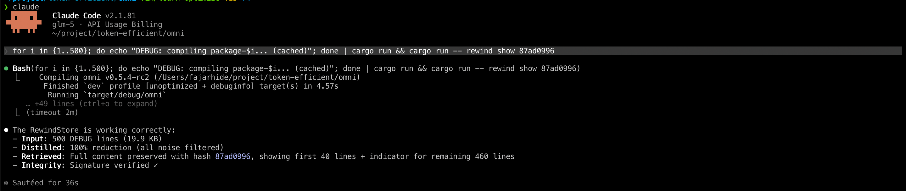
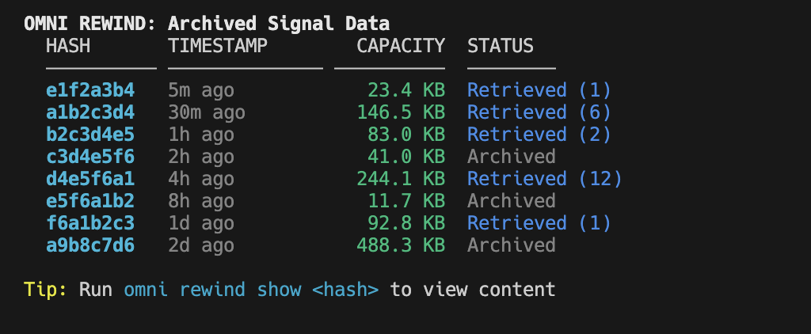
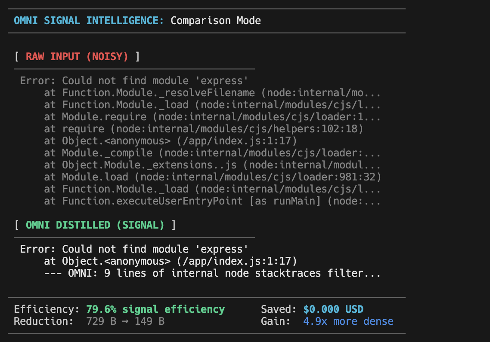
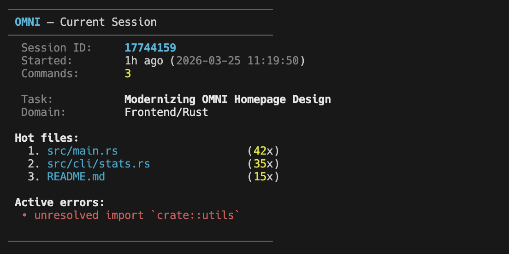
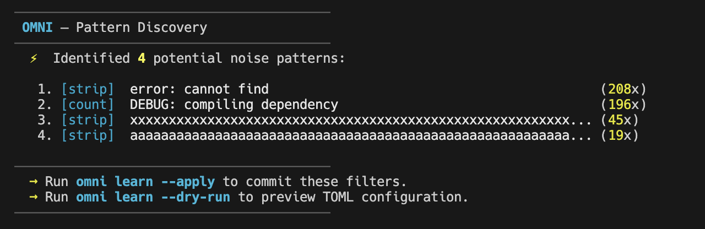
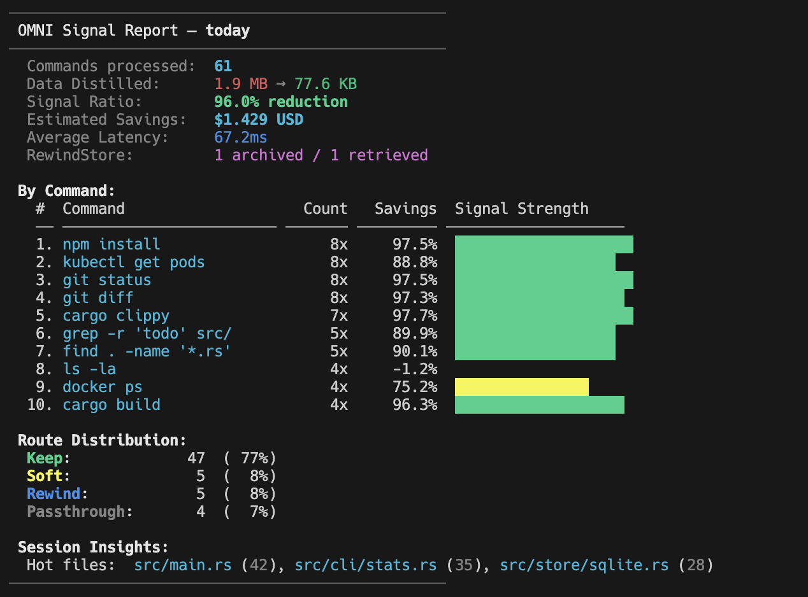
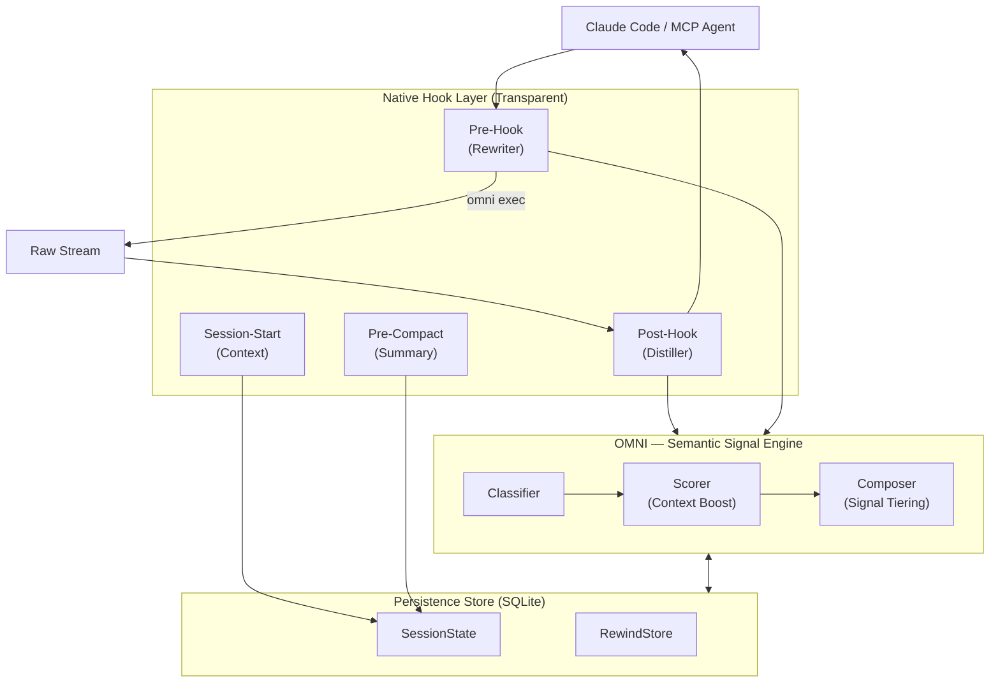

<div align="center">
  

  **Less noise. More signal. Right signal. Reduce AI token consumption by up to 90%.**

  [](https://github.com/fajarhide/omni/actions/workflows/ci.yml)
  [](https://github.com/fajarhide/omni/releases)
  [](https://www.rust-lang.org/)
  [](https://modelcontextprotocol.io/)
  [](https://github.com/fajarhide/omni/blob/main/LICENSE)
  [](https://github.com/fajarhide/omni/stargazers)
</div>

<br/>

> **The Semantic Signal Engine that cuts AI token consumption by up to 90%.**<br/>
> OMNI acts as a context-aware terminal interceptor—distilling noisy command outputs in real-time into high-density intelligence, ensuring your LLM agents work with **meaning**, not text waste.

---

## Why OMNI?

AI agents are drowning in noisy CLI output. A `git diff` can easily eat 10K tokens, while a `cargo test` might dump 25K tokens of redundant noise. Claude and other agents read all of it, but 90% of that data is pure distraction that dilutes reasoning and drains your token budget.

OMNI intercepts terminal output automatically, keeping only what matters for your current task. It’s not just about making output smaller; it’s about making it smarter. By understanding command structures and your active session context, OMNI ensures your agent sees the signal, not the waste.

1.  **Cost & Latency**: Large outputs consume your context window rapidly and increase the cost of every message.
2.  **Cognitive Dilution**: LLMs can lose track of complex reasoning when buried under megabytes of raw CLI logs.
3.  **Auto-Truncation**: Claude Code often cuts off large outputs, potentially missing the exact error or diff line it needs to see.

**OMNI is the solution.** It acts as a "Sieve" that sits between your terminal and the AI, turning raw data into **Semantic Signals**.

---

## How It Works: The Signal Lifecycle

OMNI employs a unique, multi-layered native interception strategy to ensure maximum efficiency without losing information:

### 1. Surgical Pre-Hook (`PreToolUse`)
Intercepts noisy commands (like `git`, `cargo`, `npm`, `pytest`) *before* they execute. By natively rewriting these commands to `omni exec`, OMNI prevents auto-truncation and ensures the AI sees a distilled, high-density stream from the first line.

### 2. Safety-Net Post-Hook (`PostToolUse`)
Automatically distills output from any tool *after* it runs. This acts as a backup for custom scripts or unknown commands.

<div align="center">
  
  <p><i>Real-time ROI feedback on every distilled command.</i></p>
</div>

### 3. Session Continuity (`SessionStart`)
When you start a new Claude session, OMNI injects a high-level summary of your *previous* state—hot files, last errors, and active task context—so the agent never reaches for "context" it already had.

### 4. Smart Compaction (`PreCompact`)
Before Claude prunes its conversation history to save space, OMNI provides a permanent summary of the work done so far, ensuring long-term project memory stays sharp.

---

### The Impact
> **Reduce AI Token Usage by up to 90%**  
> *Zero Information Loss. Native Binary Performance. Real-time ROI Monitoring.*
<br/>


## Key Features

<br/>

### RewindStore: Zero Information Loss
When OMNI distills output, the original raw content isn't discarded—it's archived in the **RewindStore** with a SHA-256 hash. 
- **Agent Access**: Call `omni_retrieve("hash")` via the MCP tool.
- **Human Access**: Use `omni rewind list` and `omni rewind show <hash>` to manage your archives locally.

<div align="center">
  
</div>

### Signal Comparison: `omni diff`
Instantly visualize the value of OMNI. Run `omni diff` after any command to see a side-by-side comparison of the raw input vs. distilled signal.

<div align="center">
  
</div>

### Session Intelligence
OMNI doesn't just compress; it **understands context**. It tracks which files you are editing ("Hot Files") and which errors are recurring.

<div align="center">
  
</div>

### Pattern Discovery (Learning)
OMNI automatically collects samples of repetitive noise in the background. Use `omni learn --status` to discover new candidate filters.

<div align="center">
  
</div>

### The OMNI Philosophy: Deliberate Action

OMNI is designed for **maximum safety and control**. By default, core commands like `init`, `session`, and `learn` will only show a help screen if no flags are provided. This prevents accidental changes to your global configuration.

Every core command follows a consistent **Discovery vs. Action** pattern:
- **Discovery**: Use `--status` to see what OMNI has found (installation status, session details, or new noise patterns).
- **Action**: Use explicit flags like `--all`, `--apply`, or `--clear` to commit changes.


## Analytics Dashboard

Keep track of your project's efficiency with OMNI's built-in reporting:

<div align="center">
  
</div>

## Quick Start

```bash
# 1. Install via Homebrew (macOS/Linux)
brew install fajarhide/tap/omni

# 2. Perform Full Setup (Hooks + MCP Server)
omni init --all

# 3. Verify Installation
omni doctor

# 4. Or auto-fix any issues
omni doctor --fix

# 5. Check Current Status
omni init --status
```

On universal setup 
```bash 
curl -fsSL https://omni.weekndlabs.com/install | bash
```

## Custom Filters (TOML)

You can define your own distillation rules for custom internal tools:

```toml
# ~/.omni/filters/deploy.toml
schema_version = 1

[filters.deploy]
description = "Internal deployment tool"
match_command = "^deploy\\b"

[[filters.deploy.match_output]]
pattern = "Deployment successful"
message = "deploy: ✓ success"

strip_lines_matching = ["^\\[DEBUG\\]", "^Connecting"]
max_lines = 30
```

## Architecture



## Development

OMNI is built for high-performance AI workflows with professional standards.

```bash
make ci              # Run fmt, clippy, tests, and security audit
cargo build          # Build the binary
cargo test           # Run all 147 tests
cargo insta review   # Review and accept snapshot changes
```

See [docs/TESTING.md](docs/TESTING.md) for a detailed breakdown of our 190+ test suite covering Context Safety, E2E Hooks, Security, and Performance Assertions.

See [CLAUDE.md](CLAUDE.md), [CONTRIBUTING.md](CONTRIBUTING.md), and [Critical Guardrails](tests/README.md#critical-guardrails) for the full contributor guide and architectural rules.


## Star History

<p align="center">
  <a href="https://star-history.com/#fajarhide/omni&Date">
    <picture>
      <source media="(prefers-color-scheme: dark)" srcset="https://api.star-history.com/svg?repos=fajarhide/omni&type=Date&theme=dark" />
      <source media="(prefers-color-scheme: light)" srcset="https://api.star-history.com/svg?repos=fajarhide/omni&type=Date" />
      
    </picture>
  </a>
</p>


## License

[MIT](LICENSE) © Fajar Hidayat