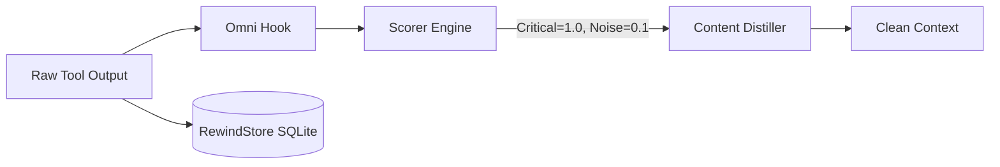

<p align="center">
  <picture>
    
  </picture>
</p>

<h1 align="center">Omni</h1>

<p align="center">
  <em>Your AI isn't bad. It's drowning.</em>
</p>

<p align="center">
  
  
  
  
  
</p>

<p align="center">
  <strong>Up to 85% less tokens &middot; ~40% faster &middot; ~60% cheaper &middot; Zero hallucination triggers</strong><br>
</p>

<p align="center">
  <sub><a href="i18n/README-id.md">🇮🇩 Indonesian</a> &middot; <a href="i18n/README-ja.md">🇯🇵 Japanese</a> &middot; <a href="i18n/README-zh.md">🇨🇳 Chinese</a> &middot; <a href="i18n/README-ar.md">🇦🇪 Arabic</a> &middot; <a href="i18n/README-vi.md">🇻🇳 Vietnamese</a> &middot; <a href="i18n/README-ko.md">🇰🇷 Korean</a></sub>
</p>

<br/>

Every AI coding assistant has the same problem.

They read everything.

Build logs.  
Docker logs.  
CI logs.  
Progress bars.  
Warnings.  
ANSI colors.  
Repeated output.  

Thousands of tokens... to find one line.

Claude isn't expensive. Your terminal is. One failed `npm install` can waste more tokens than the code you're trying to write.

OMNI fixes that.

---

## The Difference

### `npm install`
**Without Omni:** 10,000 lines of "Downloading...", "Extracting...", and warnings. AI reads everything.  
**With Omni:** Package conflict. Node 20 required.

### `terraform apply`
**Without Omni:** 4,500 lines of unchanged execution plans.  
**With Omni:** The 3 resources that failed IAM permissions.

### `docker build`
**Without Omni:** Endless cache hits, layer hashes, and download progress bars.  
**With Omni:** Missing dependency `libpq-dev` at layer 12.

### `pytest`
**Without Omni:** 500 passing tests and verbose setup logs.  
**With Omni:** Only the 2 failed assertions and their stack traces.

### `git diff`
**Without Omni:** Formatting tweaks, generated lockfiles, and whitespace changes.  
**With Omni:** Only the core business logic changes.

### `kubectl logs`
**Without Omni:** Thousands of successful health checks and normal traffic logs.  
**With Omni:** The crash loop and panic stack trace.

### `cargo build`
**Without Omni:** 300 lines of compiling dependencies and warnings.  
**With Omni:** The exact line where the borrow checker failed.

### `go test`
**Without Omni:** Pages of standard output from passing packages.  
**With Omni:** The single nil pointer dereference.

### `mvn package`
**Without Omni:** Megabytes of "Downloading from maven central".  
**With Omni:** Compilation error in `UserService.java`.

### `pip install`
**Without Omni:** Resolution logs and wheel building outputs.  
**With Omni:** Dependency conflict with `numpy`.

### `webpack / vite`
**Without Omni:** 2,000 chunk asset lists and build times.  
**With Omni:** Missing module resolution in `App.tsx`.

### `git merge`
**Without Omni:** 50 files listed with fast-forward stats.  
**With Omni:** The exact files with unresolved merge conflicts.

### `helm install`
**Without Omni:** Entire rendered YAML output of all templates.  
**With Omni:** Pod scheduling failure due to missing secret.

### `ansible-playbook`
**Without Omni:** "ok" and "skipped" statuses for 50 servers.  
**With Omni:** The single "failed" task on `web-03`.

### GitHub Actions (CI/CD)
**Without Omni:** Complete workflow logs including environment setup.  
**With Omni:** Only the specific step that exited with code 1.

---

## Why this matters

The code you *don't* send to the AI is just as important as the code you do.

When you feed an AI megabytes of terminal noise, it suffers from context bloat. It gets distracted, hallucinates fixes for the wrong warnings, and burns through your API budget.

OMNI sits invisibly between your terminal and your AI. It intercepts the raw output, drops the noise, and hands your agent the pure signal.

* You save money.
* The AI responds instantly.
* The hallucinations disappear.

---

## Benchmarks

Because OMNI removes the noise before the AI even sees it, the impact is immediate:

* **Token Reduction:** 70% to 90% less tokens per command.
* **Speed:** ~40% faster Time-To-First-Token (TTFT).
* **Cost:** ~$35 USD saved per developer/month against flagship models.
* **Accuracy:** Higher first-try resolution rates because the AI is focused.

---

## Installation

### Homebrew (macOS / Linux)
```bash
brew tap fajarhide/omni
brew install omni
```

### Cargo
```bash
cargo install omni-cli
```

### Universal Script
```bash
curl -fsSL omni.weekndlabs.com/install | bash
```

Run `omni init` to set up integrations.

---

## Integrations

OMNI works seamlessly with the agentic tools you already use. It intercepts their terminal executions automatically.

* Claude Code
* Cursor
* Windsurf
* Roo Code
* OpenAI Codex
* Antigravity CLI

---

## How it works

Omni operates purely locally using a deterministic `Read → Guard → Score → Collapse → Distill → Persist` pipeline.



If the AI *really* needs the dropped noise, OMNI's local SQLite **RewindStore** keeps the full uncompressed log safely hashed, allowing the agent to retrieve it anytime.

---

## Architecture

Built in Rust for imperceptible latency.

* **Pipeline Latency**: < 10ms overhead.
* **Memory**: Operates via efficient streams, keeping memory usage flat even on 20,000-line logs.
* **Fail Open**: If OMNI panics, it fails silently and passes the raw output through. It will never crash your host agent.

```bash
# Development
cargo build --release
cargo test --all
make fmt && make clippy
```

---

## FAQ

**Does Omni permanently delete my logs?**  
No. The raw logs are compressed and stored locally in the SQLite RewindStore. The AI receives a hash and can retrieve the full log if needed.

**Will this slow down my terminal?**  
No. OMNI is written in Rust and executes the distillation pipeline in under 10ms.

**Can I add my own filters?**  
Yes. You can teach OMNI to strip noise specific to your internal tools using TOML:
```toml
# ~/.omni/signals/custom.toml
[filters.my_tool]
match_command = "^internal-tool\\b"
strip_lines_matching = ["^DEBUG", "syncing..."]
```

## License

[MIT](LICENSE).