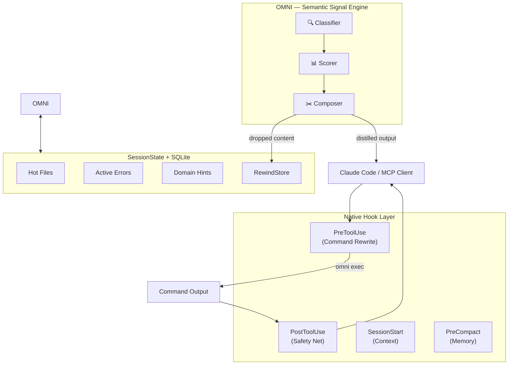

<div align="center">
  

  **Less noise. More signal. Right signal. Reduce AI token consumption by up to 90%.**

  [](https://github.com/fajarhide/omni/actions/workflows/ci.yml)
  [](https://github.com/fajarhide/omni/releases)
  [](https://www.rust-lang.org/)
  [](https://github.com/fajarhide/omni/stargazers)
  [](https://modelcontextprotocol.io/)
  [](https://github.com/fajarhide/omni/blob/main/LICENSE)
</div>

<br/>

> **The Semantic Signal Engine that cuts AI token consumption by up to 90%.**<br/>
> OMNI acts as a context-aware terminal interceptor—distilling noisy command outputs in real-time into high-density intelligence, ensuring your LLM agents work with **meaning**, not text waste.

---

## Why OMNI?

AI agents are drowning in noisy CLI output. A `git diff` can easily eat 10K tokens, while a `cargo test` might dump 25K tokens of redundant noise. Claude and other agents read all of it, but 90% of that data is pure distraction that dilutes reasoning and drains your token budget.

OMNI intercepts terminal output automatically, keeping only what matters for your current task. It’s not just about making output smaller; it’s about making it smarter. By understanding command structures and your active session context, OMNI ensures your agent sees the signal, not the waste.
## How It Works

OMNI uses a two-layer interception strategy to ensure maximum token savings and zero information loss:

```text
1. PreToolUse Hook (Surgical)  ──▶  omni --pre-hook
                                        │ (Rewrites to omni exec)
Claude runs git diff           ──▶  distilled stream (35 lines)

2. PostToolUse Hook (Safety)   ──▶  omni --post-hook
                                        │ (Backup for non-rewritten tools)
Claude reads                   ──◀  Final high-density signal
```

1. **Pre-Hook (Native)** — OMNI intercepts noisy commands (git, cargo, npm, etc.) *before* they start. By rewriting them to `omni exec`, we prevent Claude from auto-truncating large outputs.
2. **Post-Hook (Safety Net)** — Runs after a tool finishes, catching any remaining noise from tools that weren't intercepted by the pre-hook.
3. **Session Intelligence** — OMNI tracks your "hot files" and recent errors in a local SQLite store to boost the relevance scores of concurrent outputs.

---

### The Impact
> **Reduce up to 90% AI Token Usage**  
> *Zero Information Loss. Native Binary Performance. <2ms Overhead.*
<br/>


## What OMNI distils

| Output type | Example | Reduction | What's Kept | Interception |
|---|---|---|---|---|
| git diff | 800 lines → 35 lines | ~96% | File tree, changed hunks | `Pre-Hook` |
| cargo test | 25K tokens → 2K tokens | ~92% | Error count, fail traces | `Pre-Hook` |
| docker build | 600 tokens → 15 tokens | ~98% | Step count, image ID | `Pre-Hook` |
| custom scripts | 100 lines → 10 lines | ~90% | Errors, exit codes | `Post-Hook` |

## Session Continuity

When Claude Code restarts, OMNI injects context from the previous session via the `SessionStart` hook. This includes "hot files" and active errors to ensure the agent never loses its place.

## RewindStore — Never Drop, Always Retrievable

When OMNI compresses aggressively, the original content isn't deleted—it's stored in the **RewindStore** with a SHA-256 hash:

```
[omni: 1,247 chars stored → omni_retrieve("a1b2c3d4")]
```

If Claude needs the full content, it simply calls `omni_retrieve("a1b2c3d4")` via MCP and gets everything back.

## Quick Start

```bash
# Install via Homebrew macOS
brew install fajarhide/tap/omni

# Setup Claude Code hooks (Native Pre/Post/Session/Compact)
omni init --hook

# Verify
omni doctor

# View token savings grouped by command
omni stats
```

Or install universal via script:

```bash
curl -fsSL https://omni.weekndlabs.com/install | sh
omni init --hook
```

*Binary: single binary <5MB, zero runtime dependencies.*

## Custom filters

Create powerful filters using simple TOML rules:

```toml
# ~/.omni/filters/deploy.toml
schema_version = 1

[filters.deploy]
description = "Company deploy tool"
match_command = "^deploy\\b"
strip_ansi = true

[[filters.deploy.match_output]]
pattern = "Deployment successful"
message = "deploy: ✓ success"

strip_lines_matching = ["^\\[DEBUG\\]", "^Waiting"]
max_lines = 30

[[tests.deploy]]
name = "strips debug lines"
input = """
[DEBUG] Connecting...
Deployment successful
"""
expected = "deploy: ✓ success"
```

Test your filters: `omni learn --verify`

See [docs/FILTERS.md](docs/FILTERS.md) for the complete filter writing guide.

## Analytics Dashboard

```bash
$ omni stats

 ───────────────────────────────────────────────── 
  OMNI Signal Report — last 30 days
 ───────────────────────────────────────────────── 
  Commands processed:  1,247
  Data Distilled:      18.4 MB → 3.2 MB
  Signal Ratio:        82.6% reduction
  Estimated Savings:   $0.046 USD
  Average Latency:     2.1ms

   By Command:
   1. git diff HEAD~1    203x  89%  ████████████████████
   2. cargo test         89x  82%  ████████████████
   3. docker build       44x  79%  ███████████████

  Route Distribution:
  Keep:          1247  (97%)
  Rewind:          25  ( 2%)
 ───────────────────────────────────────────────── 
```

## Supported Agents

| Agent | Integration | Status |
|---|---|---|
| **Claude Code** | Native Hooks (`Pre`/`Post`/`Session`/`Compact`) | ✅ Full support |
| **Any MCP client** | MCP server (`omni --mcp`) | ✅ Full support |
| **Shell pipe** | `command \| omni` | ✅ Native support |

## Commands

| Command | Description |
|---|---|
| `omni init --hook` | Setup all Claude Code hooks |
| `omni stats` | Token savings analytics (grouped by command) |
| `omni exec -- <cmd>` | Manually wrap a command for distillation |
| `omni session` | Session state inspection |
| `omni learn` | Auto-generate filters from noise |
| `omni doctor` | Diagnose installation |
| `omni --pre-hook` | Native PreToolUse rewriter |
| `omni --post-hook`| Native PostToolUse distiller |
| `omni --mcp` | Start MCP server |

See [docs/CLI_REFERENCE.md](docs/CLI_REFERENCE.md) for full usage details.

## Architecture



## Development

To ensure your code meets all quality standards before pushing to the repository, run the comprehensive CI pipeline locally:

```bash
make ci              # Run fmt, clippy, tests, security audit, and binary size checks
```

For individual checks during development:
```bash
cargo build          # Build the binary
cargo test           # Run all 147 tests
cargo insta review   # Review and accept snapshot changes
```

See [CLAUDE.md](CLAUDE.md) and [DEVELOPER.md](docs/DEVELOPER.md) for the full contributor guide.

## Star History

[](https://www.star-history.com/?repos=fajarhide%2Fomni&type=date&legend=top-left)

## License

MIT
