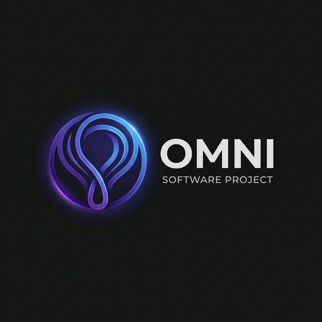
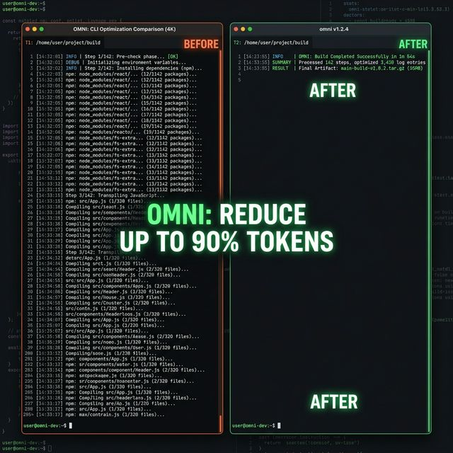
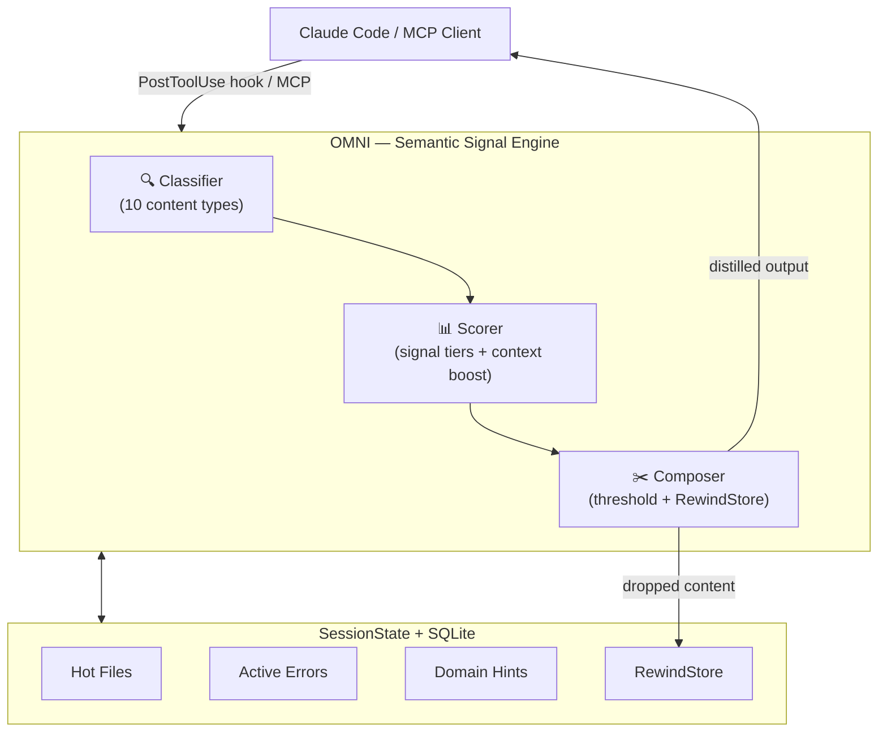

<div align="center">
  

  **Less noise. More signal. Right signal. Reduce AI token consumption by up to 90%.**

  [](https://github.com/fajarhide/omni/actions/workflows/ci.yml)
  [](https://github.com/fajarhide/omni/releases)
  [](https://www.rust-lang.org/)
  [](https://github.com/fajarhide/omni/stargazers)
  [](https://modelcontextprotocol.io/)
  [](https://github.com/fajarhide/omni/blob/main/LICENSE)
</div>

<br/>

> **The Semantic Signal Engine that cuts AI token consumption by up to 90%.**<br/>
> OMNI acts as a context-aware terminal interceptor—distilling noisy command outputs in real-time into high-density intelligence, ensuring your LLM agents work with **meaning**, not text waste.

---

## Why OMNI?

AI agents are drowning in noisy CLI output. A `git diff` can easily eat 10K tokens, while a `cargo test` might dump 25K tokens of redundant noise. Claude and other agents read all of it, but 90% of that data is pure distraction that dilutes reasoning and drains your token budget.

OMNI intercepts terminal output automatically, keeping only what matters for your current task. It’s not just about making output smaller; it’s about making it smarter. By understanding command structures and your active session context, OMNI ensures your agent sees the signal, not the waste.

## How It Works

```text
Claude runs git diff  ──▶  800 lines raw output
                                 │
PostToolUse hook      ──▶  omni --hook
                                 │
Claude reads          ──◀  35 lines pure signal
```

OMNI knows your session context. Debugging an auth bug? Changes in `src/auth/` get priority automatically. No configuration needed—it just works.


1. **Classify** — OMNI identifies the content type (git diff, build output, test results, logs) by analyzing structure, not filenames
2. **Score** — Each line gets a semantic relevance score based on signal tier (critical → noise) and your current session context
3. **Compose** — High-signal content is kept, noise is removed, and anything dropped is stored in RewindStore for retrieval

All of this happens **transparently** — your AI agent doesn't know OMNI exists. It just gets better signal.

### The Impact
> **Reduce up to 90% AI Token Usage**  
> *Zero Information Loss. Maximum Agent Context. <2ms Overhead.*
<br/>




## What OMNI distils

| Output type | Example | Reduction | What's Kept |
|---|---|---|---|
| git diff | 800 lines → 35 lines | ~96% | File tree, changed hunks, +/- lines |
| cargo test | 25K tokens → 2K tokens | ~92% | Error count, error messages, warnings |
| pytest failures | 500 lines → 20 lines | ~96% | Test failures, error messages, warnings |
| docker build | 600 tokens → 15 tokens | ~98% | Step count, cache hits, image ID |

## Session Continuity

When Claude Code restarts, OMNI injects context from the previous session so the agent never loses its place. It tracks "hot files" and active errors to guide the agent back to the problem.

```text
Continuing: debugging auth bug.
Hot files: src/auth/mod.rs (12x).
Last error: E0499
```

OMNI doesn't just compress — it **understands your session context**.

When you're debugging `src/auth/mod.rs`, OMNI:
- **Boosts** any output mentioning `auth/mod.rs` (because it's a hot file)
- **Prioritizes** errors matching patterns you've seen before
- **Infers** your task domain ("auth module") for smarter scoring
- **Persists** across compaction events, so Claude never loses context

This is powered by the `SessionState` engine that tracks hot files, recent commands, active errors, and domain hints — all stored in local SQLite.

## RewindStore — Never Drop, Always Retrievable

When OMNI compresses aggressively, the original content isn't deleted — it's stored in the **RewindStore** with a SHA-256 hash:

```
[omni: 1,247 chars stored → omni_retrieve("a1b2c3d4")]
```

If Claude needs the full content, it simply calls `omni_retrieve("a1b2c3d4")` via MCP and gets everything back. **Zero information loss, guaranteed.**

## Quick Start

```bash
# Install via Homebrew macOS
brew install fajarhide/tap/omni

# Setup Claude Code hooks (one-time)
omni init --hook

# Verify
omni doctor

# View token savings after your first session
omni stats
```

Or install via script (Linux):

```bash
curl -fsSL https://omni.weekndlabs.com | sh
omni init --hook
```

*Binary: single binary <5MB, zero runtime dependencies.*

## Custom filters

Create powerful filters using simple TOML rules:

```toml
# ~/.omni/filters/deploy.toml
schema_version = 1

[filters.deploy]
description = "Company deploy tool"
match_command = "^deploy\\b"
strip_ansi = true

[[filters.deploy.match_output]]
pattern = "Deployment successful"
message = "deploy: ✓ success"

strip_lines_matching = ["^\\[DEBUG\\]", "^Waiting"]
max_lines = 30

[[tests.deploy]]
name = "strips debug lines"
input = """
[DEBUG] Connecting...
Deployment successful
"""
expected = "deploy: ✓ success"
```

Test your filters: `omni learn --verify`

See [docs/FILTERS.md](docs/FILTERS.md) for the complete filter writing guide.

## Analytics Dashboard

```bash
$ omni stats

 ───────────────────────────────────────────────── 
  OMNI Signal Report — last 30 days
 ───────────────────────────────────────────────── 
  Commands processed:  1,247
  Data Distilled:      18.4 MB → 3.2 MB
  Signal Ratio:        82.6% reduction
  Estimated Savings:   $0.046 USD
  Average Latency:     2.1ms
  RewindStore:         23 archived / 8 retrieved

   By Filter:
   1. git          203x  89%  ████████████████████
   2. build         89x  82%  ████████████████
   3. test          44x  79%  ███████████████
   4. infra         31x  76%  █████████████

  Route Distribution:
  Distill:        1247  (97%)
  Keep:             25  ( 2%)
  Drop:             12  ( 1%)
  Passthrough:       0  ( 0%)

  Session Insights:
  Hot files:  src/auth/mod.rs (12), tests/auth_test.rs (8)

 ───────────────────────────────────────────────── 
```

## Supported Agents

| Agent | Integration | Status |
|---|---|---|
| **Claude Code** | PostToolUse hook (automatic) | ✅ Full support |
| **Any MCP client** | MCP server (`omni --mcp`) | ✅ Full support |
| **Shell pipe** | `command \| omni` | ✅ Works now |

## Commands

| Command | Description |
|---|---|
| `omni init --hook` | Setup Claude Code hooks |
| `omni stats` | Token savings analytics |
| `omni session` | Session state inspection |
| `omni learn` | Auto-generate filters from noise | [docs/LEARN.md](docs/LEARN.md) |
| `omni doctor` | Diagnose installation |
| `omni version` | Print version |
| `omni help` | Show help |
| `cmd \| omni` | Pipe mode — distil any command output |
| `omni --mcp` | Start MCP server |
| `omni --hook` | Hook mode (used by Claude Code) |

See [docs/CLI_REFERENCE.md](docs/CLI_REFERENCE.md) for full usage details.

## Architecture



## Development

To ensure your code meets all quality standards before pushing to the repository, run the comprehensive CI pipeline locally:

```bash
make ci              # Run fmt, clippy, tests, security audit, and binary size checks
```

For individual checks during development:
```bash
cargo build          # Build the binary
cargo test           # Run all 147 tests
cargo insta review   # Review and accept snapshot changes
```

See [CLAUDE.md](CLAUDE.md) and [DEVELOPER.md](docs/DEVELOPER.md) for the full contributor guide.

## Star History

[](https://www.star-history.com/?repos=fajarhide%2Fomni&type=date&legend=top-left)

## License

MIT
