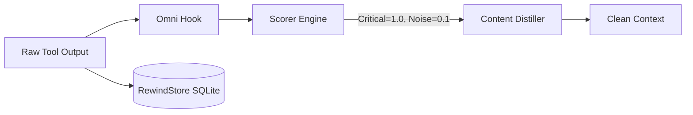

<div align="center">
  

<h1>OMNI</h1>
<p align="center">
    <em>Noise-canceling context and long-term memory for your AI agent. Stop paying Claude to read 10,000 lines of terminal noise like a headphone for AI agent</em>
</p>

[🇺🇸 English](README.md) | [🇯🇵 日本語](i18n/README-ja.md) | [🇨🇳 简体中文](i18n/README-zh.md) | [🇸🇦 العربية](i18n/README-ar.md) | [🇮🇩 Bahasa Indonesia](i18n/README-id.md) | [🇻🇳 Tiếng Việt](i18n/README-vi.md) | [🇰🇷 한국어](i18n/README-ko.md)

[](https://github.com/fajarhide/omni/actions/workflows/ci.yml)
[](https://github.com/fajarhide/omni/releases)
  [](https://www.rust-lang.org/)
  [](https://modelcontextprotocol.io/)
  [](https://github.com/fajarhide/omni/blob/main/LICENSE)
  [](https://hits.sh/github.com/fajarhide/omni/)
</br></br>
<b>
58.9% fewer tokens on a real command mix &middot; Cross-Session Memory &middot; Format-safe &middot; Fails open, never fabricates &middot; Numbers you can reproduce </b>

</br></br>

</div>

---

Every AI coding assistant has two massive problems.

**1. They read everything.**  
Build logs.  
Docker logs.  
CI logs.  
Progress bars.  
ANSI colors.  
Thousands of tokens... to find one line. Claude isn't expensive. Your terminal is.

**2. They forget everything.**  
Every time you restart Cursor, or switch from Claude Code to Windsurf, your agent gets amnesia. You have to re-explain the project goal. You have to remind them of the same framework gotchas over and over again.

OMNI fixes both.

---

## The Difference

**Problem 1: Your terminal drowns out the signal**

Real numbers, measured on `tests/fixtures/` and replayed traces — not aspirations:

| Command | Without OMNI | With OMNI | Saved |
|---|---|---|---|
| `cargo test` (490 passed, 10 failed) | 16.5 KB of per-test output | the runner's own pass/fail summary | **93%** |
| `kubectl get pods` (35 pods, 5 crashing) | the full table | `35 pods \| 30 running, 5 error` + the 5 failing pods named | — |
| `git diff` (multi-file) | lockfiles, whitespace, generated churn | the code that actually changed | **45%** |
| `docker build` (heavy cache noise) | 9.2 KB of layer hashes and progress bars | the build result, cache hits folded | **37%** |

> **The honest caveat:** OMNI compresses *noisy successful* output. A command that **fails** is passed through **verbatim** — a hidden error is worse than an uncompressed one — and structured output (JSON/YAML/CSV) is never touched. It earns its keep on repetitive tool chatter and gets out of the way everywhere else.

**Problem 2: Your agent forgets everything overnight**

### Starting a new session
**Without OMNI:** "Please re-explain the project structure, the auth module is broken, and we use Postgres not MySQL."  
**With OMNI:** The agent already knows. It picks up where you left off.

### Fixing the same bug twice
**Without OMNI:** Agent hits the same framework gotcha it already solved yesterday because it has no memory.  
**With OMNI:** The fix is already stored. `omni recall` surfaces the exact solution in under 10ms.

### Multi-IDE workflows (Cursor → Claude Code)
**Without OMNI:** New IDE, new agent, zero context. You're starting from scratch.  
**With OMNI:** Session summary is injected automatically. New agent is immediately up to speed.

---

## Why This Matters

The code you *don't* send to the AI is just as important as the code you do.

When you feed an AI megabytes of terminal noise, it suffers from context bloat—hallucinating fixes for the wrong warnings and burning your API budget on irrelevant output.

When you restart an agent and it has no memory, you lose hours re-establishing context that should have been preserved automatically.

OMNI solves both, invisibly:

* **Less noise** → lower cost, and less irrelevant output for the model to trip over.
* **Format-safe by design** → JSON, YAML, NDJSON and CSV pass through byte-for-byte; a distiller that can't parse its input stays quiet instead of fabricating a summary.
* **Persistent memory** → no more re-explaining your project, no more repeating fixes.
* **One install** → works silently with every agent you already use.

---

## Benchmarks

The honest headline, measured on the release binary against **1,810 real command
executions** replayed from one developer's actual usage:

* **58.9% fewer bytes** reaching the model across the whole mix (15.0 MB → 6.2 MB).
* **63.6% of those calls saved nothing at all.** OMNI handed the output straight
  back, adding **zero** bytes. Every byte of the saving comes from the other 36.4%,
  where there was real noise to cut.
* **Structured output is never touched.** JSON, YAML, NDJSON and CSV pass through
  byte-for-byte, because a corrupted payload costs more than a missed compression.

That second bullet is the number most tools in this category do not print. A tool
that claims to save 90% of every command is telling you it summarises output you
needed.

<div align="center">

</div>

Where the saving actually comes from, over the same 1,810 executions:

| Command | Calls | Input | Output | Saved |
|---------|-------|-------|--------|-------|
| `cargo` | 29 | 424 KB | 13 KB | **96.8%** |
| `git` | 256 | 5.9 MB | 509 KB | **91.3%** |
| `ls` | 52 | 71 KB | 29 KB | **59.5%** |
| `kubectl` | 212 | 4.4 MB | 2.3 MB | **48.0%** |
| `find` | 39 | 83 KB | 53 KB | **36.2%** |
| `grep` | 184 | 534 KB | 385 KB | **27.8%** |
| `cat` | 85 | 515 KB | 468 KB | **9.1%** |

`git` and `cargo` carry the result; `cat` and `grep` are close to a no-op. OMNI
earns its place on noisy, repetitive tooling output and gets out of the way
everywhere else.

Single fixtures from `tests/fixtures/`, if you want to reproduce one by hand:

| Command / Context | Input | Output | Saved |
|-------------------|-------|--------|-------|
| `cargo build` (large, successful) | 3,220 B | 9 B | **99.7%** |
| `cargo test` (490 passed, 10 failed) | 16.5 KB | 1,100 B | **93.3%** |
| `pytest` (failures) | 730 B | 136 B | **81.4%** |
| `git status` (dirty) | 496 B | 113 B | **77.2%** |
| `git diff` (multi-file) | 397 B | 220 B | **44.6%** |
| `docker build` (heavy noise) | 9.2 KB | 5.8 KB | **37.2%** |
| `kubectl get pods` (mixed) | 840 B | 762 B | **9.3%** |

**Latency is a real cost, not zero.** OMNI runs on every hooked command, and the
price grows with your history: a 496-byte `git status` takes ~82 ms against a
fresh database and ~308 ms against a 97 MB one. A 16.5 KB `cargo test` takes
~276 ms. Budget for it.

*To see your own actual token savings, just run `omni stats` after a few days of usage.*


---

## Quick Start & Installation

Omni is incredibly easy to set up. It natively integrates into your terminal.

**macOS / Linux:**
```bash
# 1. Install via Homebrew
brew install fajarhide/tap/omni

# 2. Setup Omni (Interactive Menu for Claude, VS Code, OpenCode, Codex, Antigravity)
omni init

# 3. Verify it's working
omni doctor

# 4. Or auto-fix any issues
omni doctor --fix

# 5. Check Current Status
omni init --status
```

**Universal Installer (macOS / Linux / WSL):**
```bash 
curl -fsSL omni.weekndlabs.com/install | bash
```

**Windows (PowerShell):**
```powershell
irm omni.weekndlabs.com/install.ps1 | iex
```

---

## Integrations

OMNI works seamlessly with the agentic tools you already use. It intercepts their terminal executions automatically.

* Claude Code
* Cursor
* Windsurf
* Roo Code
* OpenAI Codex
* Antigravity CLI

---

## Adaptive Memory OS

OMNI isn't just a terminal filter—it's a cure for AI amnesia.

If you've ever worked with an AI agent for more than an hour, you know the pain of context loss. You restart the agent, and suddenly it forgets what you were working on. It forgets the project goal. It starts making the exact same mistakes it made yesterday because it forgot the repository's undocumented quirks.

OMNI's Memory OS runs silently in the background to solve this:

* **Stop Re-Explaining the Goal (`omni goal`)**: Set your North Star objective once. OMNI will relentlessly remind the agent of this exact priority on every single prompt, preventing it from drifting off-task.
* **Never Lose Your Train of Thought (Session Continuity)**: If Cursor crashes or you switch to Claude Code, OMNI instantly injects a compressed summary of your last session. The new agent knows exactly which files were hot and what the last active error was, picking up right where you left off.
* **Teach It Once (`omni remember`)**: Stop fixing the same hallucination. Agents can save project-specific rules, gotchas, and architecture decisions directly into OMNI's local SQLite backend. When they get stuck later, they automatically pull the exact answer back out via semantic search.

Your agent gets smarter about your codebase every single day, and you never have to repeat yourself again.

---

## How it works

Omni operates purely locally using a deterministic `Read → Guard → Score → Collapse → Distill → Persist` pipeline.



If the AI *really* needs the dropped noise, OMNI's local SQLite **RewindStore** keeps the full uncompressed log safely hashed, allowing the agent to retrieve it anytime.

---

## Architecture


<div align="center">
  
</div>

Built in Rust for imperceptible latency.

* **Pipeline Latency**: < 10ms overhead.
* **Memory**: Operates via efficient streams, keeping memory usage flat even on 20,000-line logs.
* **Fail Open**: If OMNI panics, it fails silently and passes the raw output through. It will never crash your host agent.

```bash
# Development
cargo build --release
cargo test --all
make fmt && make clippy
```

---

## FAQ

**Does Omni permanently delete my logs?**  
No. The raw logs are compressed and stored locally in the SQLite RewindStore. The AI receives a hash and can retrieve the full log if needed.

**Will this slow down my terminal?**  
No. OMNI is written in Rust and executes the distillation pipeline in under 10ms.

**Can I add my own filters?**  
Yes. You can teach OMNI to strip noise specific to your internal tools using TOML:
```toml
# ~/.omni/signals/custom.toml
[filters.my_tool]
match_command = "^internal-tool\\b"
strip_lines_matching = ["^DEBUG", "syncing..."]
```

## Contributing & License

This is a passion project built for the era of Agentic AI. Whether you're here to save money on tokens, test out free models, or help build the ultimate agentic toolbelt, contributions are always welcome!

- **Development**: Want to build from source? Run `make ci` and `cargo build`. Read our [CONTRIBUTING.md](CONTRIBUTING.md) for details.
- **License**: [MIT License](LICENSE)

<!-- Star History -->
<p align="center">
  <a href="https://star-history.com/#fajarhide/omni&Date">
    <picture>
      <source media="(prefers-color-scheme: dark)" srcset="https://api.star-history.com/svg?repos=fajarhide/omni&type=Date&theme=dark" />
      <source media="(prefers-color-scheme: light)" srcset="https://api.star-history.com/svg?repos=fajarhide/omni&type=Date" />
      
    </picture>
  </a>
</p>
<center>
Build with ❤️ by [Fajar Hidayat](https://github.com/fajarhide)
</center>