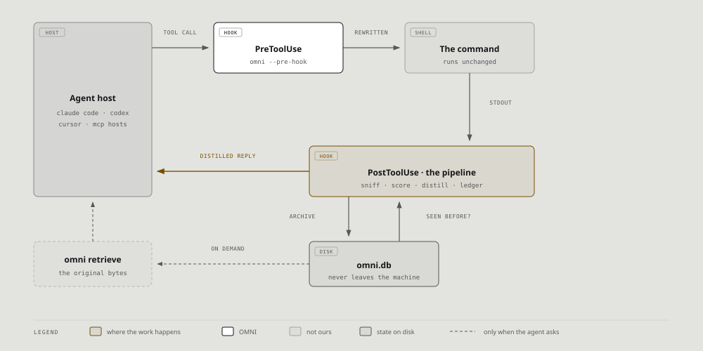
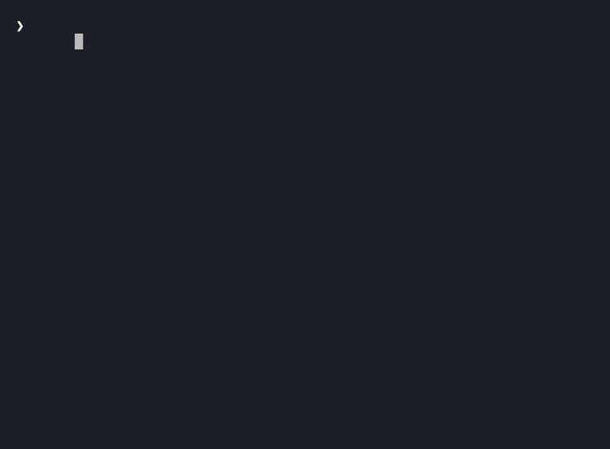

<div align="center">
  

<h1>OMNI</h1>
<p align="center">
    <em><b>Your agent pays twice for output it has already seen.</b> OMNI hands back a retrievable handle instead: <b>97.2%</b> off a file it reads twice. Across a whole session it takes about a quarter of the repetition your work actually contains, which was <b>4.5%</b> of file-read bytes on the corpus below. How repetitive your work is decides where you land between those two. Nothing deleted, nothing invented, and every number here replays on your own history.</em>
</p>

[🇺🇸 English](README.md) | [🇯🇵 日本語](i18n/README-ja.md) | [🇨🇳 简体中文](i18n/README-zh.md) | [🇸🇦 العربية](i18n/README-ar.md) | [🇮🇩 Bahasa Indonesia](i18n/README-id.md) | [🇻🇳 Tiếng Việt](i18n/README-vi.md) | [🇰🇷 한국어](i18n/README-ko.md)

[](https://github.com/fajarhide/omni/actions/workflows/ci.yml)
[](https://github.com/fajarhide/omni/releases)
  [](https://www.rust-lang.org/)
  [](https://modelcontextprotocol.io/)
  [](https://discord.gg/zHTuvZhF2M)
  [](https://github.com/fajarhide/omni/blob/main/LICENSE)
  [](https://hits.sh/github.com/fajarhide/omni/)
  [](https://www.greptile.com/?utm_source=oss_badge&utm_medium=readme&utm_campaign=greptile_for_open_source)
</br></br>

```bash
brew install fajarhide/tap/omni && omni init
```

</br>

</div>

---

## What it does

**Drops the noise.** Build logs, Docker layer hashes, progress bars, ANSI colour. The
part of the output nobody reads is removed before it reaches the model.

**Stops re-sending what the agent has already seen.** A run of lines it was shown
earlier in the session comes back as one marker with a handle, not as the bytes again.
This is the half a filter cannot do: it removes bytes because they are already in the
context, not because a pattern calls them noise.

**Remembers across sessions.** Restart your editor or switch agents, and the project
context is still there.

**Gets out of the way.** A failing command passes through verbatim. JSON, YAML and CSV
are never touched. Most commands are handed back unchanged, and that is the intended
behaviour rather than a gap.



It runs as two hooks around a tool call your agent host already makes. Nothing proxies
your shell, and the database never leaves the machine.

---

## The second read is free

An agent re-reads the same file constantly. Without OMNI it pays for every byte
again. With OMNI the second read is one marker carrying a handle, because those bytes
are already in its context, and `omni retrieve <hash>` hands the file back in full if
it is ever needed.

<table>
<tr>
<td align="center"><b>Without OMNI</b><br/><sub><code>cat</code> twice: the same 7.6 KB, twice</sub></td>
<td align="center"><b>With OMNI</b><br/><sub>second read 214 B, <b>97.2%</b> smaller</sub></td>
</tr>
<tr>
<td valign="top"></td>
<td valign="top"></td>
</tr>
</table>

This is the half a filter cannot reach. No pattern in that file is noise, so nothing
in it can be dropped on its own merits. It goes because the agent has already seen it.

**And when the file has changed since?** The parts already seen still fold, in place,
around the parts that have not. Each fold keeps the line count of what it replaced, so
every surviving line stays on the number your editor gives it and the agent can still act
on those numbers.

## The same `git log`, side by side

Without OMNI, one commit's `Author` / `Date` / body already fills the screen. With
OMNI, **every commit is kept**, as one `hash subject` line. Nothing is summarised away.

<table>
<tr>
<td align="center"><b>Without OMNI</b><br/><sub>raw <code>git log -15</code></sub></td>
<td align="center"><b>With OMNI</b><br/><sub>every commit kept, 94% smaller</sub></td>
</tr>
<tr>
<td valign="top"></td>
<td valign="top"></td>
</tr>
</table>

Measured on the fixtures in `tests/fixtures/`, so you can reproduce any row:

| Command | Without OMNI | With OMNI | Saved |
|---|---|---|---|
| `cargo test` (490 passed, 10 failed) | 16.5 KB of per-test output | the runner's own pass/fail summary | **93.0%** |
| `git status` (dirty) | 496 B of porcelain | the branch and the changed paths | **66.7%** |
| `docker build` (heavy cache noise) | 9.2 KB of layer hashes and progress bars | the build result, cache hits folded | **98.9%** |
| `git diff` (multi-file) | lockfiles, whitespace, generated churn | the code that actually changed | **37.8%** |
| `kubectl get pods` (35 pods, 5 crashing) | the full table | the full table | **0%**, by design |

That last row is the point of the table. A pod listing is an enumeration where every
row is a datum, so there is nothing to drop, and OMNI reports nothing rather than
inventing a saving.

---

## Nothing is ever lost. It never makes something up.

Four guarantees, each one a link to the code or the issue that made it true rather
than a sentence asking you to trust it.

| Guarantee | How | Proof |
|---|---|---|
| **Get the original back, byte-for-byte** | everything cut is archived in a local SQLite RewindStore; the marker carries a handle, and `omni retrieve <handle>` prints it on any host, with the `omni_retrieve` MCP tool where MCP is wired | [#388](https://github.com/fajarhide/omni/issues/388) |
| **Never fabricates a result** | a distiller that parsed no signal returns the raw output, never a green `no errors` / `passed` string | [#143](https://github.com/fajarhide/omni/issues/143) |
| **Failures are never masked** | a command that exits non-zero passes through verbatim | [#120](https://github.com/fajarhide/omni/issues/120) |
| **Structured data is never touched** | JSON / YAML / NDJSON / CSV pass through byte-for-byte | `pipeline::format` |

---

## What OMNI remembers, and for how long

Three tiers, already in the schema, never written down until now. The short answer to
"will OMNI still know my project after a month away" is yes for the conclusions and no for
the raw bytes.

| Tier | What | Kept |
|---|---|---|
| **Permanent** | project knowledge, recurring error patterns, engrams, goal memory | until you delete it, except goal memory, which honours its own `ttl_days` |
| **Working, 30 days** | sessions, distillation rows, hot files, the RewindStore, the event index, the ledger | rolling window |
| **Verbatim, 7 days** | `execution_traces` and the session transcript | shorter on purpose: it is two orders of magnitude heavier per row |

The boundary this sets is worth stating plainly, because it is the one thing a handle
cannot promise: `omni retrieve` for content archived more than 30 days ago will not
resolve. Hold the shortest window open while measuring with
`OMNI_TRACE_RETENTION_DAYS=90`.

`omni reset` wipes all of it, and `omni doctor` shows the live counts.

---

## What each host lets OMNI do

| Tier | Hosts | What you get |
|---|---|---|
| **Full** | Claude Code, Codex CLI, Gemini CLI, OpenClaw, Hermes, Pi, Aider (pipe) | The host applies OMNI's rewrite, so the model reads distilled output from its own built-in tools. |
| **Handoff-first** | Cursor, Windsurf | The host cannot rewrite built-in tool output. `omni_run` distils anything you route through it, and `omni init --cursor` installs the rule that makes the agent reach for it. |
| **MCP-only** | Cline, Roo, OpenCode, VS Code, Zed, Copilot, Antigravity | Memory, recall and session state, plus `omni_run`. The host's own tool output is never rewritten, so `omni_run` is the only path by which the model reads less. |

`omni doctor` prints the tier for every installed host. Savings are only ever counted
where the model actually received less.

Codex CLI needs one extra step. It runs only hooks it has been told to trust and skips
the rest without a word, so after `omni init --codex` start `codex` once and approve
them under "Hooks need review". `omni doctor` fails until you do. See
[#359](https://github.com/fajarhide/omni/issues/359).

---

## Install

**macOS / Linux:**
```bash
brew install fajarhide/tap/omni
omni init      # interactive setup for Claude, Cursor, VS Code, Codex, Antigravity
omni doctor    # verify, or `omni doctor --fix`
```

**Universal (macOS / Linux / WSL):**
```bash
curl -fsSL omni.weekndlabs.com/install | bash
```

**Windows (PowerShell):**
```powershell
irm omni.weekndlabs.com/install.ps1 | iex
```

**Claude Code, from inside the session:**
```
/plugin marketplace add fajarhide/omni
/plugin install omni@omni
```

**Any agent that reads skills**, listed at
[skills.sh/fajarhide/skills/omni](https://www.skills.sh/fajarhide/skills/omni):
```bash
npx skills add fajarhide/skills --skill omni
```

Both install a skill, not the binary. The skill is what tells the agent how to get
the binary, verify it, and read the markers OMNI leaves when it shortens output.

Then run your commands normally. There is nothing to prefix and no proxy to wrap.

---

## Numbers

Every figure OMNI publishes states the corpus it came from and the week it covers,
because `execution_traces` is pruned after seven days and a number that outlives its
corpus cannot be checked by anyone, us included.

On a corpus of 9,478 real command executions that reached a model, 8.42 MB over 70
sessions, frozen and hashed as `0b63218ef78a1edb` so it survives the pruning:

* **1.4% from the filters, 5.1% with the ledger**, and the ledger took **24.1% of
  all the repetition that was there to take**. The last figure is the one that
  describes OMNI. The first two describe this corpus.
* **Read the corpus before the number.** This one is shell-heavy, so it
  *understates* the case the ledger is built for: file reads here average 2.1 KB.
  An earlier week whose file reads averaged 12.4 KB took **twenty times** more
  bytes off that class, on the same code, while the capture rate barely moved.
  Twentyfold in one column, flat in the other, and only one of those two is a fact
  about OMNI.
* **This corpus does not expire.** It is frozen on disk and its hash is in
  `docs/benchmarks/0.7.8.json`, so the numbers above can be checked against the
  same bytes next release instead of against whatever the last seven days held.
  Run the harness on your own history for a figure about your workload.
* **It hands bytes back rather than inventing a saving.** Where there is nothing
  safe to take, a two-line `git status` or a JSON payload a later step parses, the
  output comes back untouched. **No call came back larger** in this measurement.
  Two did until ([#398](https://github.com/fajarhide/omni/issues/398)), and we published them while they stood.
* **21 ms per command**, growing with your history rather than with the payload. On a
  205 MB database it is 61 ms.
* **End to end, the gap favours you.** These are bytes per command, which is not the
  same as your bill: billed input tokens track roughly turns times prefix size. Measured
  on whole sessions the saving averages **larger** than this table, because a payload
  shortened once is a payload every later turn stops re-reading. It is an average and
  not a promise, and some sessions did not fall at all.

Per class, with what the filters take, what the ledger adds, and how much of the
repetition that was there it actually took:

<!-- omni:corpus-table:start -->
| Class | Calls | Input | Filters | + ledger | Available | Captured |
|---|---|---|---|---|---|---|
| other | 6,457 | 4.81 MB | 0.8% | 4.6% | 15.9% | **24.3%** |
| file read | 1,056 | 1.89 MB | 0.0% | 4.3% | 17.7% | **24.4%** |
| git | 899 | 0.86 MB | 5.1% | 8.6% | 18.4% | **20.1%** |
| search | 810 | 0.77 MB | 3.4% | 4.2% | 6.5% | **13.7%** |
| infra | 215 | 0.14 MB | 3.2% | 3.8% | 5.5% | **10.5%** |
| build and test | 41 | 0.02 MB | 9.0% | 11.1% | 21.7% | **10.8%** |
| **aggregate** | 9,478 | 8.49 MB | 1.4% | 4.9% | 15.6% | **23.3%** |

| Arm | bytes | saved |
|---|---|---|
| headroom dedup, omni's filters | 8,486,830 to 7,992,449 | 5.8% |
| rtk + omni's ledger | 8,486,830 to 8,004,410 | 5.7% |
| caveman + omni's ledger | 8,486,830 to 8,009,164 | 5.6% |
| **omni, with the ledger** | 8,486,830 to 8,067,201 | 4.9% |
| lean-ctx `compress` | 8,486,830 to 8,076,957 | 4.8% |
| caveman `compress` | 8,486,830 to 8,311,999 | 2.1% |
| rtk `pipe` | 8,486,830 to 8,308,491 | 2.1% |
| omni, filters only | 8,486,830 to 8,371,362 | 1.4% |

Measured by `make bench` over 9,478 traces (8.42 MB, 70 sessions), corpus `0b63218ef78a1edb`, OMNI 0.7.8.
<!-- omni:corpus-table:end -->

`available` is the ceiling. The ledger substitutes lines it has already delivered,
so it cannot fold what was never repeated, and `captured` is the share of that it
took. The two columns answer different questions: the saving describes this corpus,
the capture rate describes OMNI. On a week of large repeated file reads the same
mechanism took 20 times more bytes off the same class, and the capture rate barely
moved.

`infra` and `file read` read 0.0% from the filters on purpose. A pod listing is an
enumeration where every row is a datum, and a source file is not ours to summarise
(#176), so both hand the bytes back and let the ledger do the work.

The head-to-head above is generated by the same `make bench` that writes the class
table, so it cannot fall a release behind its corpus again. Every arm is handed the
same bytes. Versions: rtk 0.45.0, lean-ctx 3.9.18, caveman `bin-v1.0.0`, headroom
0.34.0.

**On this corpus OMNI is not the top arm, and both of its halves are behind.**
headroom's cross-turn dedup takes 5.8% where our ledger takes 4.9% over the same
filters and the same blocks, so that gap is the dedup engine and nothing else. At
1.4% our filter tier is the weakest of the four, against 2.1% for rtk and caveman
and 4.8% for lean-ctx. That shortfall is what puts `rtk + omni's ledger` and
`caveman + omni's ledger` above our own stack: the ledger is the same in all three
rows, and only the filters underneath it differ.

The one row that is not a like-for-like: lean-ctx has no `+ our ledger` row because
its preview reports `compressed_bytes` and never emits the text, so the row could
only be estimated.

Reproduce all of it:

```bash
OMNI_BENCH_DB=~/.omni/omni.db \
  cargo test --release --test bench_replay -- --ignored --nocapture
```

`OMNI_BENCH_RTK=/path/to/rtk` adds the competitor arm. `OMNI_BENCH_ALL=1` replays the
wider population including terminal output, and the harness prints which one it used.

---

## FAQ

**Does OMNI permanently delete my logs?**
No. Raw logs are stored locally in the SQLite RewindStore. The agent receives a hash
and can retrieve the full log at any time.

**Will this slow down my terminal?**
Measurably, yes, and the cost grows with your history rather than with the payload. A
496-byte `git status` takes about 21 ms against a fresh database and 61 ms against a
205 MB one. Budget for it. `OMNI_PASSTHROUGH=1` skips the pipeline entirely.

**Can I add my own filters?**
There are no filters to add. The pattern-matching layer was retired in 0.7.4 after it
measured at 2,018 bytes over 6,656 recorded commands, 0.031% of the corpus, while costing
5 to 7 ms of the hook's 10 ms budget. On infrastructure commands the corpus was better
without it. What remains is the Rust distillers and the ledger, both compiled in, so the
set that runs is the set the tests cover. If a tool needs handling, open an issue and it
ships in the binary for everyone.

**How do I get back something OMNI folded?**
`omni retrieve <handle>`, where the handle is the 16 characters inside the marker. It works
on every host, with or without MCP. Agents that have the MCP server wired can call
`omni_retrieve` instead.

**Can I watch the numbers instead of running a command?**
`omni dashboard` serves them on `127.0.0.1`, read-only, from the same database `omni stats`
reads. It binds loopback and nothing else.

**How do I see my own savings?**
`omni stats` after a few days. It leads with session lifetime, how many commands a session
carries before the host closes it, because that is what the context window costs you. The
distillation percentage below it is a diagnostic for one host's pipeline, not a product
claim. `omni stats --share` prints a copy-pasteable summary, and `omni stats --card` writes
it as an image.

---

## Learn more

* [Contributing](CONTRIBUTING.md): the pipeline, the standards, the gates, and how to
  add a distiller. One document, not four.
* [CHANGELOG.md](CHANGELOG.md): what shipped, with the evidence behind each entry
* [SECURITY.md](SECURITY.md): reporting a vulnerability
* [Discord](https://discord.gg/zHTuvZhF2M): ask a question, or report something OMNI got wrong

---

```bash
brew install fajarhide/tap/omni && omni init
```

A passion project for the era of agentic AI. Contributions welcome.
[Apache License 2.0](LICENSE).

<p align="center">
  <a href="https://star-history.dera.page/#fajarhide/omni&Date">
    <picture>
      <source media="(prefers-color-scheme: dark)" srcset="https://star-history.dera.page/svg?repos=fajarhide/omni&type=Date&theme=dark" />
      <source media="(prefers-color-scheme: light)" srcset="https://star-history.dera.page/svg?repos=fajarhide/omni&type=Date" />
      
    </picture>
  </a>
</p>

<p align="center">Built with care by <a href="https://github.com/fajarhide">Fajar Hidayat</a></p>
