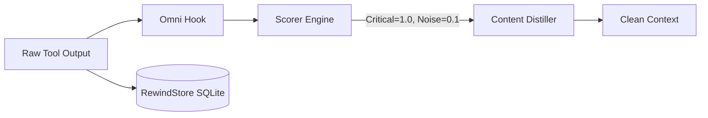

<div align="center">
  

<h1>OMNI</h1>
<p align="center">
    <em><b>Stop paying Claude to read 10,000 lines of terminal noise.</b> OMNI cuts <code>git</code> by 89%, <code>cargo</code> by 91% and <code>kubectl</code> by 77% before your agent ever sees them. Everything else passes through untouched. Nothing is ever lost, and it never invents a result.</em>
</p>

[🇺🇸 English](README.md) | [🇯🇵 日本語](i18n/README-ja.md) | [🇨🇳 简体中文](i18n/README-zh.md) | [🇸🇦 العربية](i18n/README-ar.md) | [🇮🇩 Bahasa Indonesia](i18n/README-id.md) | [🇻🇳 Tiếng Việt](i18n/README-vi.md) | [🇰🇷 한국어](i18n/README-ko.md)

[](https://github.com/fajarhide/omni/actions/workflows/ci.yml)
[](https://github.com/fajarhide/omni/releases)
  [](https://www.rust-lang.org/)
  [](https://modelcontextprotocol.io/)
  [](https://github.com/fajarhide/omni/blob/main/LICENSE)
  [](https://hits.sh/github.com/fajarhide/omni/)
</br></br>
<b>
<code>git</code> 89% &middot; <code>cargo</code> 91% &middot; <code>kubectl</code> 77% &middot; 21 ms per command &middot; 0 of 9,965 calls ever grew the output &middot; every cut recoverable byte for byte &middot; cross-session memory </b>

</br></br>

```bash
brew install fajarhide/tap/omni && omni init
```

Works with Claude Code, Cursor, Windsurf, Codex and Roo out of the box.

</br>

</div>

---

Every AI coding assistant has two massive problems.

**1. They read everything.**  
Build logs.  
Docker logs.  
CI logs.  
Progress bars.  
ANSI colors.  
Thousands of tokens... to find one line. Claude isn't expensive. Your terminal is.

**2. They forget everything.**  
Every time you restart Cursor, or switch from Claude Code to Windsurf, your agent gets amnesia. You have to re-explain the project goal. You have to remind them of the same framework gotchas over and over again.

OMNI fixes both.

---

## The Difference

**Problem 1: Your terminal drowns out the signal**

The same `git log` side by side. Without OMNI, one commit's `Author` / `Date` /
body already fills the screen. With OMNI, **every commit is kept**, as one
`hash subject` line, 94% smaller. Nothing is summarised away; the footer is
measured from the real byte counts, not promised.

<table>
<tr>
<td align="center"><b>Without OMNI</b><br/><sub>raw <code>git log -15</code></sub></td>
<td align="center"><b>With OMNI</b><br/><sub>every commit kept, 94% smaller</sub></td>
</tr>
<tr>
<td valign="top"></td>
<td valign="top"></td>
</tr>
</table>

Real numbers, measured on `tests/fixtures/` and replayed traces, not aspirations:

| Command | Without OMNI | With OMNI | Saved |
|---|---|---|---|
| `cargo test` (490 passed, 10 failed) | 16.5 KB of per-test output | the runner's own pass/fail summary | **92.9%** |
| `git status` (dirty) | 496 B of porcelain | the branch and the changed paths | **61.7%** |
| `docker build` (heavy cache noise) | 9.2 KB of layer hashes and progress bars | the build result, cache hits folded | **35.9%** |
| `git diff` (multi-file) | lockfiles, whitespace, generated churn | the code that actually changed | **25.2%** |
| `kubectl get pods` (35 pods, 5 crashing) | the full table | the full table | **0%**, by design |

Every figure above is the **delivered** payload, which includes the ~77 byte
retrieval marker OMNI attaches whenever it drops anything. Earlier releases
quoted the distiller's output before that marker, which flattered small payloads:
`git diff` reads 25.2% here and 44.6% without it. The marker is what makes the
cut reversible, so it belongs in the number.

`kubectl get pods` is the interesting row. It used to report 9.3%; it now reports
nothing at all, because a pod table is an enumeration where every row is a datum
and there is no noise to drop. Losing that 9.3% was the fix.

> **Where it does nothing, on purpose.** A command that fails is passed through verbatim, because a hidden error costs more than an uncompressed one. Structured output (JSON, YAML, CSV) is never touched, because the next step in your pipeline is going to parse it. OMNI earns its keep on repetitive tool chatter and gets out of the way everywhere else, which is what makes it safe to leave on for every command you run.

### Nothing is ever lost. It never makes something up.

Two promises, and both are in the code rather than in this paragraph.

**Nothing is ever lost.** Every byte OMNI cuts is archived locally in the RewindStore, keyed by SHA-256. The agent gets a hash with the distilled output and can call `omni_retrieve` to pull the original back byte for byte, mid-conversation, without re-running your command.

**It never makes something up.** A distiller that recognises nothing in its input returns the raw input. That is a type, not a convention: `distill` returns `Option<String>` and the routing layer falls back to the original whenever it gets `None`. There is no code path that produces a green "no errors" line OMNI did not read.

Every other compressor asks you to *trust* that what it cut didn't matter. OMNI hands you the receipt:

| Guarantee | How | Proof |
|---|---|---|
| **Get the original back, byte-for-byte** | everything cut is archived in a local SQLite **RewindStore** (SHA-256 → content); the agent gets a hash and calls `omni_retrieve` | [`How it works`](#how-it-works) |
| **Never fabricates a result** | a distiller that parsed no signal returns the raw output, never a green `no errors` / `passed` string | [#143](https://github.com/fajarhide/omni/issues/143) |
| **Failures are never masked** | a command that exits non-zero passes through verbatim | [#120](https://github.com/fajarhide/omni/issues/120) |
| **Structured data is never touched** | JSON / YAML / NDJSON / CSV pass through byte-for-byte | `pipeline::format` |
| **Numbers are measured, not aspirational** | 9,965 real traces replayed on the release binary, and 90.0% of calls net zero, which we publish too | [`Benchmarks`](#benchmarks) |

That is the one thing a bigger compression number can't buy: **you can always recover the original, and it will never lie to your agent.**

**Problem 2: Your agent forgets everything overnight**

### Starting a new session
**Without OMNI:** "Please re-explain the project structure, the auth module is broken, and we use Postgres not MySQL."  
**With OMNI:** The agent already knows. It picks up where you left off.

### Fixing the same bug twice
**Without OMNI:** Agent hits the same framework gotcha it already solved yesterday because it has no memory.  
**With OMNI:** The fix is already stored. The agent surfaces it through the `omni_recall` MCP tool before it repeats the mistake.

### Multi-IDE workflows (Cursor → Claude Code)
**Without OMNI:** New IDE, new agent, zero context. You're starting from scratch.  
**With OMNI:** Session summary is injected automatically. New agent is immediately up to speed.

---

## Why This Matters

The code you *don't* send to the AI is just as important as the code you do.

When you feed an AI megabytes of terminal noise, it suffers from context bloat, hallucinating fixes for the wrong warnings and burning your API budget on irrelevant output.

When you restart an agent and it has no memory, you lose hours re-establishing context that should have been preserved automatically.

OMNI solves both, invisibly:

* **Less noise** → lower cost, and less irrelevant output for the model to trip over.
* **Format-safe by design** → JSON, YAML, NDJSON and CSV pass through byte-for-byte; a distiller that can't parse its input stays quiet instead of fabricating a summary.
* **Persistent memory** → no more re-explaining your project, no more repeating fixes.
* **One install** → works silently with every agent you already use.

---

## Benchmarks

Measured on the release binary by replaying **9,965 real command executions** from
one developer's actual usage (`cargo test --release --test bench_replay -- --ignored`):

* **On the commands that actually generate noise, 76 to 91%.** `cargo` 91.4%,
  `git` 89.2%, `kubectl` 76.5%. That is where your context budget goes, and that
  is where OMNI works.
* **OMNI acts on 1 command in 10, and adds zero bytes to the other 9.** It is a
  filter, not a summariser. When there is nothing to cut it gets out of the way
  completely, which is why it is safe to leave on for everything.
* **Not one call in 9,965 made the output larger.** That is the number worth
  checking in any tool of this kind, and it is printed by the same harness.
* **43.3% fewer bytes** across the entire mix, noisy and quiet commands together
  (40.1 MB → 22.7 MB).
* **Structured output is never touched.** JSON, YAML, NDJSON and CSV pass through
  byte-for-byte, because a corrupted payload costs more than a missed compression.

The corpus counts only calls whose result reached a model. Terminal output is
excluded: it is 68% of the raw bytes on this installation, and including it would
let us print 79.1% instead of 43.3%. We don't, because that number is measuring a
population no model ever read.

Most tools in this category publish a single big percentage. We publish the share
of calls where we did nothing, because a tool that claims 90% on every command is
telling you it summarised something you needed.

<div align="center">

</div>

Where the saving actually comes from, over the same 9,965 executions:

| Command | Calls | Input | Output | Saved |
|---------|-------|-------|--------|-------|
| `cargo` | 124 | 1.5 MB | 127 KB | **91.4%** |
| `git` | 931 | 12.0 MB | 1.3 MB | **89.2%** |
| `kubectl` | 456 | 5.5 MB | 1.3 MB | **76.5%** |
| `az` | 62 | 264 KB | 176 KB | **33.6%** |
| `grep` | 938 | 2.4 MB | 2.0 MB | **18.1%** |
| `gh` | 232 | 534 KB | 509 KB | **4.6%** |
| `cd` | 2,963 | 5.6 MB | 5.5 MB | **2.2%** |
| `cat`, `ls`, `find`, `sed`, `python3` | 1,235 | 4.2 MB | 4.2 MB | **0%** |

`git`, `cargo` and `kubectl` carry the entire result. The last row is the point
of the table: five of the most-run commands are now deliberate passthroughs,
because their output is an enumeration where every line is a datum. They used to
report savings, and each of those savings was a row someone needed.

Single fixtures from `tests/fixtures/`, if you want to reproduce one by hand:

| Command / Context | Input | Delivered | Saved |
|-------------------|-------|-----------|-------|
| `cargo build` (large, successful) | 3,220 B | 87 B | **97.3%** |
| `cargo test` (490 passed, 10 failed) | 16,515 B | 1,178 B | **92.9%** |
| `git status` (dirty) | 496 B | 190 B | **61.7%** |
| `docker build` (heavy noise) | 9,207 B | 5,904 B | **35.9%** |
| `git diff` (multi-file) | 397 B | 297 B | **25.2%** |
| `kubectl get pods` (mixed) | 840 B | 840 B | **0%** |

"Delivered" is what the agent receives, marker included. Subtract the ~77 byte
retrieval marker and these match the figures earlier releases published; the
marker is counted here because the agent pays for it.

**21 ms per command.** That is the whole pipeline end to end through the post-hook,
and it grows with your history rather than with the payload. Median of 12 runs
each, release binary:

| | fresh database | 205 MB database |
|---|---|---|
| `git status` (496 B) | **21.1 ms** | **60.7 ms** |
| `cargo test` (16.5 KB) | **24.5 ms** | **64.5 ms** |

Payload size barely matters; database size does. Earlier releases measured 82 ms
and 276 ms on a fresh database, and the difference is three fixes rather than a
faster machine: a GPT tokenizer that was loaded per command for a reporting
column, 249 line-filter regexes compiled whether or not their filter matched, and
a connection pool opening four SQLite handles in a process that exits after one
payload.

*To see your own actual token savings, just run `omni stats` after a few days of usage.*


---

## Quick Start & Installation

Omni is incredibly easy to set up. It natively integrates into your terminal.

**macOS / Linux:**
```bash
# 1. Install via Homebrew
brew install fajarhide/tap/omni

# 2. Setup Omni (Interactive Menu for Claude, VS Code, OpenCode, Codex, Antigravity)
omni init

# 3. Verify it's working
omni doctor

# 4. Or auto-fix any issues
omni doctor --fix

# 5. Check Current Status
omni init --status
```

**Universal Installer (macOS / Linux / WSL):**
```bash 
curl -fsSL omni.weekndlabs.com/install | bash
```

**Windows (PowerShell):**
```powershell
irm omni.weekndlabs.com/install.ps1 | iex
```

---

## Integrations

OMNI works seamlessly with the agentic tools you already use. It intercepts their terminal executions automatically.

* Claude Code
* Cursor
* Windsurf
* Roo Code
* OpenAI Codex
* Antigravity CLI

---

## Adaptive Memory OS

OMNI isn't just a terminal filter. It's a cure for AI amnesia.

If you've ever worked with an AI agent for more than an hour, you know the pain of context loss. You restart the agent, and suddenly it forgets what you were working on. It forgets the project goal. It starts making the exact same mistakes it made yesterday because it forgot the repository's undocumented quirks.

OMNI's Memory OS runs silently in the background to solve this:

* **Stop Re-Explaining the Goal (`omni goal`)**: Set your North Star objective once. OMNI will relentlessly remind the agent of this exact priority on every single prompt, preventing it from drifting off-task.
* **Never Lose Your Train of Thought (Session Continuity)**: If Cursor crashes or you switch to Claude Code, OMNI instantly injects a compressed summary of your last session. The new agent knows exactly which files were hot and what the last active error was, picking up right where you left off.
* **Teach It Once (`omni remember`)**: Stop fixing the same hallucination. Agents can save project-specific rules, gotchas, and architecture decisions directly into OMNI's local SQLite backend. When they get stuck later, they automatically pull the exact answer back out via semantic search.

Your agent gets smarter about your codebase every single day, and you never have to repeat yourself again.

---

## How it works

Omni operates purely locally using a deterministic `Read → Guard → Score → Collapse → Distill → Persist` pipeline.


```mermaid
flowchart LR
    Command[Raw Tool Output] --> Hook[Omni Hook]
    Hook --> Score[Scorer Engine]
    Score -->|Critical=1.0, Noise=0.1| Distill[Content Distiller]
    Distill --> Clean[Clean Context]
    Command --> SQLite[(RewindStore SQLite)]
```

If the AI *really* needs the dropped noise, OMNI's local SQLite **RewindStore** keeps the full uncompressed log safely hashed, allowing the agent to retrieve it anytime.

---

## Architecture


<div align="center">
  
</div>

Built in Rust, though the end-to-end cost is not zero.

* **Distillation**: the scoring and collapsing pipeline itself runs in single-digit milliseconds.
* **End to end**: what you actually wait for is that plus the RewindStore write, and it grows with your history: about 21 ms against a fresh database and 61 ms against a 205 MB one. See [Benchmarks](#benchmarks) before you assume it is free.
* **Memory**: Operates via efficient streams, keeping memory usage flat even on 20,000-line logs.
* **Fail Open**: If OMNI panics, it fails silently and passes the raw output through. It will never crash your host agent.

```bash
# Development
cargo build --release
cargo test --all
make fmt && make clippy
```

---

## FAQ

**Does Omni permanently delete my logs?**  
No. The raw logs are compressed and stored locally in the SQLite RewindStore. The AI receives a hash and can retrieve the full log if needed.

**Will this slow down my terminal?**  
Yes, measurably, and the cost grows with your history rather than with the payload. A 496-byte `git status` takes about 21 ms against a fresh database and 61 ms against a 205 MB one; a 16.5 KB `cargo test` takes 24 ms and 65 ms respectively. Budget for it. `OMNI_PASSTHROUGH=1` skips the pipeline entirely when you need the raw output back.

**Can I add my own filters?**  
Yes. You can teach OMNI to strip noise specific to your internal tools using TOML:
```toml
# ~/.omni/signals/custom.toml
[filters.my_tool]
match_command = "^internal-tool\\b"
strip_lines_matching = ["^DEBUG", "syncing..."]
```

## Contributing & License

This is a passion project built for the era of Agentic AI. Whether you're here to save money on tokens, test out free models, or help build the ultimate agentic toolbelt, contributions are always welcome!

- **Development**: Want to build from source? Run `make ci` and `cargo build`. Read our [CONTRIBUTING.md](CONTRIBUTING.md) for details.
- **License**: [MIT License](LICENSE)

<!-- Star History -->
<p align="center">
  <a href="https://star-history.com/#fajarhide/omni&Date">
    <picture>
      <source media="(prefers-color-scheme: dark)" srcset="https://api.star-history.com/svg?repos=fajarhide/omni&type=Date&theme=dark" />
      <source media="(prefers-color-scheme: light)" srcset="https://api.star-history.com/svg?repos=fajarhide/omni&type=Date" />
      
    </picture>
  </a>
</p>
<center>
Build with ❤️ by [Fajar Hidayat](https://github.com/fajarhide)
</center>