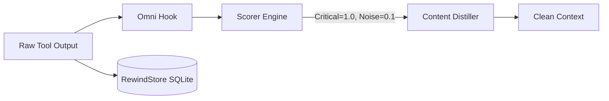
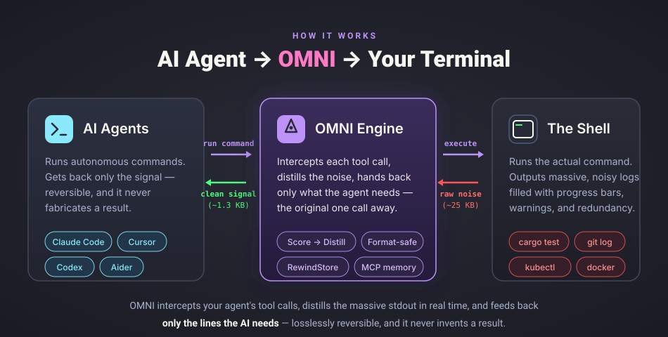

# How OMNI works

Local, deterministic, and the same input always produces the same output.



The pipeline is `Read → Guard → Score → Collapse → Distill → Persist`. Nothing
leaves your machine at any stage.

<div align="center">
  
</div>

## What it costs

Built in Rust, though the end-to-end cost is not zero.

* **Distillation**: the scoring and collapsing pipeline itself runs in single-digit
  milliseconds.
* **End to end**: what you actually wait for is that plus the RewindStore write, and
  it grows with your history: about 21 ms against a fresh database and 61 ms against
  a 205 MB one. See [Benchmarks](BENCHMARKS.md) before you assume it is free.
* **Memory**: operates via streams, so usage stays flat even on 20,000-line logs.
* **Fail open**: if OMNI panics it fails silently and passes the raw output through.
  It will never crash your host agent.

## RewindStore

Everything OMNI cuts is archived locally in SQLite, keyed by SHA-256. The agent
receives a handle alongside the distilled output and can run `omni retrieve <handle>`,
or call the `omni_retrieve` MCP tool where MCP is wired, to pull
the original back byte for byte, mid-conversation, without re-running your command.

Nothing is deleted. The cut is a view, not a destruction.

## Adaptive Memory OS

OMNI is not only a terminal filter. It also fixes the other half of the problem:
your agent forgetting everything between sessions.

* **`omni goal`**: set your objective once. OMNI reminds the agent of that exact
  priority on every prompt, so it does not drift off-task.
* **Session continuity**: if Cursor crashes or you switch to Claude Code, OMNI
  injects a compressed summary of your last session. The new agent knows which files
  were hot and what the last active error was.
* **`omni remember`**: agents save project-specific rules, gotchas and architecture
  decisions into the local SQLite backend, then pull them back out through semantic
  search when they get stuck later.

## Build from source

```bash
cargo build --release
cargo test --all
make ci
```

See [CONTRIBUTING.md](../CONTRIBUTING.md) and [DEVELOPMENT.md](DEVELOPMENT.md).
