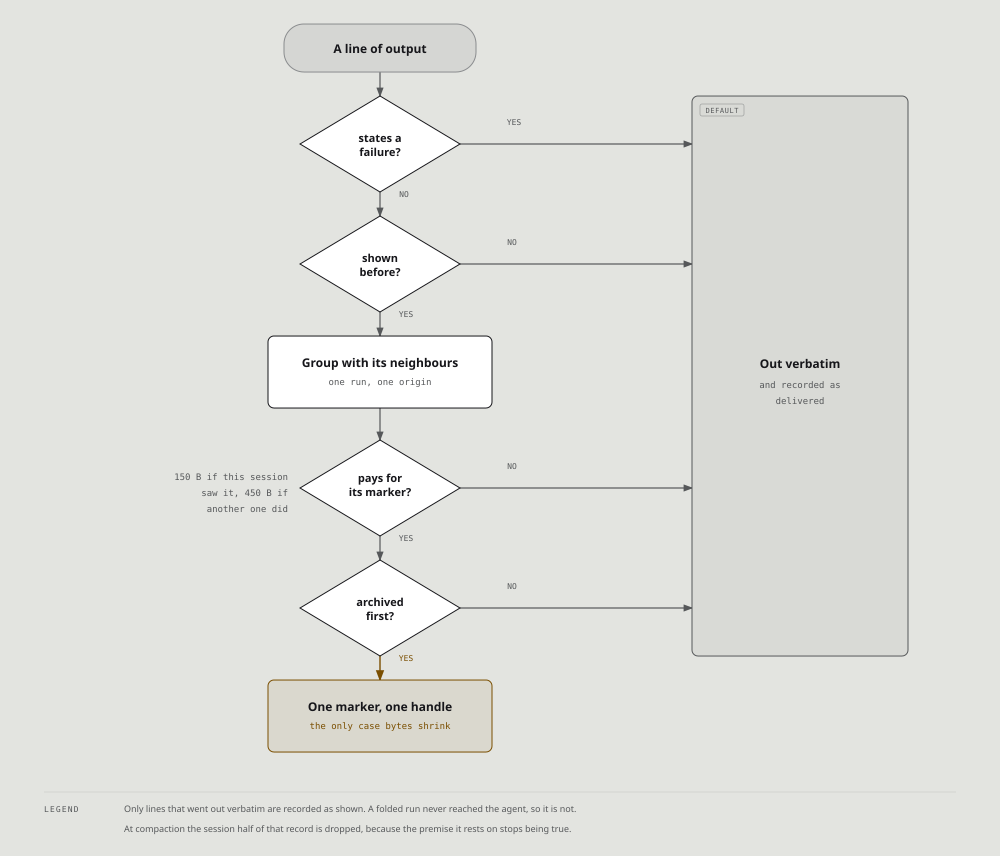

# The ledger

Every distiller answers the same question one command at a time: given this output,
what can be dropped.

The ledger answers a different one: given everything already shown in this session,
what is this output repeating.

The two are orthogonal, and on real corpora the second one is worth more. Replayed
over 6,656 traces, **22.9% of raw bytes were lines the agent had already been shown,
and 22.4% still were after every distiller had run.** Filtering barely dents
repetition, because repetition is not noise. Each line is perfectly good signal. It
is just signal that was already delivered.

## What it does

A run of consecutive lines that were all emitted earlier becomes one marker naming
the count and a handle. Everything else passes through byte for byte.

```
[OMNI: 40 lines already shown, omni retrieve bc7e821a4340073e]
```

It reaches the class nothing else can. File reads are the largest class in the
corpus, and the filters save **0.0%** of them, correctly: you cannot strip lines from
a file the agent asked to see without guessing which parts it meant. The ledger takes
25.0% of that same class without guessing anything, because those lines were already
delivered once.

## Two scopes, two different claims

They are not the same statement and the marker says which one it is making.

| origin | marker | what it means |
|---|---|---|
| session | `N lines already shown` | the agent is still holding these bytes, so the handle is free unless it chooses to re-read |
| project | `N lines from an earlier session` | these went to a different session of this project and this agent has **never seen them** |

The distinction is the whole reason the project scope exists. An earlier design
cancelled it on the grounds that a handle for another session's content is a lie,
which was right about the wording and wrong about the remedy: the fix is to stop
saying "already shown", not to stop remembering.

Because the project claim is not free, it carries a higher bar. A session-origin run
must save 150 bytes over its marker; a project-origin run must save three times that,
since the agent has no choice about paying a retrieval if it needs the content.

## The premise everything else follows from

> The agent is still holding these bytes.

That single statement is what licenses replacing forty lines with a handle. Every rule
below is either a consequence of it or a defence of the moment it stops being true.
When you find yourself asking why the ledger does something, ask what it would take
for the premise to be false, and the answer is usually there.

It is also why this is a cache invalidation problem and not a memory system. The
ledger does not store knowledge. It stores receipts.

## The flow, one command at a time



Structured payloads never get this far: the same format sniff that gates collapse gates
this stage too.

Two details are easy to read past and are the whole correctness story.

The archive happens **before** the marker, so a handle never names content that was
not stored. And what gets recorded is what was **delivered**, not what arrived: a run
that became a marker never reached the agent, so recording it would let the next
occurrence claim `already shown` about bytes nobody received. That was a real defect
([#465](https://github.com/fajarhide/omni/issues/465)) and it cut both ways, because
session origin charges a third of what project origin does, so the false claim also
made the ledger three times more willing to fold.

## How it remembers

Three verbs, and each one is a different table or a different trigger.

### Store

Two tables, on purpose.

| | holds | size |
|---|---|---|
| `ledger_lines` | `(scope, line_hash, ts, agent_id)` | 16 bytes of hash per line |
| `rewind_store` | the actual bytes of a folded run, keyed by their SHA-256 | the content, once per distinct block |

Recording every emitted line is cheap because the line itself is never stored, only
its hash. The content only goes to the archive when a handle is actually issued.

The hash is taken on the **trimmed** line, so the same line reached through `sed -n`
and through `cat` is one line rather than two.

**Recording is unconditional; folding is not.** A block is worth remembering because
it may show up again, not because it compressed today. So a command whose output is
entirely new still writes its lines, and pays for itself the next time.

### Retrieve

```sh
omni retrieve 3f7bfd89bc5d7cee
```

An exact lookup on a content address. There is no candidate set, no ranking, no
merging of results, and no search: one handle names one block of bytes. The handle is
derived from the content, so identical output is one row however many commands
produced it.

Nothing is ever pulled back automatically. The marker is a pointer, and the agent
decides whether the content is worth a retrieval. That is the trade the whole design
rests on: the worst case is not "the answer is gone", it is "the answer costs one
round trip".

Where MCP is wired the agent calls `omni_retrieve` itself. Otherwise it runs the shell
command the marker printed.

### Forget

Time, plus one event.

**At compaction, the session scope is dropped entirely.** Compaction is the moment
inside a session where the agent stops holding what it was shown, so every claim the
session scope could make becomes false at once. Forgetting costs a missed reduction.
Not forgetting means telling an agent it has content its context no longer contains,
which is the defect, not the cost.

**At 30 days, both scopes prune on the same window.** A session scope cannot outlive
its session, so the ordinary retention window already bounds it. The project scope is
the one that could grow without limit, and the honest bound on it is the same window:
content nobody has produced in a month is content this project has stopped emitting,
and a handle for it buys a retrieval of something the agent will not recognise either.

A repeat refreshes the timestamp rather than being ignored, so output that is still
being produced does not age out on the strength of when it was first seen.

There is no eviction by size, and that is deliberate. Evicting by size drops the
oldest rows of the busiest project first, which is exactly where the repeats are.

## What two agents in one repo share

The session scope is one agent's, because a host session id belongs to one host. The
**project scope is keyed on the working directory and nothing else**, so two agents
running in the same repository write into one history and read from it.

That is sharing by side effect rather than by design. Nothing in the ledger knows
which agent it is talking to, so a project-origin marker can hand agent B a handle for
lines only agent A was ever shown. The wording is still true, those lines did come
from an earlier session, and the higher bar means the trade is priced as a retrieval
either way. But `from an earlier session` reads as *your* earlier session, and it
might not be.

As of [#509](https://github.com/fajarhide/omni/issues/509) the agent is recorded on
every line, and nothing keys on it yet. The measurement decides that: keying the scope
on `(project, agent)` would end the cross-agent case together with whatever reuse in
it is genuinely free, and the corpus says the effect is currently latent rather than
live. The column is what makes it possible to ask.

## The rules it inherits

**Append-only.** It only ever shortens the output of the command in flight and never
rewrites anything already delivered. That is what keeps the upstream prompt cache
intact: a cache works on a prefix, so shortening the suffix costs nothing while
retroactive compaction would destroy it.

**Deterministic.** The same ledger state renders byte-identical output. The handle is
a content address and carries no timestamp. An earlier design used
`{timestamp}_{hash}` and made 4 of 73 repeated inputs emit different bytes.

**Nothing is lost.** Stated above and enforced by the order of two writes. The general
rule and what it costs are in [Nothing is deleted](nothing-is-deleted.md).

**Failures are never folded.** A line stating a failure is exempt however often it
has been shown. "You have seen this already" is sound for informational lines and
wrong for the error channel, where the repetition is the signal: the same TypeError
on a re-run means the bug is still there. Eliding it delivers source context and no
statement of what went wrong, which an agent reasonably reads as the failure being
fixed. Marking the line unseen rather than filtering it afterwards also splits the
run around it, so the frames either side still fold.

**Unknown means untouched.** Structured payloads never reach the ledger at all.

## What it is worth

From the same replay, the ledger is 12.2 points on top of OMNI's own filters and 11.4
points on top of a competitor's, which is the clearest statement that it is
orthogonal to whose patterns run:

| | bytes | saved |
|---|---|---|
| omni, filters only | 6,469,047 to 6,292,856 | 2.7% |
| rtk `pipe` | 6,469,047 to 6,067,012 | 6.2% |
| lean-ctx `compress` | 6,469,047 to 6,073,757 | 6.1% |
| omni, with the ledger | 6,469,047 to 5,506,627 | **14.9%** |
| rtk `pipe` + omni's ledger | 6,469,047 to 5,333,483 | 17.6% |

The last row is deliberate. A reader who wants the largest possible number would run
their filters with our ledger, and saying so is cheaper than being caught not saying
it.
