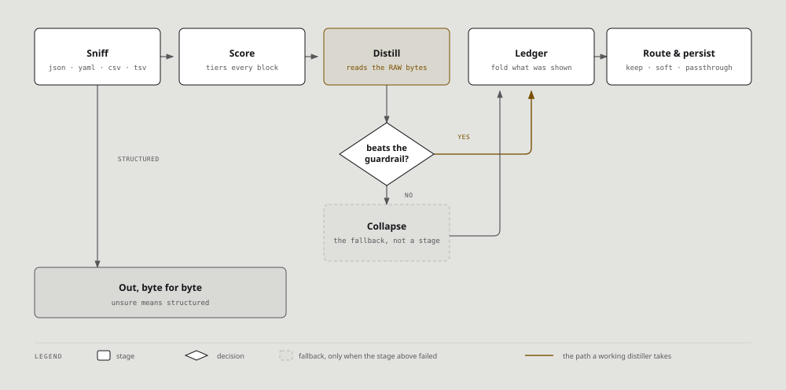

# The pipeline, stage by stage



```
Read → Guard → Score → Distill → [Collapse] → Ledger → Route → Persist
```

The order is fixed. This page is about what each stage may and may not do, which is
where the bugs live.

The brackets around Collapse are the part people get wrong, including this page until
recently. It is a fallback, not a step.

## Guard

`pipeline::format::sniff` classifies the payload. `Some(Structured)` ends the pipeline
and the bytes pass through.

Four kinds: JSON, YAML, CSV, TSV. The bias is deliberate: bracketed but unparseable,
truncated, or comment-bearing JSON all count as structured, because compression cannot
repair a malformed payload and can certainly make it worse.

Above a size threshold, bracket shape alone decides JSON, since a full `serde_json`
parse would blow the latency budget.

The YAML sniffer skips lines introduced by a block scalar indicator (`key: |`). One
embedded ConfigMap once sank a 608-line `kubectl kustomize` manifest: the block's
contents carried no `key:`, so the sniff said "not YAML" and the manifest went down
the lossy path.

## Score

`scorer::score_with_command(input, cmd, session)` returns `Vec<OutputSegment>` with
tiers: Critical 1.0, Important 0.7, Noise 0.1.

`semantic::is_critical` tiers the block **before** any distiller runs. When a distiller
behaves oddly, probe the segment tiers first; the tier may already have decided the
outcome, and a guard added to the distiller will not move it.

Pure function. No IO.

## Collapse

Runs of near-identical lines become `[N similar lines collapsed]`.

**It runs after Distill, and only when Distill did not earn its keep.** Both hooks
score and distill the **raw** content, then ask `beats_guardrail`; only if that fails
does the collapsed form get used instead. A distiller therefore sees the original
text, never collapse markers.

This page said the opposite until 0.7.4, which was true before #116 and wrong for two
releases after it. The behaviour is pinned by
`kubectl_table_distills_from_raw_not_collapse_markers`: the bug it guards against is a
column parser reading `[30 similar lines collapsed]` as a pod row.

**The mode is picked by specificity.** A `kubectl … | grep` payload exercises the
Infra path rather than the Log path, so a fixture chosen to test a collapse guard can
pass with the guard removed. Check which mode your fixture actually reaches.

## Distill

`registry::resolve_profile(command)` picks the distiller, then:

```rust
fn distill(&self, segments: &[OutputSegment], input: &str,
           session: Option<&SessionState>) -> Option<String>;
```

`Option`, and that is the whole design. A distiller that parsed nothing returns `None`
and the caller hands back the raw bytes. The invariant lives in the trait rather than
in each author remembering to call a helper, so it holds for all 12 by construction.

The TOML layer that used to short-circuit this stage was retired in 0.7.4, so the Rust
code is now the only thing that can claim a command.

## The ledger

After distillation, `ledger::Ledger` replaces runs of lines the scope has already been
shown with a handle. Gated on the same format sniff as collapse.

It is append-only, which is what keeps the upstream prompt cache intact: a cache works
on a prefix, so shortening the suffix costs nothing while retroactive compaction would
destroy it.

See [The ledger](../concepts/the-ledger.md) for the two scopes and their different
claims.

## Persist

The raw input is archived by SHA-256 and the marker carries the handle.

Order matters and is not negotiable: **archive, then write the marker.** A failed
archive leaves the run verbatim. Doing it the other way round produces, on any write
failure, a marker pointing at content that was never stored.

Recording is unconditional even when the projection saved nothing, because a block is
worth remembering in case it is seen again.

## Two doors, one pipeline

`hooks/post_tool.rs` and `hooks/pipe.rs` both run these stages. Keeping them in step
is a live maintenance problem: three separate fixes each corrected one copy and left
the other, and the ledger stage existed in one for a release before the other had it
at all.

Change both, or write down why not.

## Adding a stage

Do not, unless the measurement says so. The pipeline earns its shape from a replay
harness, and the useful pattern is to price a proposal before building it:

- "Route a pipeline by its last stage" sounds obviously right, and would have handed
  871 of 1,035 recorded pipelines to `head`, `tail` or `sed`, all verbatim
  passthroughs, stopping distillation on them entirely.
- Quote-aware chain splitting keeps 205 of 2,928 routed commands, which is what
  justified 25 lines of scanner over a 5-line naive split.
- An import-graph signal for the scorer sized at 196 traces, until the graph itself
  turned out to be wrong. Corrected, it sized at 26, against a 542 ms build on a 10 ms
  budget.

A measurement that kills a design is the measurement working.
