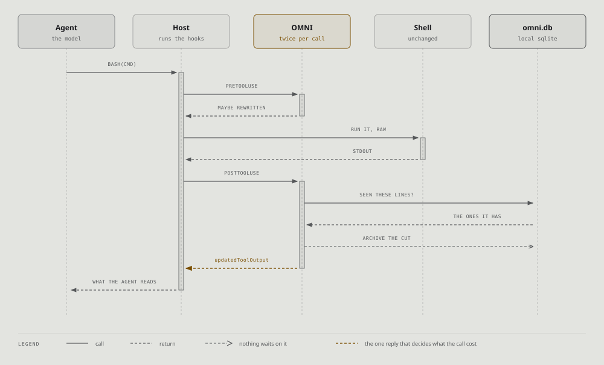

# Hooks

The entry points an agent host invokes. You never type these; `omni init` writes them
into the host's configuration.

| entry point | when the host calls it |
|---|---|
| `omni --pre-hook` | Before a tool runs |
| `omni --post-hook` | After a tool produces output |
| `omni --hook` | Universal dispatcher, for hosts with one hook slot |
| `omni --session-start` | Session begins |
| `omni --session-end` | Session ends |
| `omni --pre-compact` | Before the host compacts the conversation |
| `omni --mcp` | Run as an MCP server over stdio |
| `cmd \| omni` | Pipe mode, no host involved |

## One call, both hooks



The shell runs whatever the pre-hook handed it and never knows OMNI exists. Only the
reply is rewritten, which is why nothing here can change what your command did.

## What each one does

**Pre-tool** decides whether a command should be routed through OMNI at all, and can
rewrite it into `omni exec`. That rewrite wraps the **entire** command string,
redirection included, which is why a matched command's log file on disk can turn out
to be the distilled version. Break the prefix (`env cargo test`) when you need the raw
log.

**Post-tool** is the main event: the raw output arrives, the pipeline runs, and the
distilled result is handed back for the host to substitute.

**Post-tool-failure** exists because a failed command must pass through verbatim, and
hosts disagree wildly about how they say a command failed. Claude Code sends a plain
string, `Error: Exit code N`. Others carry structured error flags. Reading only one
shape is a bug this project has had.

**Session start** injects project context: hot files, the last active error, stored
knowledge, the pinned goal.

**Session end** writes the summary and can export CSV.

**Pre-compact** is the host's warning that the conversation is about to be shortened.

## Two doors into one pipeline

`post_tool` and `pipe` are separate entry points that run the same stages, and keeping
them in step has been a recurring source of bugs. Three separate fixes each corrected
one copy and left the other. The ledger stage existed in `post_tool` for a release
before `pipe` had it at all, so a command the pre-hook rewrote into `omni exec` got
the filters and nothing else.

If you are changing pipeline behaviour, change both, or check why not.

## Why it never crashes your agent

Every hook runs inside `catch_unwind`, at the highest entry point. A panic in one
stage costs that distillation, not the session. A database that will not open costs
session context, not the pipeline.

That is the **fail open** rule, and it has one sharp edge worth stating: failing open
means handing back the raw bytes. It does not mean emitting a cheerful summary. A
distiller that parsed nothing returning `0 tests passed` is failing **closed**, and
confidently.

## What a host has to do for any of this to matter

Register the hook, and then honour what it returns.

The second half is not guaranteed. OMNI once emitted its distilled output under a key
Claude Code ignores, so nothing was applied on that path for two releases while OMNI
recorded a saving and printed a footer for each one. The fix corrected the key and
left the value shape wrong, and the symptom survived unnoticed.

Two things that taught, both non-obvious:

- The rewrite is validated against **the host tool's own output schema**, one shape per
  tool. There is no universal shape.
- The fields are independent. A rejected rewrite still lets the context message
  through, so the savings footer prints for a distillation that was reverted.

So the proof that a hook is working is not the footer and it is not `omni stats`. It
is the host's own session transcript:

```sh
grep -c hook_error_during_execution ~/.claude/projects/<project>/<session>.jsonl
```

A warning you can see is not a warning the agent can see. Those attachments never
enter the model's context, so an agent can tell you the hook is fine while your
terminal fills with rejections.

## Testing a hook by hand

Feed it a payload directly rather than guessing which path ran:

```sh
echo '<host payload json>' | omni --post-hook
```

`omni exec` and the post-hook route differently, so a result from one is not evidence
about the other.

### The payload shape, which differs per tool

Getting this wrong fails silently and identically: the hook exits 0, prints nothing, and a
probe reads that as `0.0% saved`. There is no error to notice, so a distiller that is in
fact cutting 96% can be written off as not firing.

`Bash` puts the output at the top of `tool_response`:

```json
{ "session_id": "s1", "tool_name": "Bash",
  "tool_input":    { "command": "cat server.log" },
  "tool_response": { "content": "line one\nline two\n" } }
```

`Read` wraps it in `file`, and the extra keys are not decoration. `startLine` is what the
host counts `cat -n` numbering from, so a fold that removes lines above the survivors has
to move it:

```json
{ "session_id": "s1", "tool_name": "Read",
  "tool_input":    { "path": "notes.txt" },
  "tool_response": { "file": { "filePath": "notes.txt", "content": "...",
                               "startLine": 1, "numLines": 40, "totalLines": 400 } } }
```

The reply mirrors whichever shape arrived, under `hookSpecificOutput.updatedToolOutput`.
Claude Code validates it against **the host tool's own output schema**, so a `Bash`
rewrite carries `content` and a `Read` rewrite carries `file.content`.

**Both `Read` shapes are real and they reach different stages.** A `Read` payload written
with a bare `tool_response.content` is accepted and reaches the ledger, while
`tool_response.file.content` reaches the `readfile` distiller and the `startLine`
adjustment. Neither is wrong; they answer different questions. A probe aimed at one and
built on the other returns a clean nothing and looks like a verdict.
