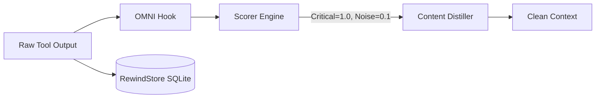

<div align="center">
  

<h1>OMNI</h1>
<p align="center" dir="rtl">
    <em>سياق مُزيل للضوضاء وذاكرة طويلة الأمد لوكيل الذكاء الاصطناعي لديك. <b>فقدان جزئي، لكنه دائمًا قابل للاسترجاع، ولا يختلق نتيجة أبدًا.</b> توقّف عن الدفع مقابل أن يقرأ Claude عشرة آلاف سطر من ضوضاء الطرفية.</em>
</p>

[🇺🇸 English](../README.md) | [🇯🇵 日本語](README-ja.md) | [🇨🇳 简体中文](README-zh.md) | [🇸🇦 العربية](README-ar.md) | [🇮🇩 Bahasa Indonesia](README-id.md) | [🇻🇳 Tiếng Việt](README-vi.md) | [🇰🇷 한국어](README-ko.md)

[](https://github.com/fajarhide/omni/actions/workflows/ci.yml)
[](https://github.com/fajarhide/omni/releases)
  [](https://www.rust-lang.org/)
  [](https://modelcontextprotocol.io/)
  [](https://github.com/fajarhide/omni/blob/main/LICENSE)
  [](https://hits.sh/github.com/fajarhide/omni/)
</br></br>
<b dir="rtl">
‏58.9٪ توكنز أقل على مزيج أوامر حقيقي &middot; ذاكرة عابرة للجلسات &middot; آمن على التنسيق &middot; قابل للاسترجاع دائمًا &middot; يفشل مفتوحًا ولا يختلق &middot; أرقام يمكنك إعادة إنتاجها </b>

</br></br>

</div>

---

<div dir="rtl">

لكل مساعد برمجة بالذكاء الاصطناعي مشكلتان كبيرتان.

**1. إنه يقرأ كل شيء.**  
سجلات البناء.  
سجلات Docker.  
سجلات CI.  
أشرطة التقدم.  
ألوان ANSI.  
آلاف التوكنز، للعثور على سطر واحد. ليست تكلفة Claude هي المرتفعة، بل طرفيتك.

**2. إنه ينسى كل شيء.**  
في كل مرة تعيد فيها تشغيل Cursor، أو تنتقل من Claude Code إلى Windsurf، يفقد وكيلك ذاكرته. تعيد شرح هدف المشروع من جديد، وتذكّره بالمطبّات نفسها في إطار العمل مرة بعد مرة.

يعالج OMNI الأمرين معًا.

</div>

---

## الفرق

<div dir="rtl">

**المشكلة الأولى: طرفيتك تُغرِق الإشارة**

نفس أمر `git log` جنبًا إلى جنب. بدون OMNI، يملأ حقل `Author` و`Date` ونص رسالة
كوميت واحدة الشاشة. مع OMNI، **تبقى كل كوميت موجودة**، بسطر واحد على هيئة
`hash subject`، وبحجم أصغر بنسبة 94٪. لم يُلخَّص شيء بعيدًا؛ والرقم في التذييل مقيس
من عدد البايتات الحقيقي، لا موعود به.

</div>

<table>
<tr>
<td align="center"><b>بدون OMNI</b><br/><sub><code>git log -15</code> خام</sub></td>
<td align="center"><b>مع OMNI</b><br/><sub>كل كوميت محفوظة، أصغر بنسبة 94٪</sub></td>
</tr>
<tr>
<td valign="top"></td>
<td valign="top"></td>
</tr>
</table>

<div dir="rtl">

أرقام حقيقية، مقيسة على `tests/fixtures/` وعلى تتبّعات أُعيد تشغيلها، لا طموحات:

</div>

| الأمر | بدون OMNI | مع OMNI | التوفير |
|---|---|---|---|
| `cargo test` (نجح 490، فشل 10) | ‏16.5 كيلوبايت من مخرجات كل اختبار | ملخّص النجاح والفشل من المُشغّل نفسه | **93٪** |
| `kubectl get pods` (‏35 pod، 5 متعطّلة) | الجدول كاملًا | `35 pods \| 30 running, 5 error` مع تسمية الـ pods الخمسة الفاشلة | لا اقتطاع |
| `git diff` (ملفات متعددة) | ملفات القفل والمسافات والتغييرات المولّدة | الشيفرة التي تغيّرت فعلًا | **45٪** |
| `docker build` (ضوضاء تخزين مؤقت كثيفة) | ‏9.2 كيلوبايت من تجزئات الطبقات وأشرطة التقدم | نتيجة البناء، مع طيّ إصابات الذاكرة المؤقتة | **37٪** |

<div dir="rtl">

> **التحفّظ الصادق:** يضغط OMNI المخرجات *الناجحة لكن المزعجة*. أما الأمر الذي **يفشل** فيمرّ **حرفيًا**، لأن خطأً مخفيًا أسوأ من خطأ غير مضغوط، والمخرجات المهيكلة (JSON/YAML/CSV) لا تُمسّ أبدًا. يكسب مكانه في ثرثرة الأدوات المتكررة، ويبتعد عن الطريق في كل ما عداها.

### لماذا يمكن الوثوق بأداة ذات فقدان جزئي

يطلب منك كل ضاغط آخر أن *تثق* بأن ما اقتطعه لم يكن مهمًا. أما OMNI فلا يطلب، بل يضمن، وكل ضمانة تسندها شيفرة يمكنك قراءتها:

</div>

| الضمانة | كيف | الدليل |
|---|---|---|
| **استعادة الأصل بايتًا ببايت** | كل ما يُقتطع يُؤرشف في **RewindStore** المحلي على SQLite (من SHA-256 إلى المحتوى)؛ يتلقى الوكيل تجزئة ويستدعي `omni_retrieve` | [`كيف يعمل`](#كيف-يعمل) |
| **لا يختلق نتيجة أبدًا** | المُقطِّر الذي لم يحلّل أي إشارة يعيد المخرجات الخام، لا سطرًا أخضر مثل `no errors` أو `passed` | [#143](https://github.com/fajarhide/omni/issues/143) |
| **لا يُخفي الإخفاقات أبدًا** | الأمر الذي ينتهي برمز خروج غير صفري يمرّ حرفيًا | [#120](https://github.com/fajarhide/omni/issues/120) |
| **لا تُمسّ البيانات المهيكلة** | ‏JSON و YAML و NDJSON و CSV تمرّ بايتًا ببايت | `pipeline::format` |
| **الأرقام مقيسة لا مأمولة** | ‏1,810 تتبّعات حقيقية أُعيد تشغيلها على الملف التنفيذي للإصدار، و63.6٪ من الاستدعاءات لم توفّر شيئًا، وهو رقم ننشره أيضًا | [`القياسات`](#القياسات) |

<div dir="rtl">

هذا ما لا تشتريه نسبة ضغط أكبر: **يمكنك دائمًا استعادة الأصل، ولن يكذب على وكيلك أبدًا.**

**المشكلة الثانية: وكيلك ينسى كل شيء بين ليلة وضحاها**

### بدء جلسة جديدة
**بدون OMNI:** «من فضلك أعد شرح بنية المشروع، وحدة المصادقة معطّلة، ونحن نستخدم Postgres لا MySQL.»  
**مع OMNI:** الوكيل يعرف مسبقًا، ويكمل من حيث توقفت.

### إصلاح العلة نفسها مرتين
**بدون OMNI:** يصطدم الوكيل بمطبّ إطار العمل الذي حلّه بالأمس، لأنه بلا ذاكرة.  
**مع OMNI:** الإصلاح مخزّن سلفًا، ويستخرجه الوكيل عبر أداة MCP المسماة `omni_recall` قبل أن يكرّر الخطأ.

### العمل عبر أكثر من محرر (من Cursor إلى Claude Code)
**بدون OMNI:** محرر جديد، ووكيل جديد، وسياق صفر. تبدأ من الصفر.  
**مع OMNI:** يُحقن ملخّص الجلسة تلقائيًا، فيلحق الوكيل الجديد بالركب فورًا.

</div>

---

## لماذا يهم هذا

<div dir="rtl">

الشيفرة التي *لا* ترسلها إلى الذكاء الاصطناعي لا تقلّ أهمية عن التي ترسلها.

حين تُطعم النموذج ميغابايتات من ضوضاء الطرفية، يعاني من تضخّم السياق: يهلوس إصلاحات لتحذيرات خاطئة، ويحرق ميزانية الـ API على مخرجات لا صلة لها.

وحين تعيد تشغيل الوكيل بلا ذاكرة، تخسر ساعات في إعادة بناء سياق كان ينبغي حفظه تلقائيًا.

يحلّ OMNI الأمرين، دون أن يظهر:

* **ضوضاء أقل** تعني تكلفة أقل، ومخرجات أقل تشوّش النموذج.
* **آمن على التنسيق بحكم التصميم**: تمرّ JSON و YAML و NDJSON و CSV بايتًا ببايت؛ والمُقطِّر الذي يعجز عن تحليل مدخلاته يصمت بدل أن يختلق ملخصًا.
* **ذاكرة دائمة**: لا إعادة شرح لمشروعك، ولا تكرار للإصلاح نفسه.
* **تثبيت واحد**: يعمل بصمت مع كل وكيل تستخدمه بالفعل.

</div>

---

## القياسات

<div dir="rtl">

الرقم الرئيسي الصادق، مقيسًا على الملف التنفيذي للإصدار مقابل **1,810 تنفيذًا حقيقيًا
للأوامر** أُعيد تشغيلها من استخدام فعلي لمطوّر واحد:

* **‏58.9٪ بايتات أقل** تصل إلى النموذج عبر المزيج كله (من 15.0 ميغابايت إلى 6.2 ميغابايت).
* **‏63.6٪ من تلك الاستدعاءات لم توفّر شيئًا على الإطلاق.** أعاد OMNI المخرجات كما هي،
  دون إضافة **أي** بايت. كل التوفير يأتي من الـ 36.4٪ الباقية، حيث وُجدت ضوضاء حقيقية
  تستحق القصّ.
* **المخرجات المهيكلة لا تُمسّ أبدًا.** تمرّ JSON و YAML و NDJSON و CSV بايتًا ببايت،
  لأن حمولة تالفة أغلى من ضغطة فائتة.

النقطة الثانية هي الرقم الذي نادرًا ما تطبعه الأدوات المشابهة. الأداة التي تدّعي توفير
90٪ من كل أمر تخبرك بأن المخرجات التي تحتاجها قد لُخِّصت هي الأخرى.

</div>

<div align="center">

</div>

<div dir="rtl">

من أين يأتي التوفير فعلًا، عبر الـ 1,810 تنفيذًا نفسها:

</div>

| الأمر | الاستدعاءات | المدخل | المخرج | التوفير |
|---------|-------|-------|--------|-------|
| `cargo` | 29 | 424 KB | 13 KB | **96.8%** |
| `git` | 256 | 5.9 MB | 509 KB | **91.3%** |
| `ls` | 52 | 71 KB | 29 KB | **59.5%** |
| `kubectl` | 212 | 4.4 MB | 2.3 MB | **48.0%** |
| `find` | 39 | 83 KB | 53 KB | **36.2%** |
| `grep` | 184 | 534 KB | 385 KB | **27.8%** |
| `cat` | 85 | 515 KB | 468 KB | **9.1%** |

<div dir="rtl">

يحمل `git` و`cargo` النتيجة، بينما `cat` و`grep` شبه بلا أثر. يكسب OMNI مكانه في
مخرجات الأدوات المزعجة والمتكررة، ويبتعد عن الطريق في ما عداها.

عيّنات مفردة من `tests/fixtures/` إن أردت إعادة إنتاج واحدة يدويًا:

</div>

| الأمر / السياق | المدخل | المخرج | التوفير |
|-------------------|-------|--------|-------|
| `cargo build` (كبير وناجح) | 3,220 B | 9 B | **99.7%** |
| `cargo test` (نجح 490، فشل 10) | 16.5 KB | 1,100 B | **93.3%** |
| `pytest` (به إخفاقات) | 730 B | 136 B | **81.4%** |
| `git status` (به تغييرات) | 496 B | 113 B | **77.2%** |
| `git diff` (ملفات متعددة) | 397 B | 220 B | **44.6%** |
| `docker build` (ضوضاء كثيفة) | 9.2 KB | 5.8 KB | **37.2%** |
| `kubectl get pods` (مختلط) | 840 B | 762 B | **9.3%** |

<div dir="rtl">

**زمن الاستجابة تكلفة حقيقية لا صفر.** يعمل OMNI على كل أمر مربوط بخُطّاف، والثمن
يكبر مع تاريخك: يستغرق `git status` بحجم 496 بايت نحو 82 ميلي ثانية مقابل قاعدة بيانات
جديدة، ونحو 308 ميلي ثانية مقابل قاعدة بحجم 97 ميغابايت. ويستغرق `cargo test` بحجم
16.5 كيلوبايت نحو 276 ميلي ثانية. ضَعْ ذلك في الحسبان.

*لرؤية توفيرك الفعلي من التوكنز، شغّل `omni stats` بعد أيام من الاستخدام.*

</div>


---

## البدء السريع والتثبيت

<div dir="rtl">

إعداد OMNI سهل للغاية، وهو يتكامل مع طرفيتك بشكل أصيل.

</div>

**macOS / Linux:**
```bash
# 1. التثبيت عبر Homebrew
brew install fajarhide/tap/omni

# 2. إعداد OMNI (قائمة تفاعلية لـ Claude و VS Code و OpenCode و Codex و Antigravity)
omni init

# 3. التحقق من أنه يعمل
omni doctor

# 4. أو الإصلاح التلقائي لأي مشكلة
omni doctor --fix

# 5. عرض الحالة الحالية
omni init --status
```

**مثبّت شامل (macOS / Linux / WSL):**
```bash 
curl -fsSL omni.weekndlabs.com/install | bash
```

**Windows (PowerShell):**
```powershell
irm omni.weekndlabs.com/install.ps1 | iex
```

---

## التكاملات

<div dir="rtl">

يعمل OMNI بسلاسة مع أدوات الوكلاء التي تستخدمها بالفعل، ويعترض تنفيذها في الطرفية تلقائيًا.

* Claude Code
* Cursor
* Windsurf
* Roo Code
* OpenAI Codex
* Antigravity CLI

</div>

---

## Adaptive Memory OS

<div dir="rtl">

‏OMNI ليس مجرد مرشّح للطرفية، بل علاج لفقدان ذاكرة الذكاء الاصطناعي.

إن عملت يومًا مع وكيل ذكاء اصطناعي أكثر من ساعة، فأنت تعرف ألم ضياع السياق. تعيد تشغيل الوكيل، فينسى فجأة ما كنتما تعملان عليه، وينسى هدف المشروع، ويبدأ بارتكاب الأخطاء نفسها التي ارتكبها بالأمس لأنه نسي خصوصيات المستودع غير الموثّقة.

يعمل Memory OS في OMNI بصمت في الخلفية لحلّ ذلك:

* **توقّف عن إعادة شرح الهدف (`omni goal`)**: حدّد هدفك الأساسي مرة واحدة، وسيذكّر OMNI الوكيل بهذه الأولوية تحديدًا في كل مُوجَّه، فلا ينحرف عن المهمة.
* **لا تفقد خيط تفكيرك (استمرارية الجلسة)**: إن انهار Cursor أو انتقلت إلى Claude Code، يحقن OMNI فورًا ملخّصًا مضغوطًا لجلستك الأخيرة. يعرف الوكيل الجديد بدقّة أي الملفات كانت نشطة وما كان آخر خطأ فعّال، فيكمل من حيث توقفت.
* **علّمه مرة واحدة (`omni remember`)**: توقّف عن إصلاح الهلوسة نفسها. يمكن للوكلاء حفظ قواعد المشروع ومطبّاته وقرارات بنيته مباشرة في قاعدة SQLite المحلية لـ OMNI، وحين يتعثّرون لاحقًا يستخرجون الجواب نفسه عبر البحث الدلالي.

يصبح وكيلك أذكى بشأن قاعدة شيفرتك كل يوم، ولن تضطر إلى تكرار نفسك مجددًا.

</div>

---

## كيف يعمل

<div dir="rtl">

يعمل OMNI محليًا بالكامل عبر خط معالجة حتمي: `Read → Guard → Score → Collapse → Distill → Persist`.

</div>



<div dir="rtl">

إن احتاج الذكاء الاصطناعي *فعلًا* إلى الضوضاء المحذوفة، يحتفظ **RewindStore** المحلي على SQLite بالسجل الكامل غير المضغوط بصورة مجزّأة وآمنة، ليستعيده الوكيل في أي وقت.

</div>

---

## البنية


<div align="center">
  
</div>

<div dir="rtl">

مبني بلغة Rust، وإن كانت التكلفة من الطرف إلى الطرف ليست صفرًا.

* **التقطير**: خط المعالجة الخاص بالتقييم والطيّ نفسه يعمل في أجزاء من الألف من الثانية بخانة واحدة.
* **من الطرف إلى الطرف**: ما تنتظره فعليًا هو ذلك مضافًا إليه الكتابة في RewindStore، وهو ينمو مع تاريخك: نحو 82 ميلي ثانية مقابل قاعدة بيانات جديدة، ونحو 308 ميلي ثانية مقابل قاعدة بحجم 97 ميغابايت. راجع [القياسات](#القياسات) قبل أن تفترض أنه مجاني.
* **الذاكرة**: يعمل عبر تدفقات كفؤة، فيبقى استهلاك الذاكرة مستويًا حتى مع سجلات من عشرين ألف سطر.
* **يفشل مفتوحًا**: إن انهار OMNI، يفشل بصمت ويمرّر المخرجات الخام، ولن يُسقط وكيلك المضيف أبدًا.

</div>

```bash
# التطوير
cargo build --release
cargo test --all
make fmt && make clippy
```

---

## الأسئلة الشائعة

<div dir="rtl">

**هل يحذف OMNI سجلاتي نهائيًا؟**  
لا. تُضغط السجلات الخام وتُخزَّن محليًا في RewindStore على SQLite. يتلقى الذكاء الاصطناعي تجزئة ويمكنه استرجاع السجل الكامل عند الحاجة.

**هل سيبطئ هذا طرفيتي؟**  
نعم، بقدر قابل للقياس، والتكلفة تنمو مع تاريخك. خط التقطير نفسه يعمل في أجزاء من الألف من الثانية بخانة واحدة، لكن كل أمر مربوط بخُطّاف يكتب أيضًا في RewindStore المحلي: يستغرق `git status` بحجم 496 بايت نحو 82 ميلي ثانية مقابل قاعدة جديدة، ونحو 308 ميلي ثانية مقابل قاعدة بحجم 97 ميغابايت، ويستغرق `cargo test` بحجم 16.5 كيلوبايت نحو 276 ميلي ثانية. ضَعْ ذلك في الحسبان. ويتخطى `OMNI_PASSTHROUGH=1` خط المعالجة بالكامل حين تحتاج إلى المخرجات الخام.

**هل يمكنني إضافة مرشّحاتي الخاصة؟**  
نعم. يمكنك تعليم OMNI إزالة الضوضاء الخاصة بأدواتك الداخلية عبر TOML:

</div>

```toml
# ~/.omni/signals/custom.toml
[filters.my_tool]
match_command = "^internal-tool\\b"
strip_lines_matching = ["^DEBUG", "syncing..."]
```

## المساهمة والترخيص

<div dir="rtl">

هذا مشروع شغف بُني لعصر الذكاء الاصطناعي الوكيل. سواء جئت لتوفير تكاليف التوكنز، أو لتجريب النماذج المجانية، أو للمساعدة في بناء حزمة أدوات الوكلاء المثلى، فالمساهمات مرحّب بها دائمًا!

- **التطوير**: تريد البناء من المصدر؟ شغّل `make ci` و`cargo build`. اقرأ [CONTRIBUTING.md](../CONTRIBUTING.md) للتفاصيل.
- **الترخيص**: [MIT License](../LICENSE)

</div>

<!-- Star History -->
<p align="center">
  <a href="https://star-history.com/#fajarhide/omni&Date">
    <picture>
      <source media="(prefers-color-scheme: dark)" srcset="https://api.star-history.com/svg?repos=fajarhide/omni&type=Date&theme=dark" />
      <source media="(prefers-color-scheme: light)" srcset="https://api.star-history.com/svg?repos=fajarhide/omni&type=Date" />
      
    </picture>
  </a>
</p>
<center>
Build with ❤️ by <a href="https://github.com/fajarhide">Fajar Hidayat</a>
</center>
