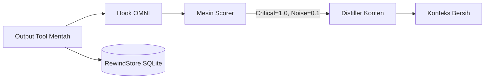

<div align="center">
  

<h1>OMNI</h1>
<p align="center">
    <em>Konteks bebas-noise dan memori jangka panjang untuk agen AI Anda. <b>Lossy, tapi selalu bisa dikembalikan, dan tidak pernah mengarang hasil.</b> Berhenti membayar Claude untuk membaca 10.000 baris noise terminal.</em>
</p>

[🇺🇸 English](../README.md) | [🇯🇵 日本語](README-ja.md) | [🇨🇳 简体中文](README-zh.md) | [🇸🇦 العربية](README-ar.md) | [🇮🇩 Bahasa Indonesia](README-id.md) | [🇻🇳 Tiếng Việt](README-vi.md) | [🇰🇷 한국어](README-ko.md)

[](https://github.com/fajarhide/omni/actions/workflows/ci.yml)
[](https://github.com/fajarhide/omni/releases)
  [](https://www.rust-lang.org/)
  [](https://modelcontextprotocol.io/)
  [](https://github.com/fajarhide/omni/blob/main/LICENSE)
  [](https://hits.sh/github.com/fajarhide/omni/)
</br></br>
<b>
58,9% lebih sedikit token pada campuran perintah nyata &middot; Memori lintas sesi &middot; Aman terhadap format &middot; Selalu reversibel &middot; Gagal terbuka, tidak pernah mengarang &middot; Angka yang bisa Anda reproduksi </b>

</br></br>

</div>

---

Setiap asisten coding AI punya dua masalah besar.

**1. Mereka membaca semuanya.**  
Build log.  
Docker log.  
CI log.  
Progress bar.  
Warna ANSI.  
Ribuan token, hanya untuk menemukan satu baris. Claude tidak mahal. Terminal Andalah yang mahal.

**2. Mereka melupakan semuanya.**  
Setiap kali Anda memulai ulang Cursor, atau berpindah dari Claude Code ke Windsurf, agen Anda hilang ingatan. Anda harus menjelaskan ulang tujuan proyek. Anda harus mengingatkan jebakan framework yang sama berulang kali.

OMNI memperbaiki keduanya.

---

## Perbedaannya

**Masalah 1: terminal Anda menenggelamkan sinyalnya**

`git log` yang sama, berdampingan. Tanpa OMNI, `Author` / `Date` / body satu commit
saja sudah memenuhi layar. Dengan OMNI, **setiap commit tetap ada**, sebagai satu
baris `hash subject`, 94% lebih kecil. Tidak ada yang diringkas hilang; footer-nya
dihitung dari jumlah byte sungguhan, bukan dijanjikan.

<table>
<tr>
<td align="center"><b>Tanpa OMNI</b><br/><sub><code>git log -15</code> mentah</sub></td>
<td align="center"><b>Dengan OMNI</b><br/><sub>setiap commit tetap ada, 94% lebih kecil</sub></td>
</tr>
<tr>
<td valign="top"></td>
<td valign="top"></td>
</tr>
</table>

Angka nyata, diukur pada `tests/fixtures/` dan trace yang diputar ulang, bukan harapan:

| Perintah | Tanpa OMNI | Dengan OMNI | Hemat |
|---|---|---|---|
| `cargo test` (490 lulus, 10 gagal) | 16,5 KB output per-test | ringkasan lulus/gagal dari runner-nya sendiri | **93%** |
| `kubectl get pods` (35 pod, 5 crash) | tabel penuh | `35 pods \| 30 running, 5 error` plus 5 pod gagal disebut namanya | tidak dipangkas |
| `git diff` (banyak berkas) | lockfile, spasi, perubahan hasil generate | kode yang benar-benar berubah | **45%** |
| `docker build` (noise cache berat) | 9,2 KB hash layer dan progress bar | hasil build, cache hit dilipat | **37%** |

> **Peringatan jujurnya:** OMNI memampatkan output yang *berhasil tapi bising*. Perintah yang **gagal** diteruskan **apa adanya**, karena error yang tersembunyi lebih buruk daripada error yang tidak dipampatkan, dan output terstruktur (JSON/YAML/CSV) tidak pernah disentuh. OMNI berguna pada celotehan tool yang berulang, dan menyingkir di tempat lain.

### Kenapa alat yang lossy bisa dipercaya

Kompresor lain meminta Anda *percaya* bahwa yang dipotong tidak penting. OMNI tidak meminta, ia menjamin, dan setiap jaminan didukung kode yang bisa Anda baca:

| Jaminan | Caranya | Bukti |
|---|---|---|
| **Aslinya bisa diambil lagi, byte demi byte** | semua yang dipotong diarsipkan di **RewindStore** SQLite lokal (SHA-256 ke konten); agen menerima hash dan memanggil `omni_retrieve` | [`Cara kerjanya`](#cara-kerjanya) |
| **Tidak pernah mengarang hasil** | distiller yang tidak berhasil mem-parse sinyal apa pun mengembalikan output mentah, bukan string hijau `no errors` atau `passed` | [#143](https://github.com/fajarhide/omni/issues/143) |
| **Kegagalan tidak pernah ditutupi** | perintah yang keluar dengan status bukan nol diteruskan apa adanya | [#120](https://github.com/fajarhide/omni/issues/120) |
| **Data terstruktur tidak pernah disentuh** | JSON / YAML / NDJSON / CSV lewat byte demi byte | `pipeline::format` |
| **Angkanya diukur, bukan diharapkan** | 1.810 trace nyata diputar ulang di biner rilis, dan 63,6% panggilan tidak menghemat apa pun, yang juga kami terbitkan | [`Tolok ukur`](#tolok-ukur) |

Itulah satu hal yang tidak bisa dibeli angka kompresi yang lebih besar: **aslinya selalu bisa Anda pulihkan, dan ia tidak akan pernah membohongi agen Anda.**

**Masalah 2: agen Anda lupa segalanya semalaman**

### Memulai sesi baru
**Tanpa OMNI:** "Tolong jelaskan lagi struktur proyeknya, modul auth-nya rusak, dan kita pakai Postgres bukan MySQL."  
**Dengan OMNI:** Agen sudah tahu. Ia melanjutkan dari tempat Anda berhenti.

### Memperbaiki bug yang sama dua kali
**Tanpa OMNI:** Agen menabrak jebakan framework yang kemarin sudah ia pecahkan, karena ia tidak punya ingatan.  
**Dengan OMNI:** Perbaikannya sudah tersimpan. Agen memunculkannya lewat MCP tool `omni_recall` sebelum mengulang kesalahan yang sama.

### Alur kerja lintas IDE (Cursor ke Claude Code)
**Tanpa OMNI:** IDE baru, agen baru, konteks nol. Anda mulai dari awal.  
**Dengan OMNI:** Ringkasan sesi disuntikkan otomatis. Agen baru langsung nyambung.

---

## Kenapa Ini Penting

Kode yang *tidak* Anda kirim ke AI sama pentingnya dengan kode yang Anda kirim.

Ketika Anda menyuapi AI dengan megabyte noise terminal, ia mengalami context bloat: berhalusinasi memperbaiki warning yang salah dan menghabiskan anggaran API Anda pada output yang tidak relevan.

Ketika Anda memulai ulang agen dan ia tidak punya memori, Anda kehilangan berjam-jam untuk membangun ulang konteks yang seharusnya tersimpan otomatis.

OMNI menyelesaikan keduanya, tanpa terlihat:

* **Noise berkurang** menurunkan biaya, dan mengurangi output tidak relevan yang bisa menyesatkan model.
* **Aman terhadap format sejak desain**: JSON, YAML, NDJSON dan CSV lewat byte demi byte; distiller yang tidak bisa mem-parse inputnya memilih diam ketimbang mengarang ringkasan.
* **Memori yang menetap**: tidak perlu lagi menjelaskan ulang proyek Anda, tidak perlu lagi mengulang perbaikan.
* **Sekali pasang**: bekerja diam-diam dengan setiap agen yang sudah Anda pakai.

---

## Tolok Ukur

Angka utama yang jujur, diukur pada biner rilis terhadap **1.810 eksekusi perintah
nyata** yang diputar ulang dari penggunaan sehari-hari satu developer:

* **58,9% lebih sedikit byte** yang sampai ke model di seluruh campuran perintah (15,0 MB menjadi 6,2 MB).
* **63,6% panggilan itu tidak menghemat apa pun.** OMNI mengembalikan outputnya
  langsung, menambahkan **nol** byte. Seluruh penghematan datang dari 36,4% sisanya,
  tempat noise-nya memang nyata.
* **Output terstruktur tidak pernah disentuh.** JSON, YAML, NDJSON dan CSV lewat
  byte demi byte, karena payload yang rusak lebih mahal daripada kompresi yang terlewat.

Butir kedua itulah angka yang jarang dicetak tools sejenis. Alat yang mengklaim
menghemat 90% pada setiap perintah sedang memberi tahu Anda bahwa output yang Anda
butuhkan ikut diringkas.

<div align="center">

</div>

Dari mana penghematannya sebenarnya datang, atas 1.810 eksekusi yang sama:

| Perintah | Panggilan | Masuk | Keluar | Hemat |
|---------|-------|-------|--------|-------|
| `cargo` | 29 | 424 KB | 13 KB | **96,8%** |
| `git` | 256 | 5,9 MB | 509 KB | **91,3%** |
| `ls` | 52 | 71 KB | 29 KB | **59,5%** |
| `kubectl` | 212 | 4,4 MB | 2,3 MB | **48,0%** |
| `find` | 39 | 83 KB | 53 KB | **36,2%** |
| `grep` | 184 | 534 KB | 385 KB | **27,8%** |
| `cat` | 85 | 515 KB | 468 KB | **9,1%** |

`git` dan `cargo` yang membawa hasilnya; `cat` dan `grep` nyaris tanpa efek. OMNI
mendapat tempatnya pada output tooling yang bising dan berulang, dan menyingkir di
tempat lain.

Fixture tunggal dari `tests/fixtures/`, jika Anda ingin mereproduksi satu per satu:

| Perintah / Konteks | Masuk | Keluar | Hemat |
|-------------------|-------|--------|-------|
| `cargo build` (besar, berhasil) | 3.220 B | 9 B | **99,7%** |
| `cargo test` (490 lulus, 10 gagal) | 16,5 KB | 1.100 B | **93,3%** |
| `pytest` (ada kegagalan) | 730 B | 136 B | **81,4%** |
| `git status` (kotor) | 496 B | 113 B | **77,2%** |
| `git diff` (banyak berkas) | 397 B | 220 B | **44,6%** |
| `docker build` (noise berat) | 9,2 KB | 5,8 KB | **37,2%** |
| `kubectl get pods` (campuran) | 840 B | 762 B | **9,3%** |

**Latensi itu biaya nyata, bukan nol.** OMNI berjalan pada setiap perintah yang
dikaitkan, dan harganya tumbuh bersama riwayat Anda: `git status` 496 byte butuh
~82 ms pada database baru dan ~308 ms pada database 97 MB. `cargo test` 16,5 KB
butuh ~276 ms. Perhitungkan itu.

*Untuk melihat penghematan token Anda sendiri, jalankan saja `omni stats` setelah beberapa hari pemakaian.*


---

## Mulai Cepat & Instalasi

OMNI sangat mudah disiapkan. Ia terintegrasi secara native ke terminal Anda.

**macOS / Linux:**
```bash
# 1. Pasang lewat Homebrew
brew install fajarhide/tap/omni

# 2. Siapkan OMNI (menu interaktif untuk Claude, VS Code, OpenCode, Codex, Antigravity)
omni init

# 3. Pastikan berjalan
omni doctor

# 4. Atau perbaiki otomatis kalau ada masalah
omni doctor --fix

# 5. Cek status saat ini
omni init --status
```

**Installer universal (macOS / Linux / WSL):**
```bash 
curl -fsSL omni.weekndlabs.com/install | bash
```

**Windows (PowerShell):**
```powershell
irm omni.weekndlabs.com/install.ps1 | iex
```

---

## Integrasi

OMNI bekerja mulus dengan tools agentik yang sudah Anda pakai. Ia mencegat eksekusi terminal mereka secara otomatis.

* Claude Code
* Cursor
* Windsurf
* Roo Code
* OpenAI Codex
* Antigravity CLI

---

## Adaptive Memory OS

OMNI bukan sekadar filter terminal, ia obat untuk amnesia AI.

Kalau Anda pernah bekerja dengan agen AI lebih dari satu jam, Anda tahu sakitnya kehilangan konteks. Anda memulai ulang agennya, dan tiba-tiba ia lupa apa yang sedang Anda kerjakan. Ia lupa tujuan proyeknya. Ia mulai mengulang kesalahan yang persis sama seperti kemarin karena ia lupa keanehan repositori yang tidak terdokumentasi.

Memory OS milik OMNI berjalan diam-diam di latar belakang untuk mengatasinya:

* **Berhenti menjelaskan ulang tujuan (`omni goal`)**: tetapkan sasaran utama Anda sekali. OMNI akan terus mengingatkan agen tentang prioritas itu pada setiap prompt, mencegahnya melenceng dari tugas.
* **Jangan kehilangan alur pikiran (kontinuitas sesi)**: kalau Cursor crash atau Anda pindah ke Claude Code, OMNI langsung menyuntikkan ringkasan padat sesi terakhir Anda. Agen baru tahu persis berkas mana yang sedang panas dan apa error aktif terakhirnya, lalu melanjutkan dari titik Anda berhenti.
* **Ajari sekali saja (`omni remember`)**: berhenti memperbaiki halusinasi yang sama. Agen bisa menyimpan aturan, jebakan, dan keputusan arsitektur khusus proyek langsung ke backend SQLite lokal OMNI. Saat mereka mentok nanti, mereka menarik jawabannya kembali lewat pencarian semantik.

Agen Anda jadi makin paham basis kode Anda setiap hari, dan Anda tidak perlu mengulang diri sendiri lagi.

---

## Cara kerjanya

OMNI bekerja sepenuhnya lokal memakai pipeline deterministik `Read → Guard → Score → Collapse → Distill → Persist`.



Kalau AI *benar-benar* butuh noise yang dibuang, **RewindStore** SQLite lokal milik OMNI menyimpan log lengkapnya dengan aman dalam bentuk ter-hash, sehingga agen bisa mengambilnya kapan saja.

---

## Arsitektur


<div align="center">
  
</div>

Dibangun dengan Rust, walau biaya ujung-ke-ujungnya bukan nol.

* **Distilasi**: pipeline scoring dan collapsing-nya sendiri berjalan dalam hitungan milidetik satu digit.
* **Ujung ke ujung**: yang benar-benar Anda tunggu adalah itu ditambah penulisan RewindStore, dan itu tumbuh bersama riwayat Anda, kira-kira 82 ms pada database baru dan ~308 ms pada database 97 MB. Lihat [Tolok ukur](#tolok-ukur) sebelum Anda menganggapnya gratis.
* **Memori**: bekerja lewat stream yang efisien, menjaga pemakaian memori tetap datar bahkan pada log 20.000 baris.
* **Gagal terbuka**: kalau OMNI panik, ia gagal diam-diam dan meneruskan output mentahnya. Ia tidak akan pernah membuat agen host Anda crash.

```bash
# Pengembangan
cargo build --release
cargo test --all
make fmt && make clippy
```

---

## FAQ

**Apakah OMNI menghapus log saya secara permanen?**  
Tidak. Log mentahnya dipampatkan dan disimpan lokal di RewindStore SQLite. AI menerima sebuah hash dan bisa mengambil log lengkapnya kalau perlu.

**Apakah ini memperlambat terminal saya?**  
Ya, terukur, dan biayanya tumbuh bersama riwayat Anda. Pipeline distilasinya sendiri berjalan dalam milidetik satu digit, tapi setiap perintah yang dikaitkan juga menulis ke RewindStore lokal: `git status` 496 byte butuh ~82 ms pada database baru dan ~308 ms pada database 97 MB, dan `cargo test` 16,5 KB butuh ~276 ms. Perhitungkan itu. `OMNI_PASSTHROUGH=1` melewati pipeline sepenuhnya kalau Anda butuh output mentahnya kembali.

**Bisakah saya menambahkan filter sendiri?**  
Bisa. Anda bisa mengajari OMNI membuang noise khas tools internal Anda memakai TOML:
```toml
# ~/.omni/signals/custom.toml
[filters.my_tool]
match_command = "^internal-tool\\b"
strip_lines_matching = ["^DEBUG", "syncing..."]
```

## Kontribusi & Lisensi

Ini proyek yang lahir dari kesenangan, dibangun untuk era AI Agentik. Entah Anda datang untuk menghemat biaya token, mencoba model gratis, atau ikut membangun toolbelt agentik terbaik, kontribusi selalu diterima!

- **Pengembangan**: ingin membangun dari sumber? Jalankan `make ci` dan `cargo build`. Baca [CONTRIBUTING.md](../CONTRIBUTING.md) untuk detailnya.
- **Lisensi**: [MIT License](../LICENSE)

<!-- Star History -->
<p align="center">
  <a href="https://star-history.com/#fajarhide/omni&Date">
    <picture>
      <source media="(prefers-color-scheme: dark)" srcset="https://api.star-history.com/svg?repos=fajarhide/omni&type=Date&theme=dark" />
      <source media="(prefers-color-scheme: light)" srcset="https://api.star-history.com/svg?repos=fajarhide/omni&type=Date" />
      
    </picture>
  </a>
</p>
<center>
Dibuat dengan ❤️ oleh <a href="https://github.com/fajarhide">Fajar Hidayat</a>
</center>
