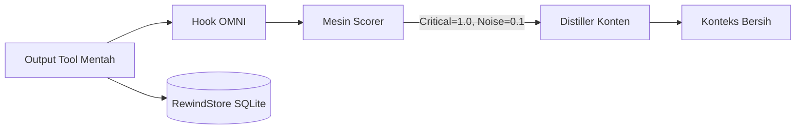

<div align="center">
  

<h1>OMNI</h1>
<p align="center">
    <em><b>Berhenti membayar Claude untuk membaca 10.000 baris noise terminal.</b> OMNI memangkas <code>git</code> 89%, <code>cargo</code> 91% dan <code>kubectl</code> 77% sebelum agen Anda sempat melihatnya. Selebihnya lewat tanpa disentuh. Tidak ada yang hilang, dan ia tidak pernah mengarang hasil.</em>
</p>

[🇺🇸 English](../README.md) | [🇯🇵 日本語](README-ja.md) | [🇨🇳 简体中文](README-zh.md) | [🇸🇦 العربية](README-ar.md) | [🇮🇩 Bahasa Indonesia](README-id.md) | [🇻🇳 Tiếng Việt](README-vi.md) | [🇰🇷 한국어](README-ko.md)

[](https://github.com/fajarhide/omni/actions/workflows/ci.yml)
[](https://github.com/fajarhide/omni/releases)
  [](https://www.rust-lang.org/)
  [](https://modelcontextprotocol.io/)
  [](https://github.com/fajarhide/omni/blob/main/LICENSE)
  [](https://hits.sh/github.com/fajarhide/omni/)
</br></br>
<b>
<code>git</code> 89% &middot; <code>cargo</code> 91% &middot; <code>kubectl</code> 77% &middot; 21 ms per perintah &middot; 0 dari 9.965 panggilan pernah memperbesar output &middot; setiap potongan bisa dipulihkan byte demi byte &middot; memori lintas sesi </b>

</br></br>

```bash
brew install fajarhide/tap/omni && omni init
```

Bekerja dengan Claude Code, Cursor, Windsurf, Codex dan Roo tanpa konfigurasi tambahan.

</br>

</div>

---

Setiap asisten coding AI punya dua masalah besar.

**1. Mereka membaca semuanya.**  
Build log.  
Docker log.  
CI log.  
Progress bar.  
Warna ANSI.  
Ribuan token, hanya untuk menemukan satu baris. Claude tidak mahal. Terminal Andalah yang mahal.

**2. Mereka melupakan semuanya.**  
Setiap kali Anda memulai ulang Cursor, atau berpindah dari Claude Code ke Windsurf, agen Anda hilang ingatan. Anda harus menjelaskan ulang tujuan proyek. Anda harus mengingatkan jebakan framework yang sama berulang kali.

OMNI memperbaiki keduanya.

---

## Perbedaannya

**Masalah 1: terminal Anda menenggelamkan sinyalnya**

`git log` yang sama, berdampingan. Tanpa OMNI, `Author` / `Date` / body satu commit
saja sudah memenuhi layar. Dengan OMNI, **setiap commit tetap ada**, sebagai satu
baris `hash subject`, 94% lebih kecil. Tidak ada yang diringkas hilang; footer-nya
dihitung dari jumlah byte sungguhan, bukan dijanjikan.

<table>
<tr>
<td align="center"><b>Tanpa OMNI</b><br/><sub><code>git log -15</code> mentah</sub></td>
<td align="center"><b>Dengan OMNI</b><br/><sub>setiap commit tetap ada, 94% lebih kecil</sub></td>
</tr>
<tr>
<td valign="top"></td>
<td valign="top"></td>
</tr>
</table>

Angka nyata, diukur pada `tests/fixtures/` dan trace yang diputar ulang, bukan harapan:

| Perintah | Tanpa OMNI | Dengan OMNI | Hemat |
|---|---|---|---|
| `cargo test` (490 lulus, 10 gagal) | 16,5 KB output per-test | ringkasan lulus/gagal dari runner-nya sendiri | **92,9%** |
| `git status` (kotor) | 496 B porcelain | branch dan path yang berubah | **61,7%** |
| `docker build` (noise cache berat) | 9,2 KB hash layer dan progress bar | hasil build, cache hit dilipat | **35,9%** |
| `git diff` (banyak berkas) | lockfile, spasi, perubahan hasil generate | kode yang benar-benar berubah | **25,2%** |
| `kubectl get pods` (35 pod, 5 crash) | tabel penuh | tabel penuh | **0%**, memang begitu |

Setiap angka di atas adalah payload yang **benar-benar dikirim**, termasuk penanda
pemulihan ~77 byte yang OMNI lampirkan setiap kali ia membuang sesuatu. Rilis
sebelumnya mengutip output distiller sebelum penanda itu, yang membuat payload kecil
terlihat lebih bagus: `git diff` terbaca 25,2% di sini dan 44,6% tanpanya. Penanda
itulah yang membuat potongannya bisa dikembalikan, jadi ia layak ikut dihitung.

Baris `kubectl get pods` yang menarik. Dulu ia melaporkan 9,3%; sekarang tidak
melaporkan apa-apa, karena tabel pod adalah enumerasi di mana setiap baris adalah
data dan tidak ada noise untuk dibuang. Kehilangan 9,3% itu justru perbaikannya.

> **Di mana ia sengaja tidak berbuat apa-apa.** Perintah yang gagal diteruskan apa adanya, karena error yang tersembunyi lebih mahal daripada error yang tidak dipampatkan. Output terstruktur (JSON, YAML, CSV) tidak pernah disentuh, karena langkah berikutnya di pipeline Anda akan mem-parse-nya. OMNI berguna pada celotehan tool yang berulang dan menyingkir di tempat lain, dan itulah yang membuatnya aman dibiarkan aktif untuk setiap perintah yang Anda jalankan.

### Tidak ada yang hilang. Ia tidak pernah mengarang.

Dua janji, dan keduanya ada di kodenya, bukan di paragraf ini.

**Tidak ada yang hilang.** Setiap byte yang OMNI potong diarsipkan secara lokal di RewindStore, dikunci dengan SHA-256. Agen menerima hash bersama output yang sudah disuling dan bisa memanggil `omni_retrieve` untuk menarik aslinya kembali byte demi byte, di tengah percakapan, tanpa menjalankan ulang perintah Anda.

**Ia tidak pernah mengarang.** Distiller yang tidak mengenali apa pun di inputnya mengembalikan input mentah. Itu tipe data, bukan konvensi: `distill` mengembalikan `Option<String>` dan lapisan routing jatuh kembali ke aslinya setiap kali menerima `None`. Tidak ada jalur kode yang menghasilkan baris hijau "no errors" yang tidak OMNI baca.

Kompresor lain meminta Anda *percaya* bahwa yang dipotong tidak penting. OMNI menyerahkan buktinya:

| Jaminan | Caranya | Bukti |
|---|---|---|
| **Aslinya bisa diambil lagi, byte demi byte** | semua yang dipotong diarsipkan di **RewindStore** SQLite lokal (SHA-256 ke konten); agen menerima hash dan memanggil `omni_retrieve` | [`Cara kerjanya`](#cara-kerjanya) |
| **Tidak pernah mengarang hasil** | distiller yang tidak berhasil mem-parse sinyal apa pun mengembalikan output mentah, bukan string hijau `no errors` atau `passed` | [#143](https://github.com/fajarhide/omni/issues/143) |
| **Kegagalan tidak pernah ditutupi** | perintah yang keluar dengan status bukan nol diteruskan apa adanya | [#120](https://github.com/fajarhide/omni/issues/120) |
| **Data terstruktur tidak pernah disentuh** | JSON / YAML / NDJSON / CSV lewat byte demi byte | `pipeline::format` |
| **Angkanya diukur, bukan diharapkan** | 9.965 trace nyata diputar ulang di biner rilis, dan 90,0% panggilan tidak menghemat apa pun, yang juga kami terbitkan | [`Tolok ukur`](#tolok-ukur) |

Itulah satu hal yang tidak bisa dibeli angka kompresi yang lebih besar: **aslinya selalu bisa Anda pulihkan, dan ia tidak akan pernah membohongi agen Anda.**

**Masalah 2: agen Anda lupa segalanya semalaman**

### Memulai sesi baru
**Tanpa OMNI:** "Tolong jelaskan lagi struktur proyeknya, modul auth-nya rusak, dan kita pakai Postgres bukan MySQL."  
**Dengan OMNI:** Agen sudah tahu. Ia melanjutkan dari tempat Anda berhenti.

### Memperbaiki bug yang sama dua kali
**Tanpa OMNI:** Agen menabrak jebakan framework yang kemarin sudah ia pecahkan, karena ia tidak punya ingatan.  
**Dengan OMNI:** Perbaikannya sudah tersimpan. Agen memunculkannya lewat MCP tool `omni_recall` sebelum mengulang kesalahan yang sama.

### Alur kerja lintas IDE (Cursor ke Claude Code)
**Tanpa OMNI:** IDE baru, agen baru, konteks nol. Anda mulai dari awal.  
**Dengan OMNI:** Ringkasan sesi disuntikkan otomatis. Agen baru langsung nyambung.

---

## Kenapa Ini Penting

Kode yang *tidak* Anda kirim ke AI sama pentingnya dengan kode yang Anda kirim.

Ketika Anda menyuapi AI dengan megabyte noise terminal, ia mengalami context bloat: berhalusinasi memperbaiki warning yang salah dan menghabiskan anggaran API Anda pada output yang tidak relevan.

Ketika Anda memulai ulang agen dan ia tidak punya memori, Anda kehilangan berjam-jam untuk membangun ulang konteks yang seharusnya tersimpan otomatis.

OMNI menyelesaikan keduanya, tanpa terlihat:

* **Noise berkurang** menurunkan biaya, dan mengurangi output tidak relevan yang bisa menyesatkan model.
* **Aman terhadap format sejak desain**: JSON, YAML, NDJSON dan CSV lewat byte demi byte; distiller yang tidak bisa mem-parse inputnya memilih diam ketimbang mengarang ringkasan.
* **Memori yang menetap**: tidak perlu lagi menjelaskan ulang proyek Anda, tidak perlu lagi mengulang perbaikan.
* **Sekali pasang**: bekerja diam-diam dengan setiap agen yang sudah Anda pakai.

---

## Tolok Ukur

Diukur pada biner rilis dengan memutar ulang **9.965 eksekusi perintah nyata** dari
penggunaan sehari-hari satu developer (`cargo test --release --test bench_replay -- --ignored`):

* **Pada perintah yang memang menghasilkan noise, 76 sampai 91%.** `cargo` 91,4%,
  `git` 89,2%, `kubectl` 76,5%. Di situlah anggaran konteks Anda habis, dan di situ
  pula OMNI bekerja.
* **OMNI bertindak pada 1 dari 10 perintah, dan menambahkan nol byte pada 9 sisanya.**
  Ia filter, bukan peringkas. Kalau tidak ada yang bisa dipotong ia menyingkir
  sepenuhnya, dan itulah yang membuatnya aman dibiarkan aktif untuk semuanya.
* **Tidak satu pun dari 9.965 panggilan membuat outputnya lebih besar.** Itu angka
  yang layak dicek pada tool jenis apa pun seperti ini, dan harness yang sama yang
  mencetaknya.
* **43,3% lebih sedikit byte** di seluruh campuran perintah, yang bising dan yang
  tenang sekaligus (40,1 MB menjadi 22,7 MB).
* **Output terstruktur tidak pernah disentuh.** JSON, YAML, NDJSON dan CSV lewat
  byte demi byte, karena payload yang rusak lebih mahal daripada kompresi yang terlewat.

Korpusnya hanya menghitung panggilan yang hasilnya sampai ke model. Output terminal
dikecualikan: ia 68% dari byte mentah pada instalasi ini, dan memasukkannya membuat
kami bisa mencetak 79,1% alih-alih 43,3%. Kami tidak melakukannya, karena angka itu
mengukur populasi yang tidak pernah dibaca model mana pun.

Kebanyakan tool sejenis menerbitkan satu persentase besar. Kami menerbitkan porsi
panggilan di mana kami tidak berbuat apa-apa, karena tool yang mengklaim 90% pada
setiap perintah sedang memberi tahu Anda bahwa ia meringkas sesuatu yang Anda
butuhkan.

<div align="center">

</div>

Dari mana penghematannya sebenarnya datang, atas 9.965 eksekusi yang sama:

| Perintah | Panggilan | Masuk | Keluar | Hemat |
|---------|-------|-------|--------|-------|
| `cargo` | 124 | 1,5 MB | 127 KB | **91,4%** |
| `git` | 931 | 12,0 MB | 1,3 MB | **89,2%** |
| `kubectl` | 456 | 5,5 MB | 1,3 MB | **76,5%** |
| `az` | 62 | 264 KB | 176 KB | **33,6%** |
| `grep` | 938 | 2,4 MB | 2,0 MB | **18,1%** |
| `gh` | 232 | 534 KB | 509 KB | **4,6%** |
| `cd` | 2.963 | 5,6 MB | 5,5 MB | **2,2%** |
| `cat`, `ls`, `find`, `sed`, `python3` | 1.235 | 4,2 MB | 4,2 MB | **0%** |

`git`, `cargo` dan `kubectl` yang membawa seluruh hasilnya. Baris terakhir adalah inti
tabel ini: lima dari perintah yang paling sering dijalankan kini sengaja diteruskan apa
adanya, karena outputnya enumerasi di mana setiap baris adalah data. Dulu mereka
melaporkan penghematan, dan setiap penghematan itu adalah baris yang seseorang
butuhkan.

Fixture tunggal dari `tests/fixtures/`, jika Anda ingin mereproduksi satu per satu:

| Perintah / Konteks | Masuk | Keluar | Hemat |
|-------------------|-------|--------|-------|
| `cargo build` (besar, berhasil) | 3.220 B | 87 B | **97,3%** |
| `cargo test` (490 lulus, 10 gagal) | 16.515 B | 1.178 B | **92,9%** |
| `git status` (kotor) | 496 B | 190 B | **61,7%** |
| `git diff` (banyak berkas) | 397 B | 297 B | **25,2%** |
| `docker build` (noise berat) | 9.207 B | 5.904 B | **35,9%** |
| `kubectl get pods` (campuran) | 840 B | 840 B | **0%** |

"Keluar" adalah yang diterima agen, penanda ikut dihitung. Kurangi penanda pemulihan
~77 byte dan angkanya cocok dengan yang diterbitkan rilis sebelumnya; penanda itu
dihitung di sini karena agen membayarnya.

**21 ms per perintah.** Itu keseluruhan pipeline dari ujung ke ujung lewat post-hook,
dan ia tumbuh bersama riwayat Anda, bukan bersama ukuran payload. Median dari 12 kali
jalan, biner rilis:

| | database baru | database 205 MB |
|---|---|---|
| `git status` (496 B) | **21,1 ms** | **60,7 ms** |
| `cargo test` (16,5 KB) | **24,5 ms** | **64,5 ms** |

Ukuran payload nyaris tidak berpengaruh; ukuran database berpengaruh. Rilis sebelumnya
mengukur 82 ms dan 276 ms pada database baru, dan selisihnya datang dari tiga
perbaikan, bukan dari mesin yang lebih cepat: tokenizer GPT yang dimuat per perintah
hanya untuk satu kolom laporan, 249 regex line-filter yang dikompilasi entah filternya
cocok atau tidak, dan connection pool yang membuka empat handle SQLite di proses yang
selesai setelah satu payload.

*Untuk melihat penghematan token Anda sendiri, jalankan saja `omni stats` setelah beberapa hari pemakaian.*


---

## Mulai Cepat & Instalasi

OMNI sangat mudah disiapkan. Ia terintegrasi secara native ke terminal Anda.

**macOS / Linux:**
```bash
# 1. Pasang lewat Homebrew
brew install fajarhide/tap/omni

# 2. Siapkan OMNI (menu interaktif untuk Claude, VS Code, OpenCode, Codex, Antigravity)
omni init

# 3. Pastikan berjalan
omni doctor

# 4. Atau perbaiki otomatis kalau ada masalah
omni doctor --fix

# 5. Cek status saat ini
omni init --status
```

**Installer universal (macOS / Linux / WSL):**
```bash 
curl -fsSL omni.weekndlabs.com/install | bash
```

**Windows (PowerShell):**
```powershell
irm omni.weekndlabs.com/install.ps1 | iex
```

---

## Integrasi

OMNI bekerja mulus dengan tools agentik yang sudah Anda pakai. Ia mencegat eksekusi terminal mereka secara otomatis.

* Claude Code
* Cursor
* Windsurf
* Roo Code
* OpenAI Codex
* Antigravity CLI

---

## Adaptive Memory OS

OMNI bukan sekadar filter terminal, ia obat untuk amnesia AI.

Kalau Anda pernah bekerja dengan agen AI lebih dari satu jam, Anda tahu sakitnya kehilangan konteks. Anda memulai ulang agennya, dan tiba-tiba ia lupa apa yang sedang Anda kerjakan. Ia lupa tujuan proyeknya. Ia mulai mengulang kesalahan yang persis sama seperti kemarin karena ia lupa keanehan repositori yang tidak terdokumentasi.

Memory OS milik OMNI berjalan diam-diam di latar belakang untuk mengatasinya:

* **Berhenti menjelaskan ulang tujuan (`omni goal`)**: tetapkan sasaran utama Anda sekali. OMNI akan terus mengingatkan agen tentang prioritas itu pada setiap prompt, mencegahnya melenceng dari tugas.
* **Jangan kehilangan alur pikiran (kontinuitas sesi)**: kalau Cursor crash atau Anda pindah ke Claude Code, OMNI langsung menyuntikkan ringkasan padat sesi terakhir Anda. Agen baru tahu persis berkas mana yang sedang panas dan apa error aktif terakhirnya, lalu melanjutkan dari titik Anda berhenti.
* **Ajari sekali saja (`omni remember`)**: berhenti memperbaiki halusinasi yang sama. Agen bisa menyimpan aturan, jebakan, dan keputusan arsitektur khusus proyek langsung ke backend SQLite lokal OMNI. Saat mereka mentok nanti, mereka menarik jawabannya kembali lewat pencarian semantik.

Agen Anda jadi makin paham basis kode Anda setiap hari, dan Anda tidak perlu mengulang diri sendiri lagi.

---

## Cara kerjanya

OMNI bekerja sepenuhnya lokal memakai pipeline deterministik `Read → Guard → Score → Collapse → Distill → Persist`.



Kalau AI *benar-benar* butuh noise yang dibuang, **RewindStore** SQLite lokal milik OMNI menyimpan log lengkapnya dengan aman dalam bentuk ter-hash, sehingga agen bisa mengambilnya kapan saja.

---

## Arsitektur


<div align="center">
  
</div>

Dibangun dengan Rust, walau biaya ujung-ke-ujungnya bukan nol.

* **Distilasi**: pipeline scoring dan collapsing-nya sendiri berjalan dalam hitungan milidetik satu digit.
* **Ujung ke ujung**: yang benar-benar Anda tunggu adalah itu ditambah penulisan RewindStore, dan itu tumbuh bersama riwayat Anda, kira-kira 21 ms pada database baru dan ~61 ms pada database 205 MB. Lihat [Tolok ukur](#tolok-ukur) sebelum Anda menganggapnya gratis.
* **Memori**: bekerja lewat stream yang efisien, menjaga pemakaian memori tetap datar bahkan pada log 20.000 baris.
* **Gagal terbuka**: kalau OMNI panik, ia gagal diam-diam dan meneruskan output mentahnya. Ia tidak akan pernah membuat agen host Anda crash.

```bash
# Pengembangan
cargo build --release
cargo test --all
make fmt && make clippy
```

---

## FAQ

**Apakah OMNI menghapus log saya secara permanen?**  
Tidak. Log mentahnya dipampatkan dan disimpan lokal di RewindStore SQLite. AI menerima sebuah hash dan bisa mengambil log lengkapnya kalau perlu.

**Apakah ini memperlambat terminal saya?**  
Ya, terukur, dan biayanya tumbuh bersama riwayat Anda. Pipeline distilasinya sendiri berjalan dalam milidetik satu digit, tapi setiap perintah yang dikaitkan juga menulis ke RewindStore lokal: `git status` 496 byte butuh ~21 ms pada database baru dan ~61 ms pada database 205 MB, dan `cargo test` 16,5 KB butuh ~25 ms. Perhitungkan itu. `OMNI_PASSTHROUGH=1` melewati pipeline sepenuhnya kalau Anda butuh output mentahnya kembali.

**Bisakah saya menambahkan filter sendiri?**  
Bisa. Anda bisa mengajari OMNI membuang noise khas tools internal Anda memakai TOML:
```toml
# ~/.omni/signals/custom.toml
[filters.my_tool]
match_command = "^internal-tool\\b"
strip_lines_matching = ["^DEBUG", "syncing..."]
```

## Kontribusi & Lisensi

Ini proyek yang lahir dari kesenangan, dibangun untuk era AI Agentik. Entah Anda datang untuk menghemat biaya token, mencoba model gratis, atau ikut membangun toolbelt agentik terbaik, kontribusi selalu diterima!

- **Pengembangan**: ingin membangun dari sumber? Jalankan `make ci` dan `cargo build`. Baca [CONTRIBUTING.md](../CONTRIBUTING.md) untuk detailnya.
- **Lisensi**: [MIT License](../LICENSE)

<!-- Star History -->
<p align="center">
  <a href="https://star-history.com/#fajarhide/omni&Date">
    <picture>
      <source media="(prefers-color-scheme: dark)" srcset="https://api.star-history.com/svg?repos=fajarhide/omni&type=Date&theme=dark" />
      <source media="(prefers-color-scheme: light)" srcset="https://api.star-history.com/svg?repos=fajarhide/omni&type=Date" />
      
    </picture>
  </a>
</p>
<center>
Dibuat dengan ❤️ oleh <a href="https://github.com/fajarhide">Fajar Hidayat</a>
</center>
