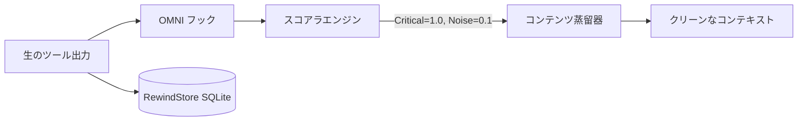

<div align="center">
  

<h1>OMNI</h1>
<p align="center">
    <em><b>1万行のターミナルノイズを読ませるために Claude に課金するのは、もう終わりです。</b>OMNI はエージェントが目にする前に <code>git</code> を 89%、<code>cargo</code> を 91%、<code>kubectl</code> を 77% 削ります。それ以外はそのまま通します。失われるものは何もなく、結果を捏造することもありません。</em>
</p>

[🇺🇸 English](../README.md) | [🇯🇵 日本語](README-ja.md) | [🇨🇳 简体中文](README-zh.md) | [🇸🇦 العربية](README-ar.md) | [🇮🇩 Bahasa Indonesia](README-id.md) | [🇻🇳 Tiếng Việt](README-vi.md) | [🇰🇷 한국어](README-ko.md)

[](https://github.com/fajarhide/omni/actions/workflows/ci.yml)
[](https://github.com/fajarhide/omni/releases)
  [](https://www.rust-lang.org/)
  [](https://modelcontextprotocol.io/)
  [](https://github.com/fajarhide/omni/blob/main/LICENSE)
  [](https://hits.sh/github.com/fajarhide/omni/)
</br></br>
<b>
<code>git</code> 89% &middot; <code>cargo</code> 91% &middot; <code>kubectl</code> 77% &middot; 1コマンドあたり 21 ms &middot; 9,965 件中、出力が大きくなった呼び出しは 0 件 &middot; 切った分はバイト単位で復元可能 &middot; セッション横断メモリ </b>

</br></br>

```bash
brew install fajarhide/tap/omni && omni init
```

Claude Code、Cursor、Windsurf、Codex、Roo でそのまま動きます。

</br>

</div>

---

AI コーディングアシスタントには、大きな問題が2つあります。

**1. すべてを読んでしまう。**  
ビルドログ。  
Docker のログ。  
CI のログ。  
プログレスバー。  
ANSI カラー。  
たった1行を見つけるために、何千ものトークン。高いのは Claude ではありません。あなたのターミナルです。

**2. すべてを忘れてしまう。**  
Cursor を再起動するたび、あるいは Claude Code から Windsurf に乗り換えるたびに、エージェントは記憶を失います。プロジェクトの目的を説明し直し、同じフレームワークの落とし穴を何度も伝え直すことになります。

OMNI はその両方を解決します。

---

## 何が違うのか

**問題 1: ターミナルがシグナルをかき消す**

同じ `git log` を並べて比べます。OMNI なしでは、1コミットの `Author` / `Date` /
本文だけで画面が埋まります。OMNI ありでは、**すべてのコミットが残ります**。
`hash subject` の1行として、94% 小さくなって。要約で消えたものはなく、フッターの
数字は実際のバイト数から測ったもので、約束ではありません。

<table>
<tr>
<td align="center"><b>OMNI なし</b><br/><sub>生の <code>git log -15</code></sub></td>
<td align="center"><b>OMNI あり</b><br/><sub>全コミット保持、94% 削減</sub></td>
</tr>
<tr>
<td valign="top"></td>
<td valign="top"></td>
</tr>
</table>

`tests/fixtures/` と再生したトレースで実測した数字であって、願望ではありません。

| コマンド | OMNI なし | OMNI あり | 削減 |
|---|---|---|---|
| `cargo test` (490 成功、10 失敗) | テストごとの出力 16.5 KB | ランナー自身の成否サマリ | **92.9%** |
| `git status` (変更あり) | porcelain 出力 496 B | ブランチと変更されたパス | **61.7%** |
| `docker build` (キャッシュノイズ多め) | レイヤーハッシュとプログレスバー 9.2 KB | ビルド結果、キャッシュヒットは畳む | **35.9%** |
| `git diff` (複数ファイル) | ロックファイル、空白、生成物の差分 | 実際に変わったコード | **25.2%** |
| `kubectl get pods` (35 pod、5 crash) | テーブル全体 | テーブル全体 | 意図して **0%** |

上の数字はすべて、実際に**届けられた**ペイロードで、OMNI が何かを落としたときに付ける
約 77 バイトの復元マーカーを含みます。以前のリリースはこのマーカーを付ける前の蒸留器
出力を引用しており、小さなペイロードほど良く見えていました。`git diff` はここでは
25.2%、マーカーなしなら 44.6% です。マーカーこそが切った分を復元可能にしているので、
数字に含めるのが筋です。

面白いのは `kubectl get pods` の行です。以前は 9.3% と報告していましたが、いまは何も
報告しません。pod のテーブルは1行1行がデータである列挙であり、落とすべきノイズが存在
しないからです。あの 9.3% を失ったことが修正でした。

> **意図して何もしない場所。** 失敗したコマンドはそのまま通します。隠れたエラーは圧縮されていないエラーより高くつくからです。構造化出力 (JSON、YAML、CSV) には一切触れません。あなたのパイプラインの次の工程がそれをパースするからです。OMNI は繰り返しの多いツールの雑音でこそ働き、それ以外では退きます。だからこそ、実行するすべてのコマンドで有効にしたまま安全に使えます。

### 失われるものは何もない。捏造もしない。

2つの約束で、どちらもこの段落ではなくコードの中にあります。

**失われるものは何もない。** OMNI が切ったバイトはすべて、SHA-256 をキーにローカルの RewindStore へ保管されます。エージェントは蒸留された出力とともにハッシュを受け取り、`omni_retrieve` を呼べば会話の途中で、コマンドを再実行することなく、元をバイト単位で取り戻せます。

**捏造もしない。** 入力から何も認識できなかった蒸留器は、生の入力をそのまま返します。これは規約ではなく型です。`distill` は `Option<String>` を返し、ルーティング層は `None` を受け取るたびに元へフォールバックします。OMNI が読んでいない緑色の「no errors」を生み出すコードパスは存在しません。

他の圧縮ツールは、切り捨てた部分が重要でなかったことを *信じてくれ* と言います。OMNI は証拠を手渡します。

| 保証 | 方法 | 根拠 |
|---|---|---|
| **元をバイト単位で取り戻せる** | 切ったものはすべてローカル SQLite の **RewindStore** に保管 (SHA-256 から内容へ)。エージェントはハッシュを受け取り `omni_retrieve` を呼ぶ | [`仕組み`](#仕組み) |
| **結果を決して捏造しない** | 何のシグナルも解析できなかった蒸留器は、緑色の `no errors` や `passed` ではなく生の出力を返す | [#143](https://github.com/fajarhide/omni/issues/143) |
| **失敗を決して隠さない** | 終了コードが0でないコマンドはそのまま通す | [#120](https://github.com/fajarhide/omni/issues/120) |
| **構造化データに触れない** | JSON / YAML / NDJSON / CSV はバイト単位でそのまま通る | `pipeline::format` |
| **数字は実測であり願望ではない** | リリースバイナリで実トレース9,965件を再生。しかも 90.0% の呼び出しは削減ゼロで、その数字も公開する | [`ベンチマーク`](#ベンチマーク) |

大きな圧縮率では買えないものが、ここにあります。**元は必ず復元でき、エージェントに嘘をつくことは決してありません。**

**問題 2: エージェントは一晩ですべて忘れる**

### 新しいセッションを始めるとき
**OMNI なし:** 「プロジェクト構成をもう一度説明して。auth モジュールが壊れていて、MySQL ではなく Postgres を使ってる」  
**OMNI あり:** エージェントはすでに知っています。あなたが中断したところから続けます。

### 同じバグを二度直すとき
**OMNI なし:** 昨日すでに解決したはずのフレームワークの落とし穴に、記憶がないので再び当たります。  
**OMNI あり:** その修正はすでに保存済み。同じ失敗を繰り返す前に、MCP ツール `omni_recall` 経由で自分から引き出します。

### 複数 IDE をまたぐ作業 (Cursor から Claude Code へ)
**OMNI なし:** 新しい IDE、新しいエージェント、コンテキストはゼロ。振り出しに戻ります。  
**OMNI あり:** セッションの要約が自動で注入され、新しいエージェントはすぐに状況を把握します。

---

## なぜ重要なのか

AI に *送らない* コードは、送るコードと同じくらい重要です。

メガバイト単位のターミナルノイズを与えると、AI はコンテキスト肥大に陥り、見当違いの警告に対する修正を幻視し、API 予算を無関係な出力に費やします。

エージェントを再起動して記憶が空なら、自動的に保たれていたはずの文脈を作り直すのに何時間も失います。

OMNI はその両方を、表に出ずに解決します。

* **ノイズが減る**ことでコストが下がり、モデルがつまずく無関係な出力も減ります。
* **設計からフォーマット安全**: JSON、YAML、NDJSON、CSV はバイト単位でそのまま通り、入力を解析できない蒸留器は要約を捏造せず黙ります。
* **持続する記憶**: プロジェクトを説明し直す必要も、同じ修正を繰り返す必要もありません。
* **一度の導入**: すでに使っているあらゆるエージェントと、静かに連携します。

---

## ベンチマーク

ある開発者の実際の利用から再生した **9,965 件の実コマンド実行** に対し、リリース
バイナリで実測しました (`cargo test --release --test bench_replay -- --ignored`)。

* **実際にノイズを生むコマンドでは 76 から 91%。** `cargo` 91.4%、`git` 89.2%、
  `kubectl` 76.5%。あなたのコンテキスト予算が消えていくのはそこであり、OMNI が働くの
  もそこです。
* **OMNI が手を出すのは 10 コマンドに 1 つ。残り 9 つには 0 バイトも足しません。**
  これは要約器ではなくフィルタです。切るものがなければ完全に退くので、すべてに対して
  有効のままにしておいて安全です。
* **9,965 件のうち、出力が大きくなった呼び出しは 1 件もありません。** この種のツール
  で本当に確認する価値があるのはこの数字で、同じハーネスが印字します。
* **構成全体では 43.3% 減** (40.1 MB から 22.7 MB へ)。ノイズの多いコマンドも静かな
  コマンドも合わせた数字です。
* **構造化出力には決して触れません。** JSON、YAML、NDJSON、CSV はバイト単位でそのまま
  通ります。壊れたペイロードは、逃した圧縮より高くつくからです。

コーパスは、結果がモデルに届いた呼び出しだけを数えています。ターミナル出力は除外
しました。この環境では生バイトの 68% を占めており、含めれば 43.3% ではなく 79.1% と
書けてしまいます。書きません。その数字は、どのモデルも読んでいない母集団を測って
いるからです。

この分野のツールの多くは、大きな百分率をひとつ公開します。私たちは、何もしなかった
呼び出しの割合を公開します。すべてのコマンドで 90% を謳うツールは、あなたに必要な
何かを要約したと告げているのと同じだからです。

<div align="center">

</div>

同じ 9,965 件の実行で、削減が実際にどこから来ているか。

| コマンド | 呼び出し | 入力 | 出力 | 削減 |
|---------|-------|-------|--------|-------|
| `cargo` | 124 | 1.5 MB | 127 KB | **91.4%** |
| `git` | 931 | 12.0 MB | 1.3 MB | **89.2%** |
| `kubectl` | 456 | 5.5 MB | 1.3 MB | **76.5%** |
| `az` | 62 | 264 KB | 176 KB | **33.6%** |
| `grep` | 938 | 2.4 MB | 2.0 MB | **18.1%** |
| `gh` | 232 | 534 KB | 509 KB | **4.6%** |
| `cd` | 2,963 | 5.6 MB | 5.5 MB | **2.2%** |
| `cat`、`ls`、`find`、`sed`、`python3` | 1,235 | 4.2 MB | 4.2 MB | **0%** |

結果を担っているのは `git`、`cargo`、`kubectl` です。最終行がこの表の要点で、最もよく
実行される5つのコマンドは、いまは意図的なパススルーです。出力が1行1行データである
列挙だからです。以前は削減を報告しており、その削減はどれも誰かが必要としていた行
でした。

手元で1つずつ再現したい場合の、`tests/fixtures/` の単体フィクスチャ。

| コマンド / 文脈 | 入力 | 出力 | 削減 |
|-------------------|-------|--------|-------|
| `cargo build` (大きく、成功) | 3,220 B | 87 B | **97.3%** |
| `cargo test` (490 成功、10 失敗) | 16,515 B | 1,178 B | **92.9%** |
| `git status` (変更あり) | 496 B | 190 B | **61.7%** |
| `git diff` (複数ファイル) | 397 B | 297 B | **25.2%** |
| `docker build` (ノイズ多め) | 9,207 B | 5,904 B | **35.9%** |
| `kubectl get pods` (混在) | 840 B | 840 B | **0%** |

「出力」はエージェントが受け取るもので、マーカーを含みます。約 77 バイトの復元
マーカーを引けば、以前のリリースが公開した数字と一致します。エージェントがその分も
支払うので、ここでは数えています。

**1コマンドあたり 21 ms。** これはポストフックを通したパイプライン全体の値で、
ペイロードの大きさではなく履歴とともに増えます。リリースバイナリ、各12回の中央値。

| | 新しいデータベース | 205 MB のデータベース |
|---|---|---|
| `git status` (496 B) | **21.1 ms** | **60.7 ms** |
| `cargo test` (16.5 KB) | **24.5 ms** | **64.5 ms** |

効くのはペイロードの大きさではなくデータベースの大きさです。以前のリリースは新しい
データベースで 82 ms と 276 ms を計測しており、その差はマシンの速さではなく3つの修正
です。レポート用の1カラムのためにコマンドごとに読み込まれていた GPT トークナイザ、
該当するかどうかに関わらずコンパイルされていた 249 個の行フィルタ正規表現、そして
1ペイロードで終了するプロセスで SQLite ハンドルを4つ開いていたコネクションプール
です。

*自分の実際のトークン削減を見るには、数日使ったあとに `omni stats` を実行してください。*


---

## クイックスタートとインストール

OMNI の準備は驚くほど簡単で、ターミナルにネイティブに統合されます。

**macOS / Linux:**
```bash
# 1. Homebrew でインストール
brew install fajarhide/tap/omni

# 2. OMNI をセットアップ (Claude、VS Code、OpenCode、Codex、Antigravity 向けの対話メニュー)
omni init

# 3. 動作確認
omni doctor

# 4. 問題があれば自動修復
omni doctor --fix

# 5. 現在の状態を確認
omni init --status
```

**ユニバーサルインストーラ (macOS / Linux / WSL):**
```bash 
curl -fsSL omni.weekndlabs.com/install | bash
```

**Windows (PowerShell):**
```powershell
irm omni.weekndlabs.com/install.ps1 | iex
```

---

## 連携

OMNI は、あなたがすでに使っているエージェント系ツールとそのまま動きます。ターミナル実行を自動的に横取りします。

* Claude Code
* Cursor
* Windsurf
* Roo Code
* OpenAI Codex
* Antigravity CLI

---

## Adaptive Memory OS

OMNI は単なるターミナルフィルタではなく、AI の健忘症に対する治療です。

AI エージェントと1時間以上作業したことがあるなら、コンテキストが失われる痛みを知っているはずです。エージェントを再起動すると、何をしていたか突然忘れます。プロジェクトの目的を忘れます。リポジトリの文書化されていない癖を忘れて、昨日とまったく同じ間違いを始めます。

OMNI の Memory OS は、これを解くために背後で静かに動きます。

* **目的を説明し直さない (`omni goal`)**: 北極星となる目標を一度だけ設定します。OMNI はその優先事項を毎回のプロンプトで執拗に思い出させ、脱線を防ぎます。
* **思考の流れを失わない (セッション継続)**: Cursor が落ちても、Claude Code に移っても、OMNI は直前のセッションの圧縮された要約を即座に注入します。新しいエージェントは、どのファイルが熱かったか、最後に有効だったエラーが何かを正確に把握し、中断地点から再開します。
* **一度教えれば済む (`omni remember`)**: 同じ幻覚を直し続けるのはやめましょう。エージェントはプロジェクト固有のルール、落とし穴、アーキテクチャ上の判断を OMNI のローカル SQLite バックエンドに直接保存できます。後で行き詰まったとき、意味検索でその答えを自分から引き出します。

エージェントはあなたのコードベースについて日々賢くなり、あなたが同じ説明を繰り返すことは二度とありません。

---

## 仕組み

OMNI は完全にローカルで、決定的な `Read → Guard → Score → Collapse → Distill → Persist` パイプラインとして動作します。



AI が落としたノイズを *本当に* 必要とする場合、OMNI のローカル SQLite **RewindStore** が完全な未圧縮ログをハッシュ付きで安全に保持しており、エージェントはいつでも取り出せます。

---

## アーキテクチャ


<div align="center">
  
</div>

Rust 製ですが、エンドツーエンドのコストはゼロではありません。

* **蒸留**: スコアリングと畳み込みのパイプライン自体は1桁ミリ秒で動きます。
* **エンドツーエンド**: 実際に待つのはそれに RewindStore への書き込みを足したもので、履歴とともに増えます。新しいデータベースで約 21 ms、205 MB のデータベースで約 61 ms です。無料だと考える前に [ベンチマーク](#ベンチマーク) を見てください。
* **メモリ**: 効率的なストリームで動作し、2万行のログでもメモリ使用量は平坦なままです。
* **フェイルオープン**: OMNI が panic した場合、静かに失敗して生の出力を通します。ホストのエージェントを落とすことは決してありません。

```bash
# 開発
cargo build --release
cargo test --all
make fmt && make clippy
```

---

## FAQ

**OMNI はログを永久に削除しますか?**  
いいえ。生ログは圧縮されローカルの SQLite RewindStore に保存されます。AI はハッシュを受け取り、必要なら完全なログを取得できます。

**ターミナルは遅くなりますか?**  
はい、測定できる程度に。そしてコストは履歴とともに増えます。蒸留パイプライン自体は1桁ミリ秒ですが、フックされたコマンドはすべてローカルの RewindStore にも書き込みます。496 バイトの `git status` は新しいデータベースで約 21 ms、205 MB のデータベースで約 61 ms、16.5 KB の `cargo test` は約 25 ms です。見込んでおいてください。生の出力が必要なときは `OMNI_PASSTHROUGH=1` でパイプライン全体を飛ばせます。

**独自のフィルタを追加できますか?**  
できます。社内ツール固有のノイズを削る方法を、TOML で OMNI に教えられます。
```toml
# ~/.omni/signals/custom.toml
[filters.my_tool]
match_command = "^internal-tool\\b"
strip_lines_matching = ["^DEBUG", "syncing..."]
```

## コントリビューションとライセンス

これはエージェント型 AI の時代のために作られた、情熱から生まれたプロジェクトです。トークン代を節約しに来た方も、無料モデルを試しに来た方も、究極のエージェント用ツールベルトを一緒に作りに来た方も、貢献はいつでも歓迎します。

- **開発**: ソースからビルドしたいですか? `make ci` と `cargo build` を実行してください。詳細は [CONTRIBUTING.md](../CONTRIBUTING.md) を参照。
- **ライセンス**: [MIT License](../LICENSE)

<!-- Star History -->
<p align="center">
  <a href="https://star-history.com/#fajarhide/omni&Date">
    <picture>
      <source media="(prefers-color-scheme: dark)" srcset="https://api.star-history.com/svg?repos=fajarhide/omni&type=Date&theme=dark" />
      <source media="(prefers-color-scheme: light)" srcset="https://api.star-history.com/svg?repos=fajarhide/omni&type=Date" />
      
    </picture>
  </a>
</p>
<center>
Build with ❤️ by <a href="https://github.com/fajarhide">Fajar Hidayat</a>
</center>
