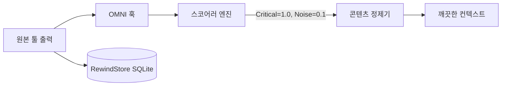

<div align="center">
  

<h1>OMNI</h1>
<p align="center">
    <em><b>터미널 노이즈 1만 줄을 읽히려고 Claude에 비용을 내는 일은 이제 그만두세요.</b> OMNI는 에이전트가 보기 전에 <code>git</code>을 89%, <code>cargo</code>를 91%, <code>kubectl</code>을 77% 잘라냅니다. 나머지는 그대로 통과합니다. 잃어버리는 것은 없고, 결과를 지어내지도 않습니다.</em>
</p>

[🇺🇸 English](../README.md) | [🇯🇵 日本語](README-ja.md) | [🇨🇳 简体中文](README-zh.md) | [🇸🇦 العربية](README-ar.md) | [🇮🇩 Bahasa Indonesia](README-id.md) | [🇻🇳 Tiếng Việt](README-vi.md) | [🇰🇷 한국어](README-ko.md)

[](https://github.com/fajarhide/omni/actions/workflows/ci.yml)
[](https://github.com/fajarhide/omni/releases)
  [](https://www.rust-lang.org/)
  [](https://modelcontextprotocol.io/)
  [](https://github.com/fajarhide/omni/blob/main/LICENSE)
  [](https://hits.sh/github.com/fajarhide/omni/)
</br></br>
<b>
<code>git</code> 89% &middot; <code>cargo</code> 91% &middot; <code>kubectl</code> 77% &middot; 명령당 21 ms &middot; 9,965건 중 출력이 커진 호출 0건 &middot; 잘라낸 모든 것을 바이트 단위로 복원 &middot; 세션 간 메모리 </b>

</br></br>

```bash
brew install fajarhide/tap/omni && omni init
```

Claude Code, Cursor, Windsurf, Codex, Roo에서 별도 설정 없이 동작합니다.

</br>

</div>

---

모든 AI 코딩 어시스턴트에는 두 가지 큰 문제가 있습니다.

**1. 전부 다 읽습니다.**  
빌드 로그.  
Docker 로그.  
CI 로그.  
진행 표시줄.  
ANSI 색상.  
한 줄을 찾자고 수천 개의 토큰을 씁니다. 비싼 건 Claude가 아니라 당신의 터미널입니다.

**2. 전부 다 잊습니다.**  
Cursor를 재시작할 때마다, 또는 Claude Code에서 Windsurf로 옮길 때마다 에이전트는 기억을 잃습니다. 프로젝트 목표를 다시 설명해야 하고, 똑같은 프레임워크 함정을 몇 번이고 다시 알려줘야 합니다.

OMNI는 둘 다 해결합니다.

---

## 무엇이 다른가

**문제 1: 터미널이 신호를 덮어버린다**

같은 `git log`를 나란히 놓고 봅니다. OMNI 없이는 커밋 하나의 `Author` / `Date` /
본문만으로 화면이 찹니다. OMNI를 쓰면 **모든 커밋이 남습니다.** `hash subject`
한 줄로, 94% 더 작게. 요약으로 사라진 것은 없고, 푸터의 숫자는 실제 바이트 수에서
측정한 것이지 약속이 아닙니다.

<table>
<tr>
<td align="center"><b>OMNI 없이</b><br/><sub>원본 <code>git log -15</code></sub></td>
<td align="center"><b>OMNI 사용</b><br/><sub>모든 커밋 유지, 94% 감소</sub></td>
</tr>
<tr>
<td valign="top"></td>
<td valign="top"></td>
</tr>
</table>

`tests/fixtures/`와 재생한 트레이스에서 실측한 숫자이며, 희망 사항이 아닙니다.

| 명령 | OMNI 없이 | OMNI 사용 | 절감 |
|---|---|---|---|
| `cargo test` (490 통과, 10 실패) | 테스트별 출력 16.5 KB | 러너 자신의 통과/실패 요약 | **92.9%** |
| `git status` (변경 있음) | porcelain 출력 496 B | 브랜치와 변경된 경로 | **61.7%** |
| `docker build` (캐시 노이즈 많음) | 레이어 해시와 진행 표시줄 9.2 KB | 빌드 결과, 캐시 히트는 접음 | **35.9%** |
| `git diff` (여러 파일) | 락파일, 공백, 생성물 변경 | 실제로 바뀐 코드 | **25.2%** |
| `kubectl get pods` (pod 35개, 5개 크래시) | 전체 테이블 | 전체 테이블 | 의도된 **0%** |

위의 모든 수치는 실제로 **전달된** 페이로드이며, OMNI가 무언가를 버릴 때마다 붙이는
약 77바이트의 복원 마커를 포함합니다. 이전 릴리스는 그 마커를 붙이기 전의 정제기
출력을 인용했고, 그래서 작은 페이로드가 실제보다 좋아 보였습니다. `git diff`는 여기서
25.2%, 마커가 없으면 44.6%입니다. 잘라낸 것을 되돌릴 수 있게 만드는 것이 바로 그
마커이므로 숫자에 포함되는 것이 맞습니다.

흥미로운 줄은 `kubectl get pods`입니다. 예전에는 9.3%를 보고했지만 지금은 아무것도
보고하지 않습니다. pod 테이블은 모든 줄이 데이터인 열거이고, 버릴 노이즈가 없기
때문입니다. 그 9.3%를 잃은 것이 바로 수정이었습니다.

> **의도적으로 아무것도 하지 않는 곳.** 실패한 명령은 그대로 통과시킵니다. 숨겨진 오류가 압축되지 않은 오류보다 비싸기 때문입니다. 구조화된 출력(JSON, YAML, CSV)은 절대 건드리지 않습니다. 파이프라인의 다음 단계가 그것을 파싱할 테니까요. OMNI는 반복적인 툴 잡음에서 제 몫을 하고 그 밖에서는 비켜서며, 그래서 실행하는 모든 명령에 켜둔 채로 두어도 안전합니다.

### 잃어버리는 것은 없습니다. 지어내지도 않습니다.

두 가지 약속이고, 둘 다 이 문단이 아니라 코드 안에 있습니다.

**잃어버리는 것은 없습니다.** OMNI가 잘라낸 모든 바이트는 SHA-256을 키로 로컬 RewindStore에 보관됩니다. 에이전트는 정제된 출력과 함께 해시를 받고, `omni_retrieve`를 호출해 대화 도중에 명령을 다시 실행하지 않고도 원본을 바이트 단위로 되찾을 수 있습니다.

**지어내지도 않습니다.** 입력에서 아무것도 인식하지 못한 정제기는 원본 입력을 그대로 반환합니다. 관례가 아니라 타입입니다. `distill`은 `Option<String>`을 반환하고, 라우팅 계층은 `None`을 받을 때마다 원본으로 되돌아갑니다. OMNI가 읽지 않은 초록색 "no errors"를 만들어내는 코드 경로는 없습니다.

다른 압축 도구는 잘라낸 것이 중요하지 않았다고 *믿어달라*고 합니다. OMNI는 영수증을 건넵니다.

| 보장 | 방법 | 근거 |
|---|---|---|
| **원본을 바이트 단위로 되찾을 수 있음** | 잘라낸 것은 모두 로컬 SQLite **RewindStore**에 보관(SHA-256에서 내용으로). 에이전트는 해시를 받아 `omni_retrieve`를 호출 | [`동작 방식`](#동작-방식) |
| **결과를 결코 지어내지 않음** | 아무 신호도 파싱하지 못한 정제기는 초록색 `no errors`나 `passed`가 아니라 원본 출력을 반환 | [#143](https://github.com/fajarhide/omni/issues/143) |
| **실패를 결코 가리지 않음** | 종료 코드가 0이 아닌 명령은 그대로 통과 | [#120](https://github.com/fajarhide/omni/issues/120) |
| **구조화된 데이터는 건드리지 않음** | JSON / YAML / NDJSON / CSV는 바이트 단위로 그대로 통과 | `pipeline::format` |
| **숫자는 측정된 것이지 희망이 아님** | 릴리스 바이너리에서 실제 트레이스 9,965건 재생. 게다가 호출의 90.0%는 절약이 전혀 없었고 그 숫자도 함께 공개 | [`벤치마크`](#벤치마크) |

더 큰 압축률로는 살 수 없는 것이 바로 이것입니다. **원본은 언제나 복원할 수 있고, 에이전트에게 거짓말하지 않습니다.**

**문제 2: 에이전트는 하룻밤 사이에 모든 것을 잊는다**

### 새 세션을 시작할 때
**OMNI 없이:** "프로젝트 구조를 다시 설명해 주세요. auth 모듈이 망가졌고, MySQL이 아니라 Postgres를 씁니다."  
**OMNI 사용:** 에이전트는 이미 알고 있습니다. 당신이 멈춘 지점부터 이어갑니다.

### 같은 버그를 두 번 고칠 때
**OMNI 없이:** 어제 이미 풀었던 프레임워크 함정에 기억이 없어 다시 부딪힙니다.  
**OMNI 사용:** 그 해결책은 이미 저장돼 있습니다. 같은 실수를 반복하기 전에 MCP 도구 `omni_recall`로 스스로 꺼내옵니다.

### 여러 IDE를 오가는 작업 (Cursor에서 Claude Code로)
**OMNI 없이:** 새 IDE, 새 에이전트, 컨텍스트는 0. 처음부터 다시 시작합니다.  
**OMNI 사용:** 세션 요약이 자동으로 주입되어 새 에이전트가 곧바로 따라잡습니다.

---

## 왜 중요한가

AI에게 *보내지 않는* 코드는 보내는 코드만큼 중요합니다.

터미널 노이즈를 메가바이트 단위로 먹이면 AI는 컨텍스트 비대에 빠져, 엉뚱한 경고에 대한 수정을 환각하고 API 예산을 무관한 출력에 태웁니다.

에이전트를 재시작했는데 기억이 없으면, 자동으로 보존되었어야 할 맥락을 다시 세우느라 몇 시간을 잃습니다.

OMNI는 둘 다, 눈에 띄지 않게 해결합니다.

* **노이즈가 줄어** 비용이 내려가고, 모델이 걸려 넘어질 무관한 출력도 줄어듭니다.
* **설계부터 포맷 안전**: JSON, YAML, NDJSON, CSV는 바이트 단위로 그대로 통과하고, 입력을 파싱하지 못한 정제기는 요약을 지어내는 대신 조용히 있습니다.
* **지속되는 기억**: 프로젝트를 다시 설명할 필요도, 같은 수정을 반복할 필요도 없습니다.
* **한 번 설치**: 이미 쓰고 있는 모든 에이전트와 조용히 함께 동작합니다.

---

## 벤치마크

한 개발자의 실제 사용에서 재생한 **9,965건의 실제 명령 실행**에 대해 릴리스
바이너리에서 측정했습니다 (`cargo test --release --test bench_replay -- --ignored`).

* **실제로 노이즈를 만드는 명령에서는 76에서 91%.** `cargo` 91.4%, `git` 89.2%,
  `kubectl` 76.5%. 당신의 컨텍스트 예산이 사라지는 곳이 거기이고, OMNI가 일하는 곳도
  거기입니다.
* **OMNI는 10개 명령 중 1개에만 손을 대고, 나머지 9개에는 0바이트를 더합니다.**
  요약기가 아니라 필터입니다. 자를 것이 없으면 완전히 비켜서기 때문에 모든 명령에
  켜둔 채로 두어도 안전합니다.
* **9,965건 중 출력을 더 크게 만든 호출은 하나도 없습니다.** 이런 부류의 도구에서
  정말로 확인할 가치가 있는 숫자이고, 같은 하네스가 그것을 찍습니다.
* 시끄러운 명령과 조용한 명령을 합친 전체 구성에서 **바이트 43.3% 감소**
  (40.1 MB에서 22.7 MB로).
* **구조화된 출력은 결코 건드리지 않습니다.** JSON, YAML, NDJSON, CSV는 바이트 단위로
  그대로 통과합니다. 손상된 페이로드가 놓친 압축보다 비싸기 때문입니다.

이 코퍼스는 결과가 모델에 도달한 호출만 셉니다. 터미널 출력은 제외했습니다. 이
설치본에서 원시 바이트의 68%를 차지하며, 포함하면 43.3% 대신 79.1%를 찍을 수
있습니다. 그렇게 하지 않습니다. 그 숫자는 어떤 모델도 읽지 않은 모집단을 재는 것이기
때문입니다.

이 부류의 도구 대부분은 큰 백분율 하나를 공개합니다. 우리는 아무것도 하지 않은 호출의
비율을 공개합니다. 모든 명령에서 90%를 주장하는 도구는, 당신에게 필요했던 무언가를
요약해 버렸다고 말하는 셈이기 때문입니다.

<div align="center">

</div>

같은 9,965건의 실행에서 절감이 실제로 어디서 오는지:

| 명령 | 호출 | 입력 | 출력 | 절감 |
|---------|-------|-------|--------|-------|
| `cargo` | 124 | 1.5 MB | 127 KB | **91.4%** |
| `git` | 931 | 12.0 MB | 1.3 MB | **89.2%** |
| `kubectl` | 456 | 5.5 MB | 1.3 MB | **76.5%** |
| `az` | 62 | 264 KB | 176 KB | **33.6%** |
| `grep` | 938 | 2.4 MB | 2.0 MB | **18.1%** |
| `gh` | 232 | 534 KB | 509 KB | **4.6%** |
| `cd` | 2,963 | 5.6 MB | 5.5 MB | **2.2%** |
| `cat`, `ls`, `find`, `sed`, `python3` | 1,235 | 4.2 MB | 4.2 MB | **0%** |

결과 전체를 떠받치는 것은 `git`, `cargo`, `kubectl`입니다. 마지막 줄이 이 표의 요점
입니다. 가장 많이 실행되는 명령 다섯 개는 이제 의도적인 패스스루입니다. 그 출력이 모든
줄이 데이터인 열거이기 때문입니다. 예전에는 절감을 보고했고, 그 절감 하나하나가 누군가
필요로 했던 줄이었습니다.

직접 하나씩 재현하고 싶다면 `tests/fixtures/`의 단일 픽스처:

| 명령 / 상황 | 입력 | 출력 | 절감 |
|-------------------|-------|--------|-------|
| `cargo build` (대규모, 성공) | 3,220 B | 87 B | **97.3%** |
| `cargo test` (490 통과, 10 실패) | 16,515 B | 1,178 B | **92.9%** |
| `git status` (변경 있음) | 496 B | 190 B | **61.7%** |
| `git diff` (여러 파일) | 397 B | 297 B | **25.2%** |
| `docker build` (노이즈 많음) | 9,207 B | 5,904 B | **35.9%** |
| `kubectl get pods` (혼합) | 840 B | 840 B | **0%** |

"출력"은 에이전트가 받는 것이며 마커를 포함합니다. 약 77바이트의 복원 마커를 빼면
이전 릴리스가 공개한 수치와 일치합니다. 에이전트가 그만큼도 지불하므로 여기서는
세었습니다.

**명령당 21 ms.** 포스트 훅을 거친 파이프라인 전체의 값이며, 페이로드 크기가 아니라
기록과 함께 커집니다. 릴리스 바이너리, 각 12회의 중앙값:

| | 새 데이터베이스 | 205 MB 데이터베이스 |
|---|---|---|
| `git status` (496 B) | **21.1 ms** | **60.7 ms** |
| `cargo test` (16.5 KB) | **24.5 ms** | **64.5 ms** |

페이로드 크기는 거의 영향이 없고, 데이터베이스 크기가 영향을 줍니다. 이전 릴리스는 새
데이터베이스에서 82 ms와 276 ms를 측정했는데, 그 차이는 더 빠른 기계가 아니라 세 가지
수정입니다. 보고용 열 하나 때문에 명령마다 로드되던 GPT 토크나이저, 해당 필터가
맞든 아니든 컴파일되던 249개의 라인 필터 정규식, 그리고 페이로드 하나를 처리하고
끝나는 프로세스에서 SQLite 핸들을 네 개 여는 커넥션 풀입니다.

*자신의 실제 토큰 절감을 보려면 며칠 사용한 뒤 `omni stats`를 실행하세요.*


---

## 빠른 시작과 설치

OMNI는 설정이 대단히 쉽고, 터미널에 네이티브로 통합됩니다.

**macOS / Linux:**
```bash
# 1. Homebrew로 설치
brew install fajarhide/tap/omni

# 2. OMNI 설정 (Claude, VS Code, OpenCode, Codex, Antigravity용 대화형 메뉴)
omni init

# 3. 동작 확인
omni doctor

# 4. 문제가 있으면 자동 수정
omni doctor --fix

# 5. 현재 상태 확인
omni init --status
```

**범용 설치 스크립트 (macOS / Linux / WSL):**
```bash 
curl -fsSL omni.weekndlabs.com/install | bash
```

**Windows (PowerShell):**
```powershell
irm omni.weekndlabs.com/install.ps1 | iex
```

---

## 통합

OMNI는 당신이 이미 쓰고 있는 에이전트 도구들과 매끄럽게 동작하며, 그들의 터미널 실행을 자동으로 가로챕니다.

* Claude Code
* Cursor
* Windsurf
* Roo Code
* OpenAI Codex
* Antigravity CLI

---

## Adaptive Memory OS

OMNI는 단순한 터미널 필터가 아니라 AI 건망증의 치료제입니다.

AI 에이전트와 한 시간 넘게 일해 본 적이 있다면 컨텍스트 손실의 고통을 압니다. 에이전트를 재시작하면 무엇을 하고 있었는지 갑자기 잊습니다. 프로젝트 목표를 잊습니다. 저장소의 문서화되지 않은 특이점을 잊었기 때문에, 어제와 똑같은 실수를 다시 시작합니다.

OMNI의 Memory OS는 이를 해결하려고 배경에서 조용히 돌아갑니다.

* **목표를 다시 설명하지 않기 (`omni goal`)**: 북극성 목표를 한 번만 설정하세요. OMNI는 매 프롬프트마다 그 우선순위를 집요하게 상기시켜, 에이전트가 과제에서 벗어나지 않게 합니다.
* **생각의 흐름을 잃지 않기 (세션 연속성)**: Cursor가 죽거나 Claude Code로 옮겨도, OMNI는 직전 세션의 압축 요약을 즉시 주입합니다. 새 에이전트는 어떤 파일이 뜨거웠는지, 마지막 활성 오류가 무엇이었는지 정확히 알고 멈춘 자리에서 이어갑니다.
* **한 번만 가르치기 (`omni remember`)**: 같은 환각을 계속 고치지 마세요. 에이전트는 프로젝트별 규칙, 함정, 아키텍처 결정을 OMNI의 로컬 SQLite 백엔드에 직접 저장할 수 있습니다. 나중에 막히면 의미 검색으로 그 답을 스스로 꺼내옵니다.

에이전트는 매일 당신의 코드베이스에 대해 더 똑똑해지고, 당신은 두 번 다시 같은 말을 반복하지 않아도 됩니다.

---

## 동작 방식

OMNI는 전적으로 로컬에서, 결정적인 `Read → Guard → Score → Collapse → Distill → Persist` 파이프라인으로 동작합니다.



AI가 버려진 노이즈를 *정말로* 필요로 하면, OMNI의 로컬 SQLite **RewindStore**가 압축되지 않은 전체 로그를 해시와 함께 안전하게 보관하고 있어 에이전트가 언제든 가져올 수 있습니다.

---

## 아키텍처


<div align="center">
  
</div>

Rust로 만들었지만, 엔드투엔드 비용은 0이 아닙니다.

* **정제**: 스코어링과 접기 파이프라인 자체는 한 자릿수 밀리초에 실행됩니다.
* **엔드투엔드**: 실제로 기다리는 것은 거기에 RewindStore 쓰기를 더한 값이며, 기록과 함께 커집니다. 새 데이터베이스에서 약 21 ms, 205 MB 데이터베이스에서 약 61 ms입니다. 공짜라고 가정하기 전에 [벤치마크](#벤치마크)를 보세요.
* **메모리**: 효율적인 스트림으로 동작해, 2만 줄 로그에서도 메모리 사용량이 평평하게 유지됩니다.
* **페일 오픈**: OMNI가 패닉하면 조용히 실패하고 원본 출력을 통과시킵니다. 호스트 에이전트를 죽이는 일은 결코 없습니다.

```bash
# 개발
cargo build --release
cargo test --all
make fmt && make clippy
```

---

## FAQ

**OMNI가 제 로그를 영구히 삭제하나요?**  
아닙니다. 원본 로그는 압축되어 로컬 SQLite RewindStore에 저장됩니다. AI는 해시를 받고, 필요하면 전체 로그를 가져올 수 있습니다.

**터미널이 느려지나요?**  
네, 측정 가능한 수준으로요. 그리고 비용은 기록과 함께 커집니다. 정제 파이프라인 자체는 한 자릿수 밀리초지만, 후킹된 모든 명령은 로컬 RewindStore에도 씁니다. 496바이트 `git status`는 새 데이터베이스에서 약 21 ms, 205 MB 데이터베이스에서 약 61 ms, 16.5 KB `cargo test`는 약 25 ms입니다. 예산에 넣어두세요. 원본 출력이 필요할 때는 `OMNI_PASSTHROUGH=1`로 파이프라인 전체를 건너뛸 수 있습니다.

**제 필터를 추가할 수 있나요?**  
가능합니다. 사내 도구 특유의 노이즈를 벗기는 법을 TOML로 OMNI에 가르칠 수 있습니다.
```toml
# ~/.omni/signals/custom.toml
[filters.my_tool]
match_command = "^internal-tool\\b"
strip_lines_matching = ["^DEBUG", "syncing..."]
```

## 기여와 라이선스

이것은 에이전트 AI 시대를 위해 만들어진, 애정에서 출발한 프로젝트입니다. 토큰 비용을 아끼러 오셨든, 무료 모델을 시험해 보러 오셨든, 최고의 에이전트 도구 벨트를 함께 만들러 오셨든, 기여는 언제나 환영합니다!

- **개발**: 소스에서 빌드하고 싶으신가요? `make ci`와 `cargo build`를 실행하세요. 자세한 내용은 [CONTRIBUTING.md](../CONTRIBUTING.md)를 보세요.
- **라이선스**: [MIT License](../LICENSE)

<!-- Star History -->
<p align="center">
  <a href="https://star-history.com/#fajarhide/omni&Date">
    <picture>
      <source media="(prefers-color-scheme: dark)" srcset="https://api.star-history.com/svg?repos=fajarhide/omni&type=Date&theme=dark" />
      <source media="(prefers-color-scheme: light)" srcset="https://api.star-history.com/svg?repos=fajarhide/omni&type=Date" />
      
    </picture>
  </a>
</p>
<center>
Build with ❤️ by <a href="https://github.com/fajarhide">Fajar Hidayat</a>
</center>
