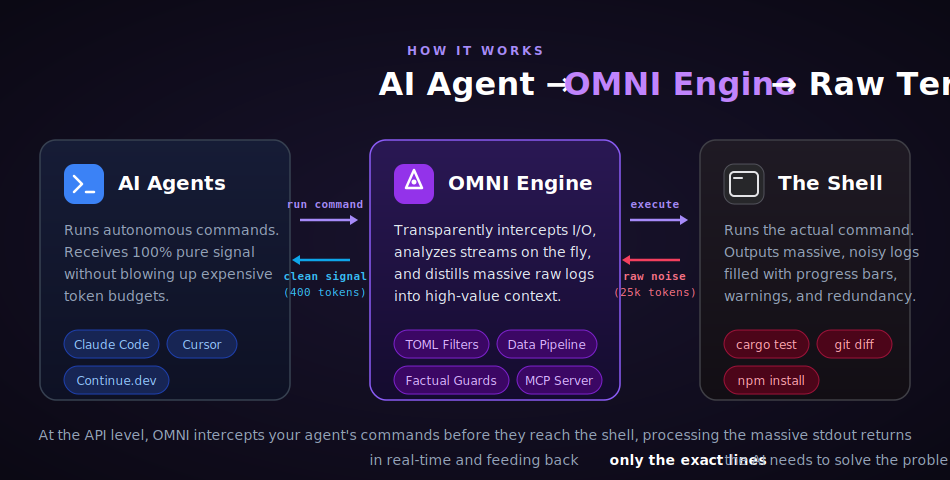

<div align="center">
  
  
  **Hệ điều hành Context cho AI Agents. Ít nhiễu hơn. Nhiều tín hiệu hơn. Giảm tiêu thụ token của bạn lên đến 90%.**

  [🇺🇸 English](../README.md) | [🇯🇵 日本語](README-ja.md) | [🇨🇳 简体中文](README-zh.md) | [🇸🇦 العربية](README-ar.md) | [🇮🇩 Bahasa Indonesia](README-id.md) | [🇻🇳 Tiếng Việt](README-vi.md) | [🇰🇷 한국어](README-ko.md)

  [](https://github.com/fajarhide/omni/actions/workflows/ci.yml)
  [](https://github.com/fajarhide/omni/releases)
  [](https://www.rust-lang.org/)
  [](https://modelcontextprotocol.io/)
  [](https://github.com/fajarhide/omni/blob/main/LICENSE)
  [](https://hits.sh/github.com/fajarhide/omni/)
</div>

<br/>

> **OMNI** là **Hệ Điều Hành Ngữ Cảnh (Context OS) dành cho Tác Nhân AI Tự Trị**.
> Nó hoạt động như một bộ lọc ngữ nghĩa hiệu suất cao giữa thiết bị đầu cuối (terminal) của bạn và LLM. Bằng cách chưng cất thông minh các nhật ký ồn ào, lưu trữ trạng thái và quản lý ngân sách mã thông báo (token), OMNI đảm bảo các tác nhân của bạn luôn tập trung, ít ảo giác hơn và thực thi các vòng lặp một cách hoàn hảo—tất cả trong khi **cắt giảm chi phí API của bạn lên đến 90%**.
> 
> *Ngừng trả tiền cho sự ồn ào của thiết bị đầu cuối. Bắt đầu xây dựng bằng tín hiệu thuần túy.*
---

## Mục lục
- [Vấn đề: Phình to ngữ cảnh, Token Đắt đỏ & Đầu ra Ồn ào](#vấn-đề-phình-to-ngữ-cảnh-token-đắt-đỏ--đầu-ra-ồn-ào)
- [Giải pháp: Omni](#giải-pháp-omni)
- [Triết lý](#triết-lý)
- [Các Trường hợp Sử dụng Thực tế](#các-trường-hợp-sử-dụng-thực-tế)
- [Hiệu suất & Điểm chuẩn](#hiệu-suất--điểm-chuẩn)
- [Giải thích các Tính năng](#giải-thích-các-tính-năng)
- [Dưới Mui xe: Cách Omni Hoạt động](#dưới-mui-xe-cách-omni-hoạt-động)
- [Kiến trúc](#kiến-trúc)
- [Bắt đầu Nhanh & Cài đặt](#bắt-đầu-nhanh--cài-đặt)
- [Cách Sử dụng](#cách-sử-dụng)
  - [Hỗ trợ & Tích hợp Đa Tác nhân](#hỗ-trợ--tích-hợp-đa-tác-nhân)
  - [Chỉ mục Tài liệu](#chỉ-mục-tài-liệu)
- [Hoạt động Tốt hơn với Heimsense](#hoạt-động-tốt-hơn-với-heimsense)
- [Đóng góp & Giấy phép](#đóng-góp--giấy-phép)

---

## Vấn đề: Mã thông báo đắt đỏ, Ảo giác & Vòng lặp vô hạn

Khi bạn chạy các tác nhân AI tự trị (như Claude Code, Cursor hoặc Aider) trong thiết bị đầu cuối của mình, chúng đọc *mọi thứ*. Một lệnh `npm install` hoặc `cargo test` đơn giản có thể dễ dàng đổ 10.000 đến 25.000 mã thông báo (token) chứa toàn tiếng ồn vô ích vào cửa sổ ngữ cảnh AI của bạn.

Điều này gây ra những thất bại nghiêm trọng:
1. **Đốt sạch ngân sách**: Bạn trả tiền thật cho từng mã thông báo của đầu ra rác.
2. **Tác nhân "Mất trí nhớ" & Ảo giác**: Các lỗi cốt lõi bị chôn vùi dưới hàng megabyte thanh tải (loading bar) và cảnh báo phụ thuộc. AI trở nên bối rối, đánh mất mục tiêu ban đầu và tạo ra các bản sửa lỗi ảo giác cho những vấn đề không chính xác.
3. **Bị khóa vào Mô hình đắt tiền (Model Lock-in)**: Bạn buộc phải sử dụng các mô hình hàng đầu đắt tiền nhất chỉ để có một cửa sổ ngữ cảnh đủ lớn nhằm xử lý sự cồng kềnh đó.
4. **Vòng lặp mong manh**: Các vòng lặp tự trị bị phá vỡ vì các tác nhân thiếu nhận thức về giới hạn mã thông báo và áp lực ngữ cảnh.

## Giải pháp: OMNI Context OS

OMNI là phần mềm trung gian minh bạch tối thượng dành cho Agentic AI.

Nó chặn các lệnh từ thiết bị đầu cuối ngay lập tức, loại bỏ tiếng ồn và cung cấp cho AI của bạn một bản tóm tắt ngữ nghĩa cô đọng cao. **Kết quả?** Bạn có thể chạy tác nhân của mình trên các mô hình giá cả phải chăng, cung cấp cho nó *không có tiếng ồn*, và chứng kiến nó giải quyết các tác vụ mã hóa phức tạp ngay lập tức.

Cho dù bạn đang chạy một lệnh gọi công cụ MCP nhanh hay điều phối một vòng lặp Maker-Checker đa tác nhân khổng lồ, OMNI cung cấp bộ nhớ liên tục, theo dõi ngân sách và các hàng rào thực tế mà AI của bạn cần để thành công.

Ngữ cảnh rất đắt đỏ và ồn ào. OMNI sẽ sửa chữa điều đó.

---

## Triết lý

OMNI không được xây dựng chỉ để "cắt giảm ngữ cảnh" hoặc "tiết kiệm token" — đó chỉ là những tác dụng phụ vui vẻ. Triết lý thực sự đằng sau OMNI là **Chất lượng Ngữ cảnh**.

Các tác nhân AI như Claude chỉ thông minh như ngữ cảnh bạn cung cấp cho chúng. Khi bạn làm ngập chúng bằng megabyte nhật ký phụ thuộc hoặc thanh tải, bạn buộc chúng phải sàng lọc rác để tìm ra vấn đề thực sự. Điều này làm loãng khả năng suy luận của chúng và dẫn đến các phản hồi bị suy giảm hoặc không hữu ích.

**Mục tiêu của OMNI là cung cấp cho AI của bạn tín hiệu thuần túy, mật độ cao.** Điều này có nghĩa là chỉ lấy ngữ cảnh thực sự quan trọng và có ý nghĩa đối với Claude. Chúng tôi dọn dẹp những tiếng ồn mà AI không cần, có nghĩa là:
1. Tự động, số lượng token bạn sử dụng ít hơn đáng kể.
2. Phản hồi của AI có **chất lượng cao hơn đáng kể** vì cửa sổ ngữ cảnh của nó được tập trung tia laser vào vấn đề thực sự.

**Hãy dùng thử trong một tuần.** Cảm nhận sự khác biệt về chất lượng và tốc độ suy luận của AI khi nó được cung cấp một chế độ ăn gồm tín hiệu thuần túy thay vì tiếng ồn thô của thiết bị đầu cuối.

---

## Các Trường hợp Sử dụng Thực tế

OMNI được thiết kế để giải quyết những sự bực bội hàng ngày của các nhà phát triển Agentic AI. Đây là cách OMNI biến đổi quy trình làm việc của bạn:

1. **"Vòng lặp Vô hạn của Cái chết" trong Monorepos**
   - **Tình huống**: Bạn yêu cầu Claude chạy `npm install` và `npm run build` trong một monorepo lớn. Nó xuất ra 20.000 dòng cảnh báo phụ thuộc và một lỗi bản dựng nhỏ ở cuối. AI bị phân tâm bởi các cảnh báo và cố gắng khắc phục các sự cố phụ thuộc không liên quan, đốt cháy token của bạn và khiến bạn mắc kẹt trong một vòng lặp vô hạn.
   - **Bản sửa lỗi của OMNI**: OMNI chặn bản dựng. Nó hoàn toàn tắt tiếng hàng trăm cảnh báo `peer dependency` và chỉ đưa ra `Build Error: Cannot find module 'X'` cùng với dấu vết ngăn xếp (stack trace). AI thấy đầu ra 50 token và sửa mã ngay lập tức.

2. **"Ảo giác Im lặng" trên Tệp Lớn**
   - **Tình huống**: AI muốn hiểu một dự án và chạy `cat src/utils.ts`. Tệp dài 3.000 dòng. AI vật lộn để giữ tất cả nó trong bộ nhớ làm việc và bắt đầu ảo giác các chữ ký hàm.
   - **Bản sửa lỗi của OMNI**: OMNI chặn `cat` thô và thay thế nó bằng **Structured Outline (Dàn ý có cấu trúc)**. Nó hiển thị cho AI các lượt nhập, API công khai (tên hàm và loại) và đánh dấu rủi ro, giảm đầu ra 80%. Sau đó, OMNI cảnh báo AI: `"Tệp này có 12 yếu tố phụ thuộc — hãy sử dụng omni_context cho bản đồ tác động."` AI được hướng dẫn để thực hiện các chỉnh sửa an toàn hơn, dựa trên thực tế.

3. **Cộng tác Đa Tác nhân**
   - **Tình huống**: Bạn đang sử dụng Cursor IDE để chỉnh sửa nhanh và Claude Code CLI cho các tác vụ nặng. Cả hai đều cần biết chuyện gì đang xảy ra mà không cần chạy các lệnh thừa và lãng phí token.
   - **Bản sửa lỗi của OMNI**: OMNI hoạt động như một lớp bộ nhớ chia sẻ. Bằng cách sử dụng `omni_agents` và `Store` SQLite cục bộ của nó, Cursor và Claude chia sẻ cùng các luồng bộ nhớ đã được lọc, lỗi hoạt động và môi trường thực thi. Chúng hợp tác mà không đụng độ.

---

## Hiệu suất & Điểm chuẩn
<div align="center">

</div>

OMNI được xây dựng bằng Rust để thực thi không có độ trễ và hiệu quả tàn nhẫn. Dưới đây là các điểm chuẩn thực tế được đo lường trên tệp nhị phân phát hành:

| Lệnh / Ngữ cảnh | Kích thước Đầu vào | Kích thước Đầu ra | Token Tiết kiệm | Tác động lên AI |
|-------------------|------------|-------------|---------------|--------------|
| `docker build` (đa giai đoạn) | 9.2 KB | 49 bytes | **99.5%** | Loại bỏ nhiễu bộ nhớ đệm; AI ngay lập tức nhìn thấy lỗi xây dựng thực sự. |
| `cargo test` (bộ lớn) | 16.5 KB | 4.3 KB | **78.0%** | Tước hàng trăm bài kiểm tra "ok"; AI chỉ tập trung vào các lỗi và dấu vết ngăn xếp. |
| `git status` (bẩn) | 496 bytes | 113 bytes | **77.2%** | Xóa các tệp sạch và gợi ý; chỉ giữ các tệp đã sửa đổi/không bị theo dõi. |
| `kubectl get pods` | 840 bytes | 762 bytes | **10.0%** | Hiển thị có chọn lọc các pod CrashLoopBackOff/Error, bỏ qua các pod khỏe mạnh. |
| `git diff` (đa tệp) | 397 bytes | 220 bytes | **50.0%** | Bảo vệ các hunk có thay đổi, loại bỏ các dòng ngữ cảnh thừa. |

- **Độ trễ Đường ống**: **< 100ms** (đầu cuối, bao gồm khởi động nhị phân)
- **Tiết kiệm Mọi lúc**: **97.3%** giảm token qua các phiên phát triển trung bình.
- **ROI**: **$35+ USD** tiết kiệm được cho mỗi nhà phát triển/tháng (đo trên các mô hình hàng đầu).

*Để xem khoản tiết kiệm token thực tế của riêng bạn, chỉ cần chạy `omni stats` sau vài ngày sử dụng.*

---

## Giải thích các Tính năng

### Động cơ Chưng cất Cốt lõi (Core Distillation Engine)
- **Không còn sự nhầm lẫn cho AI**: Omni hoạt động như một bộ lọc thông minh. Nếu một bài kiểm tra thất bại, nó *chỉ* hiển thị cho AI dòng lỗi cụ thể và stack trace, chặn các nhật ký phụ thuộc ồn ào.
- **Giảm 90% Token**: Bằng cách loại bỏ tiếng ồn thiết bị đầu cuối vô ích, bạn cắt giảm hóa đơn API của mình một cách đáng kể.
- **Nén Thích ứng (Adaptive Compression)**: OMNI theo dõi khi các tác nhân truy xuất đầu ra bị bỏ sót. Nếu một lệnh thường xuyên bị truy xuất, OMNI sẽ tự động nới lỏng việc nén vào lần tới.
- **Bỏ qua Tốc độ cao Thông minh**: Để đảm bảo độ trễ bằng 0 cho các tác vụ nhỏ, OMNI tự động bỏ qua quá trình chưng cất đối với các đầu ra dưới ngưỡng 2000 token.

### An toàn Ngữ cảnh & Bảo vệ Sự thật (Context Safety)
- **Không mất thông tin**: Lo lắng Omni lọc mất thứ gì đó quan trọng? Đừng lo. Omni lưu đầu ra thô cục bộ (`RewindStore`). AI có thể tự động yêu cầu nó bằng cách sử dụng `omni_retrieve`.
- **Cảnh vệ Chống Ảo giác**: OMNI chỉ phát ra cảnh báo khi nó có thông tin xác thực. Nếu đầu ra bị nén nhiều hoặc một tệp có quá nhiều phụ thuộc, OMNI sẽ đưa ra cảnh báo hệ thống để giữ cho AI của bạn thực tế.
- **Khả năng Hiển thị Việc Bỏ sót**: OMNI đánh dấu rõ ràng nội dung bị xóa (ví dụ: `[OMNI: omitted X lines of noise]`) trong đầu ra, giúp AI của bạn nhận thức tình huống tốt hơn.

### Trí tuệ Đa Tác nhân & Không gian Làm việc
- **Cộng tác Đa Tác nhân**: Nhận thức đầy đủ về môi trường của nó. Nếu bạn đang chạy Cursor cùng với Claude CLI, chúng sẽ chia sẻ mượt mà các luồng bộ nhớ đã lọc mà không bị xung đột.
- **Trí tuệ Phiên làm việc**: OMNI nhớ những gì bạn đang làm. Nó biết tệp nào bạn đang chỉnh sửa và ngừng cung cấp cho AI ngữ cảnh thừa thãi.
- **ReadFile + Grep có Cấu trúc**: Thay vì kết xuất tệp thô, OMNI trả về dàn ý có cấu trúc (imports, public API) và các tóm tắt grep được nhóm.
- **Biểu đồ Phụ thuộc Nhẹ**: OMNI xây dựng biểu đồ mối quan hệ tệp cục bộ nhanh chóng. Nếu AI của bạn đọc một tệp được nhập nhiều, OMNI sẽ cảnh báo về bản đồ tác động.

### Độ trung thực Ngữ cảnh & Phục hồi Phiên (Context Fidelity & Session Recovery)
- **Engrams (Tóm tắt Nhiệm vụ phụ Tự động)**: OMNI tự động phát hiện khi một nhiệm vụ phụ hoàn thành (ví dụ: giải quyết lỗi biên dịch, commit mã hoặc sửa một bài kiểm tra bị hỏng). Nó tạo ra một bản chụp nhanh được nén cao (một "Engram") mà không lãng phí token cho các cuộc gọi LLM, do đó tác nhân của bạn không bao giờ bị "chứng quên ngữ cảnh" trong các phiên làm việc dài.
- **Nén Ngữ cảnh Thông minh (Smart Context Compaction)**: Khi cửa sổ ngữ cảnh của bạn đầy, OMNI không cắt giảm token một cách mù quáng. Nó sử dụng thuật toán nhận biết ưu tiên để đóng gói dữ liệu quan trọng nhất trước (Tệp được Ghim > Lỗi Hoạt động > Engrams > Hoạt động Công cụ > Tệp Nóng), tiết kiệm chi phí rất lớn.
- **Bàn giao Phiên (Session Handoffs)**: Chuyển từ Claude Code sang Cursor? Sử dụng công cụ `omni_handoff` để xuất ngay lập tức bộ nhớ của phiên hiện tại (tệp nóng, lệnh gần đây, lỗi hoạt động) thành một bản tóm tắt markdown di động mà tác nhân mới của bạn có thể hấp thụ ngay lập tức.

### Kỹ thuật Vòng lặp Tự động (Autonomous Loop Engineering)
- **Hệ điều hành Ngữ cảnh cho Vòng lặp**: OMNI quản lý ngữ cảnh cho các tác nhân vòng lặp tự động lặp lại. Thông qua các biến môi trường (`OMNI_LOOP_BUDGET`, `OMNI_LOOP_GOAL`), OMNI áp đặt giới hạn chưng cất thích ứng và theo dõi lâu dài.
- **Mẫu Xác minh Maker-Checker**: Mở rộng các nhiệm vụ của bạn một cách gọn gàng bằng cách tách việc thực thi (Tác nhân Maker) khỏi xác thực (Tác nhân Checker), trao đổi trạng thái ngữ cảnh một cách an toàn thông qua bộ nhớ phiên đa tác nhân của OMNI.
- **Giới hạn Dự đoán Dựa trên Mục tiêu**: Việc chưng cất tự động mở rộng quy mô dựa trên mục tiêu nhiệm vụ—nếu mục tiêu chứa "debug", OMNI sẽ giữ lại nhiều ngữ cảnh lỗi hơn. Nếu là "refactor", OMNI sẽ nén dấu vết mã một cách mạnh mẽ.

### Giám sát & Gỡ lỗi
- **Bảng điều khiển Sức khỏe Phiên**: Chạy `omni session --health` để có bảng điều khiển trực quan đẹp mắt về áp lực ngữ cảnh, các engram hoạt động, hoạt động công cụ đang cuộn và token tiết kiệm được.
- **Màn hình Chưng cất**: Theo dõi token tiết kiệm được theo thời gian. Sử dụng `omni_budget` và `omni_history` ngay bên trong LLM của bạn, hoặc chạy `omni stats`.
- **Tác động Hình ảnh (`omni diff`)**: Chạy `omni diff` để so sánh trực quan đầu ra thô khổng lồ với phiên bản được lọc tinh gọn của Omni.
- **Chuyển tiếp Gỡ lỗi**: Cần đầu ra thô? Chỉ cần đặt `OMNI_PASSTHROUGH=1` trong môi trường của bạn để vượt qua hoàn toàn động cơ và xem đầu ra gốc.

---

## Dưới Mui xe: Cách Omni Hoạt động

OMNI không chỉ là một kịch bản regex; nó là một **Động cơ Tín hiệu Ngữ nghĩa** hiệu suất cao được viết bằng Rust. Nhưng làm thế nào nó thực sự cắt giảm 90% mức tiêu thụ token trong vòng chưa đầy 100 mili giây?

Đây là câu chuyện về những gì xảy ra bên trong cơ sở mã OMNI khi AI Agent của bạn nhập một lệnh như `cargo test`:

1. **Sự đánh chặn (`src/hooks` & `src/main.rs`)**: Ngay lúc AI nhấn "Enter", OMNI sẽ đánh chặn việc thực thi. `main.rs` tự động phát hiện ngữ cảnh. Mô-đun `hooks` bọc lệnh một cách liền mạch, cho phép OMNI ghi lại đầu ra thiết bị đầu cuối thô dưới dạng luồng dữ liệu tốc độ cao mà không làm chậm quá trình thực thi.
2. **Đường ống Truyền phát (`src/pipeline`)**: Thay vì đợi lệnh hoàn tất và đổ hàng megabyte văn bản vào bộ nhớ, OMNI xử lý đầu ra từng dòng bằng cách sử dụng đường ống truyền phát hiệu quả về bộ nhớ.
3. **Bộ não Ngữ nghĩa (`src/distillers` & `src/guard`)**: Khi văn bản truyền vào, nó đi qua các Distillers. Được hỗ trợ bởi các quy tắc TOML (`signals/`), các bộ chưng cất phân tích ý nghĩa ngữ nghĩa của đầu ra.
   - Đây có phải là một bánh xe tải không? *Vứt nó đi.*
   - Đây có phải là danh sách 500 bài kiểm tra đạt không? *Vứt nó đi.*
   - Đây có phải là một stack trace lỗi không? **Giữ nó lại.**
   Trong khi đó, mô-đun `guard` đảm bảo sự thật được giữ nguyên.
4. **Mạng lưới An toàn (`src/store`)**: OMNI tuân theo chính sách "Không mất thông tin" nghiêm ngặt. Trước khi bất kỳ tiếng ồn nào bị loại bỏ, đầu ra thô được lưu trữ an toàn trong cơ sở dữ liệu SQLite cục bộ, nhanh chóng (`Store`). OMNI để lại một mẩu bánh mì nhỏ trong ngữ cảnh của AI: `[OMNI: omitted 1,200 lines of noise. Use omni_retrieve to view]`.
5. **Giao diện Đa tác nhân (`src/mcp` & `src/session`)**: Cuối cùng, đầu ra tín hiệu cao được trả về cho AI. Đằng sau hậu trường, máy chủ `mcp` đã sẵn sàng. Nếu AI muốn truy vấn các lỗi lịch sử, các công cụ MCP cung cấp quyền truy cập có cấu trúc ngay lập tức.

**Kết quả:** Kết xuất đầu cuối `25.000` token cồng kềnh trở thành một báo cáo lỗi `400` token ngắn gọn. AI hiểu vấn đề ngay lập tức và bạn tiết kiệm được tiền thật.

---

## Kiến trúc

<div align="center">
  
</div>

## Bắt đầu Nhanh & Cài đặt

Omni cực kỳ dễ thiết lập. Nó tích hợp nguyên bản vào thiết bị đầu cuối của bạn.

**macOS / Linux:**
```bash
# 1. Cài đặt qua Homebrew
brew install fajarhide/tap/omni

# 2. Thiết lập Omni (Menu tương tác)
omni init

# 3. Xác minh nó đang hoạt động
omni doctor

# 4. Hoặc tự động khắc phục mọi sự cố
omni doctor --fix

# 5. Kiểm tra trạng thái hiện tại
omni init --status
```

**Trình cài đặt Chung (macOS / Linux / WSL):**
```bash 
curl -fsSL omni.weekndlabs.com/install | bash
```

**Windows (PowerShell):**
```powershell
irm omni.weekndlabs.com/install.ps1 | iex
```

---

## Cách Sử dụng

Sau khi được cài đặt, OMNI hoạt động vô hình trong nền. Cho dù AI của bạn chạy lệnh thiết bị đầu cuối qua MCP hay bạn tự chuyển đầu ra (`ls | omni`), OMNI tự động nhảy vào như một lớp trong suốt.

Để xem phân tích chi tiết về khoản tiết kiệm:
```bash
omni stats
```

Để chẩn đoán cài đặt OMNI của bạn:
```bash
omni doctor
```

Bạn có thể dễ dàng tạo các quy tắc của riêng mình bằng cách sử dụng các tệp TOML đơn giản trong `~/.omni/signals/`.

### Hỗ trợ & Tích hợp Đa Tác nhân

Theo mặc định, `omni init --claude` tự động móc vào **Claude Code**. Tuy nhiên, OMNI hoạt động hoàn hảo với bất kỳ AI tác nhân nào! Chạy `omni init` để xem menu tương tác.

1. **VS Code & Continue.dev**: Sử dụng trình cung cấp ngữ cảnh MCP của chúng tôi (`integrations/continue-dev/`).
2. **OpenCode & Codex CLI**: Các trình bao bọc tích hợp tự động chuyển đầu ra lệnh đến OMNI.
3. **Antigravity IDE**: OMNI đăng ký dưới dạng máy chủ MCP nguyên bản.
4. **Pi Agent**: Gói OMNI nguyên bản cho Pi.

**Tinh chỉnh Đa Tác nhân (`~/.omni/config.toml`)**
```toml
[global]
aggressiveness = "balanced"

[agents.vscode_continue]
aggressiveness = "aggressive"
enable_readfile_distillation = true

[agents.opencode]
aggressiveness = "conservative"
enable_readfile_distillation = false
```

### Chỉ mục Tài liệu

**Dành cho Người dùng:**
- [Hướng dẫn Tối thượng (HOW_TO_USE.md)](../docs/HOW_TO_USE.md) — Mọi thứ bạn cần.
- [Tích hợp OpenClaw](https://clawhub.ai/fajarhide/omni-signal-engine) — Plugin OpenClaw chính thức.
- [Tích hợp Hermes Agent](https://github.com/wysie/hermes-omni-plugin) — Plugin Hermes Agent cộng đồng.

**Dành cho Nhà phát triển & Người Tích hợp Hệ thống:**
- [Hướng dẫn Kỹ thuật Vòng lặp](../docs/LOOP_ENGINEERING.md) — Cách tích hợp OMNI với các tác nhân tự động.
- [Hướng dẫn Phát triển](../docs/DEVELOPMENT.md) — Cách đóng góp.
- [Kiến trúc Kiểm tra](../docs/TESTING.md) — Đảm bảo chất lượng.
- [Tính liên tục của Phiên](../docs/SESSION.md) — Bộ nhớ của OMNI.
- [Bản đồ Đường đi](../docs/ROADMAP.md) — Tính năng sắp tới.
- [Hướng dẫn Di chuyển](../docs/MIGRATION.md)

---

## Hoạt động Tốt hơn với Heimsense

Omni là một phần của bộ công cụ AI cá nhân của tôi. Nếu bạn sử dụng `claude-code`, tôi khuyên bạn nên ghép Omni với dự án khác của tôi: **[Heimsense](https://github.com/fajarhide/heimsense)**.

Heimsense mở khóa các môi trường hạn chế như `claude-code` để chạy với *bất kỳ* mô hình miễn phí hoặc tương thích với OpenAI nào.
**Omni + Heimsense** = Chạy các khung tác nhân đẳng cấp thế giới bằng các mô hình giá cả phải chăng với độ ồn bằng 0.

---

## Đóng góp & Giấy phép

Đây là một dự án đam mê được xây dựng cho kỷ nguyên của Agentic AI. Mọi đóng góp đều luôn được hoan nghênh!

- **Phát triển**: Muốn xây dựng từ mã nguồn? Chạy `make ci` và `cargo build`.
- **Giấy phép**: [MIT License](../LICENSE)

<!-- Star History -->
<p align="center">
  <a href="https://star-history.com/#fajarhide/omni&Date">
    <picture>
      <source media="(prefers-color-scheme: dark)" srcset="https://api.star-history.com/svg?repos=fajarhide/omni&type=Date&theme=dark" />
      <source media="(prefers-color-scheme: light)" srcset="https://api.star-history.com/svg?repos=fajarhide/omni&type=Date" />
      
    </picture>
  </a>
</p>

Dibuat dengan ❤️ oleh [Fajar Hidayat](https://github.com/fajarhide)
