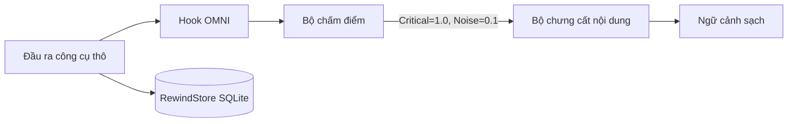

<div align="center">
  

<h1>OMNI</h1>
<p align="center">
    <em><b>Đừng trả tiền để Claude đọc 10.000 dòng nhiễu terminal nữa.</b> OMNI cắt <code>git</code> 89%, <code>cargo</code> 91% và <code>kubectl</code> 77% trước khi agent của bạn kịp nhìn thấy. Mọi thứ còn lại đi qua nguyên vẹn. Không mất gì cả, và nó không bao giờ bịa ra kết quả.</em>
</p>

[🇺🇸 English](../README.md) | [🇯🇵 日本語](README-ja.md) | [🇨🇳 简体中文](README-zh.md) | [🇸🇦 العربية](README-ar.md) | [🇮🇩 Bahasa Indonesia](README-id.md) | [🇻🇳 Tiếng Việt](README-vi.md) | [🇰🇷 한국어](README-ko.md)

[](https://github.com/fajarhide/omni/actions/workflows/ci.yml)
[](https://github.com/fajarhide/omni/releases)
  [](https://www.rust-lang.org/)
  [](https://modelcontextprotocol.io/)
  [](https://github.com/fajarhide/omni/blob/main/LICENSE)
  [](https://hits.sh/github.com/fajarhide/omni/)
</br></br>
<b>
<code>git</code> 89% &middot; <code>cargo</code> 91% &middot; <code>kubectl</code> 77% &middot; 21 ms mỗi lệnh &middot; 0 trong 9.965 lệnh gọi làm đầu ra lớn hơn &middot; mọi phần bị cắt đều khôi phục được từng byte &middot; bộ nhớ xuyên phiên </b>

</br></br>

```bash
brew install fajarhide/tap/omni && omni init
```

Chạy được ngay với Claude Code, Cursor, Windsurf, Codex và Roo.

</br>

</div>

---

Mọi trợ lý lập trình AI đều có hai vấn đề lớn.

**1. Chúng đọc mọi thứ.**  
Log build.  
Log Docker.  
Log CI.  
Thanh tiến trình.  
Màu ANSI.  
Hàng nghìn token, chỉ để tìm một dòng. Claude không đắt. Terminal của bạn mới đắt.

**2. Chúng quên mọi thứ.**  
Mỗi lần bạn khởi động lại Cursor, hay chuyển từ Claude Code sang Windsurf, agent của bạn mất trí nhớ. Bạn phải giải thích lại mục tiêu dự án. Bạn phải nhắc lại cùng những cái bẫy của framework hết lần này đến lần khác.

OMNI sửa cả hai.

---

## Khác biệt ở đâu

**Vấn đề 1: terminal nhấn chìm tín hiệu**

Cùng một `git log`, đặt cạnh nhau. Không có OMNI, riêng `Author` / `Date` / phần thân
của một commit đã đầy màn hình. Có OMNI, **mọi commit đều còn nguyên**, dưới dạng một
dòng `hash subject`, nhỏ hơn 94%. Không có gì bị tóm tắt mất đi; con số ở chân trang
được đo từ số byte thật, không phải lời hứa.

<table>
<tr>
<td align="center"><b>Không có OMNI</b><br/><sub><code>git log -15</code> thô</sub></td>
<td align="center"><b>Có OMNI</b><br/><sub>giữ mọi commit, nhỏ hơn 94%</sub></td>
</tr>
<tr>
<td valign="top"></td>
<td valign="top"></td>
</tr>
</table>

Con số thật, đo trên `tests/fixtures/` và các trace phát lại, không phải mong muốn:

| Lệnh | Không có OMNI | Có OMNI | Tiết kiệm |
|---|---|---|---|
| `cargo test` (490 đạt, 10 hỏng) | 16,5 KB đầu ra từng test | bản tóm tắt đạt/hỏng của chính runner | **92,9%** |
| `git status` (có thay đổi) | 496 B đầu ra porcelain | nhánh và các đường dẫn đã đổi | **61,7%** |
| `docker build` (nhiễu cache nặng) | 9,2 KB hash layer và thanh tiến trình | kết quả build, cache hit được gộp | **35,9%** |
| `git diff` (nhiều tệp) | lockfile, khoảng trắng, thay đổi do sinh mã | phần mã thực sự thay đổi | **25,2%** |
| `kubectl get pods` (35 pod, 5 crash) | toàn bộ bảng | toàn bộ bảng | **0%**, có chủ đích |

Mọi con số ở trên là payload **thực sự được giao**, đã tính cả dấu khôi phục khoảng
77 byte mà OMNI gắn vào mỗi khi nó bỏ đi thứ gì đó. Các bản phát hành trước trích đầu
ra của bộ chưng cất trước dấu đó, khiến các payload nhỏ trông đẹp hơn thực tế:
`git diff` đọc là 25,2% ở đây và 44,6% nếu không tính. Chính dấu đó làm cho phần bị cắt
khôi phục được, nên nó thuộc về con số.

Dòng đáng chú ý là `kubectl get pods`. Trước đây nó báo 9,3%; giờ nó không báo gì cả, vì
một bảng pod là một liệt kê mà mỗi dòng là một dữ liệu, không có nhiễu nào để bỏ. Mất
9,3% đó chính là bản sửa lỗi.

> **Nơi nó cố ý không làm gì.** Một lệnh thất bại được cho qua nguyên vẹn, vì một lỗi bị giấu đắt hơn một lỗi chưa nén. Đầu ra có cấu trúc (JSON, YAML, CSV) không bao giờ bị chạm vào, vì bước tiếp theo trong pipeline của bạn sẽ phân tích nó. OMNI xứng đáng có mặt ở phần lải nhải lặp lại của công cụ và tránh đường ở mọi chỗ khác, và đó là điều khiến việc bật nó cho mọi lệnh bạn chạy là an toàn.

### Không mất gì cả. Nó không bao giờ bịa ra điều gì.

Hai lời hứa, và cả hai nằm trong mã nguồn chứ không nằm trong đoạn văn này.

**Không mất gì cả.** Mọi byte OMNI cắt đi đều được lưu cục bộ trong RewindStore, khóa bằng SHA-256. Agent nhận một hash kèm đầu ra đã chưng cất và có thể gọi `omni_retrieve` để kéo bản gốc về từng byte một, ngay giữa cuộc hội thoại, mà không cần chạy lại lệnh của bạn.

**Nó không bao giờ bịa ra điều gì.** Bộ chưng cất không nhận ra gì trong đầu vào sẽ trả lại đúng đầu vào thô. Đó là một kiểu dữ liệu, không phải một quy ước: `distill` trả về `Option<String>` và lớp định tuyến quay về bản gốc mỗi khi nhận `None`. Không có đường mã nào tạo ra một dòng xanh "no errors" mà OMNI chưa đọc.

Các bộ nén khác đề nghị bạn *tin* rằng thứ họ cắt đi không quan trọng. OMNI đưa cho bạn biên nhận:

| Bảo đảm | Bằng cách nào | Bằng chứng |
|---|---|---|
| **Lấy lại bản gốc, từng byte một** | mọi thứ bị cắt đều được lưu trong **RewindStore** SQLite cục bộ (SHA-256 tới nội dung); agent nhận một hash và gọi `omni_retrieve` | [`Cách hoạt động`](#cách-hoạt-động) |
| **Không bao giờ bịa kết quả** | bộ chưng cất không phân tích được tín hiệu nào sẽ trả về đầu ra thô, chứ không phải một dòng xanh `no errors` hay `passed` | [#143](https://github.com/fajarhide/omni/issues/143) |
| **Thất bại không bao giờ bị che** | lệnh thoát với mã khác 0 được cho qua nguyên vẹn | [#120](https://github.com/fajarhide/omni/issues/120) |
| **Dữ liệu có cấu trúc không bị chạm** | JSON / YAML / NDJSON / CSV đi qua từng byte một | `pipeline::format` |
| **Số liệu là đo được, không phải kỳ vọng** | 9.965 trace thật phát lại trên bản binary phát hành, và 90,0% lệnh gọi không tiết kiệm được gì, con số đó chúng tôi cũng công bố | [`Đo đạc`](#đo-đạc) |

Đó là điều mà một tỉ lệ nén lớn hơn không mua được: **bạn luôn khôi phục được bản gốc, và nó sẽ không bao giờ nói dối agent của bạn.**

**Vấn đề 2: agent của bạn quên sạch sau một đêm**

### Bắt đầu một phiên mới
**Không có OMNI:** "Giải thích lại cấu trúc dự án giúp mình, module auth đang hỏng, và tụi mình dùng Postgres chứ không phải MySQL."  
**Có OMNI:** Agent đã biết rồi. Nó tiếp tục từ chỗ bạn dừng.

### Sửa cùng một bug hai lần
**Không có OMNI:** Agent lại vấp đúng cái bẫy framework nó đã gỡ hôm qua, vì nó không có trí nhớ.  
**Có OMNI:** Cách sửa đã được lưu. Agent tự lôi ra qua công cụ MCP `omni_recall` trước khi lặp lại sai lầm.

### Làm việc qua nhiều IDE (Cursor sang Claude Code)
**Không có OMNI:** IDE mới, agent mới, ngữ cảnh bằng 0. Bạn bắt đầu lại từ đầu.  
**Có OMNI:** Bản tóm tắt phiên được tiêm tự động. Agent mới bắt nhịp ngay.

---

## Vì sao điều này quan trọng

Đoạn mã bạn *không* gửi cho AI cũng quan trọng như đoạn bạn gửi.

Khi bạn nhồi cho AI hàng megabyte nhiễu terminal, nó rơi vào tình trạng phình ngữ cảnh: ảo giác ra cách sửa cho những cảnh báo không liên quan và đốt ngân sách API vào đầu ra vô ích.

Khi bạn khởi động lại agent và nó không có trí nhớ, bạn mất hàng giờ dựng lại ngữ cảnh lẽ ra đã được giữ tự động.

OMNI giải quyết cả hai, một cách vô hình:

* **Ít nhiễu hơn** nên chi phí thấp hơn, và ít đầu ra vô ích để mô hình vấp phải hơn.
* **An toàn định dạng từ thiết kế**: JSON, YAML, NDJSON và CSV đi qua từng byte một; bộ chưng cất không phân tích được đầu vào sẽ im lặng thay vì bịa ra một bản tóm tắt.
* **Bộ nhớ bền**: không phải giải thích lại dự án, không phải lặp lại cùng một cách sửa.
* **Cài một lần**: chạy lặng lẽ cùng mọi agent bạn đang dùng.

---

## Đo đạc

Đo trên bản binary phát hành bằng cách phát lại **9.965 lần thực thi lệnh thật** từ
thói quen sử dụng của một lập trình viên (`cargo test --release --test bench_replay -- --ignored`):

* **Trên những lệnh thực sự sinh nhiễu, 76 đến 91%.** `cargo` 91,4%, `git` 89,2%,
  `kubectl` 76,5%. Đó là nơi ngân sách ngữ cảnh của bạn tiêu hết, và cũng là nơi OMNI
  làm việc.
* **OMNI ra tay với 1 lệnh trong 10, và thêm 0 byte vào 9 lệnh còn lại.** Nó là bộ lọc,
  không phải bộ tóm tắt. Khi không có gì để cắt, nó tránh đường hoàn toàn, và đó là lý
  do bật nó cho mọi thứ vẫn an toàn.
* **Không một lệnh gọi nào trong 9.965 làm đầu ra lớn hơn.** Đó là con số đáng kiểm tra
  ở bất kỳ công cụ nào kiểu này, và chính bộ đo đó in ra nó.
* **Giảm 43,3% số byte** trên toàn bộ tổ hợp, cả lệnh ồn ào lẫn lệnh yên tĩnh
  (40,1 MB xuống 22,7 MB).
* **Đầu ra có cấu trúc không bao giờ bị chạm vào.** JSON, YAML, NDJSON và CSV đi qua
  từng byte một, vì một payload hỏng đắt hơn một lần nén bị bỏ lỡ.

Tập dữ liệu chỉ đếm những lệnh gọi mà kết quả đến được một mô hình. Đầu ra terminal bị
loại trừ: nó chiếm 68% số byte thô trên bản cài này, và nếu tính vào thì chúng tôi có
thể in 79,1% thay vì 43,3%. Chúng tôi không làm vậy, vì con số đó đang đo một tập hợp
mà không mô hình nào từng đọc.

Phần lớn công cụ cùng loại công bố một tỉ lệ phần trăm thật to. Chúng tôi công bố tỉ lệ
lệnh gọi mà chúng tôi không làm gì cả, vì một công cụ tuyên bố 90% trên mọi lệnh đang
nói với bạn rằng nó đã tóm tắt mất thứ bạn cần.

<div align="center">

</div>

Phần tiết kiệm thực sự đến từ đâu, trên cùng 9.965 lần thực thi:

| Lệnh | Lần gọi | Vào | Ra | Tiết kiệm |
|---------|-------|-------|--------|-------|
| `cargo` | 124 | 1,5 MB | 127 KB | **91,4%** |
| `git` | 931 | 12,0 MB | 1,3 MB | **89,2%** |
| `kubectl` | 456 | 5,5 MB | 1,3 MB | **76,5%** |
| `az` | 62 | 264 KB | 176 KB | **33,6%** |
| `grep` | 938 | 2,4 MB | 2,0 MB | **18,1%** |
| `gh` | 232 | 534 KB | 509 KB | **4,6%** |
| `cd` | 2.963 | 5,6 MB | 5,5 MB | **2,2%** |
| `cat`, `ls`, `find`, `sed`, `python3` | 1.235 | 4,2 MB | 4,2 MB | **0%** |

`git`, `cargo` và `kubectl` gánh toàn bộ kết quả. Dòng cuối mới là điểm chính của bảng
này: năm trong số các lệnh chạy nhiều nhất giờ được cho qua nguyên vẹn một cách có chủ
đích, vì đầu ra của chúng là liệt kê mà mỗi dòng là một dữ liệu. Trước đây chúng từng
báo có tiết kiệm, và mỗi phần tiết kiệm đó là một dòng ai đó cần.

Các fixture đơn lẻ trong `tests/fixtures/`, nếu bạn muốn tự tái lập từng cái:

| Lệnh / Bối cảnh | Vào | Ra | Tiết kiệm |
|-------------------|-------|--------|-------|
| `cargo build` (lớn, thành công) | 3.220 B | 87 B | **97,3%** |
| `cargo test` (490 đạt, 10 hỏng) | 16.515 B | 1.178 B | **92,9%** |
| `git status` (có thay đổi) | 496 B | 190 B | **61,7%** |
| `git diff` (nhiều tệp) | 397 B | 297 B | **25,2%** |
| `docker build` (nhiễu nặng) | 9.207 B | 5.904 B | **35,9%** |
| `kubectl get pods` (hỗn hợp) | 840 B | 840 B | **0%** |

"Ra" là thứ agent nhận được, đã gồm cả dấu khôi phục. Trừ đi dấu khoảng 77 byte thì
các con số này khớp với những gì các bản phát hành trước công bố; dấu đó được đếm ở đây
vì agent phải trả cho nó.

**21 ms mỗi lệnh.** Đó là toàn bộ pipeline từ đầu tới cuối qua post-hook, và nó lớn dần
theo lịch sử của bạn chứ không theo kích thước payload. Trung vị của 12 lần chạy mỗi ô,
bản binary phát hành:

| | cơ sở dữ liệu mới | cơ sở dữ liệu 205 MB |
|---|---|---|
| `git status` (496 B) | **21,1 ms** | **60,7 ms** |
| `cargo test` (16,5 KB) | **24,5 ms** | **64,5 ms** |

Kích thước payload gần như không quan trọng; kích thước cơ sở dữ liệu thì có. Các bản
phát hành trước đo được 82 ms và 276 ms trên cơ sở dữ liệu mới, và khác biệt đến từ ba
bản sửa chứ không phải một cỗ máy nhanh hơn: một bộ tokenizer GPT được nạp cho mỗi lệnh
chỉ để phục vụ một cột báo cáo, 249 biểu thức chính quy lọc dòng được biên dịch bất kể
bộ lọc của chúng có khớp hay không, và một connection pool mở bốn handle SQLite trong
một tiến trình kết thúc sau đúng một payload.

*Để xem mức tiết kiệm token của chính bạn, chỉ cần chạy `omni stats` sau vài ngày sử dụng.*


---

## Bắt đầu nhanh & Cài đặt

OMNI cực kỳ dễ thiết lập và tích hợp nguyên bản vào terminal của bạn.

**macOS / Linux:**
```bash
# 1. Cài qua Homebrew
brew install fajarhide/tap/omni

# 2. Thiết lập OMNI (menu tương tác cho Claude, VS Code, OpenCode, Codex, Antigravity)
omni init

# 3. Kiểm tra đã chạy
omni doctor

# 4. Hoặc tự động sửa nếu có vấn đề
omni doctor --fix

# 5. Xem trạng thái hiện tại
omni init --status
```

**Trình cài đặt chung (macOS / Linux / WSL):**
```bash 
curl -fsSL omni.weekndlabs.com/install | bash
```

**Windows (PowerShell):**
```powershell
irm omni.weekndlabs.com/install.ps1 | iex
```

---

## Tích hợp

OMNI hoạt động trơn tru với các công cụ agent bạn đang dùng. Nó tự động chặn các lần thực thi terminal của chúng.

* Claude Code
* Cursor
* Windsurf
* Roo Code
* OpenAI Codex
* Antigravity CLI

---

## Adaptive Memory OS

OMNI không chỉ là một bộ lọc terminal, nó là thuốc chữa chứng mất trí nhớ của AI.

Nếu bạn từng làm việc với một AI agent quá một giờ, bạn biết nỗi đau mất ngữ cảnh. Bạn khởi động lại agent, và đột nhiên nó quên đang làm gì. Nó quên mục tiêu dự án. Nó bắt đầu lặp đúng những sai lầm hôm qua vì đã quên những điểm kỳ quặc không được ghi lại của kho mã.

Memory OS của OMNI chạy lặng lẽ ở nền để giải quyết chuyện này:

* **Thôi giải thích lại mục tiêu (`omni goal`)**: đặt mục tiêu sao Bắc Đẩu của bạn một lần. OMNI sẽ nhắc agent về đúng ưu tiên đó trong từng prompt, không để nó trôi khỏi nhiệm vụ.
* **Không đánh mất mạch suy nghĩ (tính liên tục của phiên)**: nếu Cursor sập hoặc bạn chuyển sang Claude Code, OMNI lập tức tiêm một bản tóm tắt nén của phiên trước. Agent mới biết chính xác tệp nào đang nóng và lỗi hoạt động cuối cùng là gì, rồi tiếp tục từ chỗ bạn dừng.
* **Dạy một lần (`omni remember`)**: đừng sửa mãi cùng một ảo giác. Agent có thể lưu quy tắc, cái bẫy và quyết định kiến trúc riêng của dự án thẳng vào backend SQLite cục bộ của OMNI. Khi bí về sau, chúng tự kéo câu trả lời ra bằng tìm kiếm ngữ nghĩa.

Agent của bạn hiểu kho mã của bạn hơn mỗi ngày, và bạn không phải lặp lại chính mình nữa.

---

## Cách hoạt động

OMNI chạy hoàn toàn cục bộ theo một pipeline tất định `Read → Guard → Score → Collapse → Distill → Persist`.


```mermaid
flowchart LR
    Command[Đầu ra công cụ thô] --> Hook[Hook OMNI]
    Hook --> Score[Bộ chấm điểm]
    Score -->|Critical=1.0, Noise=0.1| Distill[Bộ chưng cất nội dung]
    Distill --> Clean[Ngữ cảnh sạch]
    Command --> SQLite[(RewindStore SQLite)]
```

Nếu AI *thực sự* cần phần nhiễu đã bị bỏ, **RewindStore** SQLite cục bộ của OMNI giữ toàn bộ log chưa nén một cách an toàn dưới dạng đã băm, để agent lấy lại bất cứ lúc nào.

---

## Kiến trúc


<div align="center">
  
</div>

Viết bằng Rust, dù chi phí đầu-cuối không phải bằng 0.

* **Chưng cất**: bản thân pipeline chấm điểm và gộp chạy trong vài mili giây một chữ số.
* **Đầu cuối**: thứ bạn thực sự chờ là phần đó cộng với lần ghi RewindStore, và nó lớn dần theo lịch sử, khoảng 21 ms với cơ sở dữ liệu mới và khoảng 61 ms với cơ sở dữ liệu 205 MB. Xem [Đo đạc](#đo-đạc) trước khi cho rằng nó miễn phí.
* **Bộ nhớ**: hoạt động qua stream hiệu quả, giữ mức dùng bộ nhớ phẳng ngay cả với log 20.000 dòng.
* **Fail open**: nếu OMNI panic, nó thất bại lặng lẽ và cho đầu ra thô đi qua. Nó sẽ không bao giờ làm sập agent chủ của bạn.

```bash
# Phát triển
cargo build --release
cargo test --all
make fmt && make clippy
```

---

## Câu hỏi thường gặp

**OMNI có xóa vĩnh viễn log của tôi không?**  
Không. Log thô được nén và lưu cục bộ trong RewindStore SQLite. AI nhận một hash và có thể lấy lại toàn bộ log khi cần.

**Việc này có làm terminal của tôi chậm đi không?**  
Có, ở mức đo được, và chi phí lớn dần theo lịch sử. Bản thân pipeline chưng cất chạy trong vài mili giây một chữ số, nhưng mọi lệnh được hook cũng ghi vào RewindStore cục bộ: `git status` 496 byte mất khoảng 21 ms với cơ sở dữ liệu mới và khoảng 61 ms với cơ sở dữ liệu 205 MB, còn `cargo test` 16,5 KB mất khoảng 25 ms. Hãy tính vào ngân sách. `OMNI_PASSTHROUGH=1` bỏ qua toàn bộ pipeline khi bạn cần lại đầu ra thô.

**Tôi có thể thêm bộ lọc của riêng mình không?**  
Có. Bạn có thể dạy OMNI bóc phần nhiễu riêng của công cụ nội bộ bằng TOML:
```toml
# ~/.omni/signals/custom.toml
[filters.my_tool]
match_command = "^internal-tool\\b"
strip_lines_matching = ["^DEBUG", "syncing..."]
```

## Đóng góp & Giấy phép

Đây là một dự án làm vì đam mê, xây cho kỷ nguyên AI dạng agent. Dù bạn đến để tiết kiệm tiền token, thử các mô hình miễn phí, hay góp sức dựng nên bộ đồ nghề agent tối thượng, đóng góp luôn được chào đón!

- **Phát triển**: muốn build từ mã nguồn? Chạy `make ci` và `cargo build`. Đọc [CONTRIBUTING.md](../CONTRIBUTING.md) để biết chi tiết.
- **Giấy phép**: [MIT License](../LICENSE)

<!-- Star History -->
<p align="center">
  <a href="https://star-history.com/#fajarhide/omni&Date">
    <picture>
      <source media="(prefers-color-scheme: dark)" srcset="https://api.star-history.com/svg?repos=fajarhide/omni&type=Date&theme=dark" />
      <source media="(prefers-color-scheme: light)" srcset="https://api.star-history.com/svg?repos=fajarhide/omni&type=Date" />
      
    </picture>
  </a>
</p>
<center>
Build with ❤️ by <a href="https://github.com/fajarhide">Fajar Hidayat</a>
</center>
