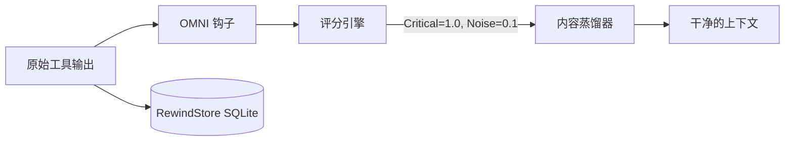

<div align="center">
  

<h1>OMNI</h1>
<p align="center">
    <em>为 AI 智能体提供降噪上下文与长期记忆。<b>有损，但永远可还原，且绝不编造结果。</b>别再为让 Claude 读一万行终端噪音而付费。</em>
</p>

[🇺🇸 English](../README.md) | [🇯🇵 日本語](README-ja.md) | [🇨🇳 简体中文](README-zh.md) | [🇸🇦 العربية](README-ar.md) | [🇮🇩 Bahasa Indonesia](README-id.md) | [🇻🇳 Tiếng Việt](README-vi.md) | [🇰🇷 한국어](README-ko.md)

[](https://github.com/fajarhide/omni/actions/workflows/ci.yml)
[](https://github.com/fajarhide/omni/releases)
  [](https://www.rust-lang.org/)
  [](https://modelcontextprotocol.io/)
  [](https://github.com/fajarhide/omni/blob/main/LICENSE)
  [](https://hits.sh/github.com/fajarhide/omni/)
</br></br>
<b>
真实命令组合下 Token 减少 58.9% &middot; 跨会话记忆 &middot; 格式安全 &middot; 永远可还原 &middot; 失败即放行，绝不编造 &middot; 可复现的数字 </b>

</br></br>

</div>

---

每一个 AI 编码助手都有两个巨大的问题。

**1. 它们什么都读。**  
构建日志。  
Docker 日志。  
CI 日志。  
进度条。  
ANSI 颜色。  
成千上万个 Token，只为找出一行。贵的不是 Claude，是你的终端。

**2. 它们什么都忘。**  
每次重启 Cursor，或者从 Claude Code 换到 Windsurf，你的智能体就失忆了。你得重新解释项目目标，得一遍又一遍提醒它同样的框架陷阱。

OMNI 把这两件事一起解决。

---

## 差别在哪

**问题 1：终端淹没了信号**

同一条 `git log` 并排对比。没有 OMNI，一条提交的 `Author` / `Date` / 正文就填满
了屏幕。有了 OMNI，**每一条提交都还在**，压成一行 `hash subject`，体积小 94%。
没有任何东西被摘要掉；页脚的数字是按真实字节数量出来的，不是承诺出来的。

<table>
<tr>
<td align="center"><b>没有 OMNI</b><br/><sub>原始 <code>git log -15</code></sub></td>
<td align="center"><b>有 OMNI</b><br/><sub>保留每条提交，体积小 94%</sub></td>
</tr>
<tr>
<td valign="top"></td>
<td valign="top"></td>
</tr>
</table>

真实数字，测自 `tests/fixtures/` 与回放的 trace，不是愿景：

| 命令 | 没有 OMNI | 有 OMNI | 节省 |
|---|---|---|---|
| `cargo test`（490 通过，10 失败） | 16.5 KB 逐条测试输出 | 运行器自己的通过/失败汇总 | **93%** |
| `kubectl get pods`（35 个 pod，5 个崩溃） | 整张表 | `35 pods \| 30 running, 5 error` 外加 5 个失败 pod 的名字 | 不裁剪 |
| `git diff`（多文件） | 锁文件、空白、生成物变动 | 真正改动的代码 | **45%** |
| `docker build`（缓存噪音很重） | 9.2 KB 的层哈希与进度条 | 构建结果，缓存命中折叠 | **37%** |

> **诚实的提醒：** OMNI 压缩的是*成功但嘈杂*的输出。**失败**的命令**原样**放行，因为被藏起来的错误比没压缩的错误更糟；结构化输出（JSON/YAML/CSV）从不触碰。它在重复的工具絮语上赚回自己的位置，在别处让开。

### 为什么一个有损工具值得信任

别的压缩工具要你*相信*它砍掉的东西不重要。OMNI 不要求你相信，它做出保证，而每条保证都有你能读到的代码撑着：

| 保证 | 怎么做到 | 依据 |
|---|---|---|
| **原文可按字节取回** | 砍掉的一切都归档在本地 SQLite **RewindStore**（SHA-256 到内容）；智能体拿到哈希并调用 `omni_retrieve` | [`工作原理`](#工作原理) |
| **绝不编造结果** | 没能解析出任何信号的蒸馏器返回原始输出，而不是一句绿色的 `no errors` 或 `passed` | [#143](https://github.com/fajarhide/omni/issues/143) |
| **失败绝不被掩盖** | 退出码非零的命令原样放行 | [#120](https://github.com/fajarhide/omni/issues/120) |
| **结构化数据绝不触碰** | JSON / YAML / NDJSON / CSV 按字节原样通过 | `pipeline::format` |
| **数字是测出来的，不是喊出来的** | 在发布版二进制上回放 1,810 条真实 trace，而且 63.6% 的调用一点没省，这个数字我们同样公开 | [`基准测试`](#基准测试) |

这正是更大的压缩率买不到的东西：**你永远能拿回原文，而它永远不会对你的智能体撒谎。**

**问题 2：你的智能体一夜之间忘光一切**

### 开始一个新会话
**没有 OMNI：**「麻烦再讲一遍项目结构，auth 模块是坏的，我们用的是 Postgres 不是 MySQL。」  
**有 OMNI：** 智能体已经知道了。它从你停下的地方接着做。

### 同一个 bug 修两遍
**没有 OMNI：** 智能体又撞上昨天已经解决过的框架陷阱，因为它没有记忆。  
**有 OMNI：** 修法早已存下。它会在重蹈覆辙之前，通过 MCP 工具 `omni_recall` 自己把答案捞出来。

### 跨 IDE 的工作流（Cursor 到 Claude Code）
**没有 OMNI：** 新 IDE，新智能体，零上下文。你从头开始。  
**有 OMNI：** 会话摘要自动注入，新智能体立刻进入状态。

---

## 为什么这很重要

你*不*发给 AI 的代码，和你发出去的一样重要。

当你把几兆字节的终端噪音喂给 AI，它会陷入上下文膨胀：为不相干的警告幻想出修复方案，把 API 预算烧在无关输出上。

当你重启智能体而它没有记忆，你会花上几个小时重建本该自动留存的上下文。

OMNI 把这两件事都解决了，而且不露痕迹：

* **噪音更少**，成本更低，模型能绊倒的无关输出也更少。
* **设计上就格式安全**：JSON、YAML、NDJSON 和 CSV 按字节原样通过；解析不了输入的蒸馏器会闭嘴，而不是编一份摘要。
* **持久记忆**：不用再解释你的项目，不用再重复同一处修复。
* **装一次**：与你已经在用的每个智能体静默协作。

---

## 基准测试

诚实的头条数字，在发布版二进制上，针对某位开发者真实使用中回放的
**1,810 次真实命令执行**测得：

* 到达模型的字节数，在整个组合上**减少 58.9%**（15.0 MB 到 6.2 MB）。
* **其中 63.6% 的调用一点也没省。** OMNI 把输出原样递回，**没有**多加一个字节。
  全部节省都来自另外 36.4%，那里确实有噪音可砍。
* **结构化输出从不触碰。** JSON、YAML、NDJSON 和 CSV 按字节原样通过，因为一份损坏
  的载荷比一次错过的压缩代价更高。

第二条才是同类工具很少印出来的数字。一个宣称对每条命令都节省 90% 的工具，等于在
告诉你：你需要的输出也被摘要掉了。

<div align="center">

</div>

在同样这 1,810 次执行里，节省究竟从哪来：

| 命令 | 调用 | 输入 | 输出 | 节省 |
|---------|-------|-------|--------|-------|
| `cargo` | 29 | 424 KB | 13 KB | **96.8%** |
| `git` | 256 | 5.9 MB | 509 KB | **91.3%** |
| `ls` | 52 | 71 KB | 29 KB | **59.5%** |
| `kubectl` | 212 | 4.4 MB | 2.3 MB | **48.0%** |
| `find` | 39 | 83 KB | 53 KB | **36.2%** |
| `grep` | 184 | 534 KB | 385 KB | **27.8%** |
| `cat` | 85 | 515 KB | 468 KB | **9.1%** |

扛住结果的是 `git` 和 `cargo`；`cat` 和 `grep` 基本等于没动。OMNI 的位置在嘈杂、
重复的工具输出上，其余地方它让开。

想手动复现一条的话，`tests/fixtures/` 里的单个 fixture：

| 命令 / 场景 | 输入 | 输出 | 节省 |
|-------------------|-------|--------|-------|
| `cargo build`（大型，成功） | 3,220 B | 9 B | **99.7%** |
| `cargo test`（490 通过，10 失败） | 16.5 KB | 1,100 B | **93.3%** |
| `pytest`（有失败） | 730 B | 136 B | **81.4%** |
| `git status`（有改动） | 496 B | 113 B | **77.2%** |
| `git diff`（多文件） | 397 B | 220 B | **44.6%** |
| `docker build`（噪音很重） | 9.2 KB | 5.8 KB | **37.2%** |
| `kubectl get pods`（混合） | 840 B | 762 B | **9.3%** |

**延迟是实打实的成本，不是零。** OMNI 在每条被挂钩的命令上运行，而代价随你的历史
增长：496 字节的 `git status` 对着全新数据库约 82 ms，对着 97 MB 的数据库约 308 ms；
16.5 KB 的 `cargo test` 约 276 ms。请把它算进预算。

*想看自己真实的 Token 节省，用几天之后跑一下 `omni stats` 就好。*


---

## 快速上手与安装

OMNI 极易配置，原生集成进你的终端。

**macOS / Linux:**
```bash
# 1. 通过 Homebrew 安装
brew install fajarhide/tap/omni

# 2. 配置 OMNI（面向 Claude、VS Code、OpenCode、Codex、Antigravity 的交互菜单）
omni init

# 3. 确认已生效
omni doctor

# 4. 或自动修复问题
omni doctor --fix

# 5. 查看当前状态
omni init --status
```

**通用安装脚本（macOS / Linux / WSL）:**
```bash 
curl -fsSL omni.weekndlabs.com/install | bash
```

**Windows (PowerShell):**
```powershell
irm omni.weekndlabs.com/install.ps1 | iex
```

---

## 集成

OMNI 与你已经在用的智能体工具无缝配合，自动拦截它们的终端执行。

* Claude Code
* Cursor
* Windsurf
* Roo Code
* OpenAI Codex
* Antigravity CLI

---

## Adaptive Memory OS

OMNI 不只是一个终端过滤器，它是 AI 健忘症的解药。

只要你和 AI 智能体一起工作超过一小时，就知道上下文丢失有多难受。你重启智能体，它突然忘了你们在做什么，忘了项目目标，开始重犯昨天犯过的一模一样的错误，因为它忘了这个仓库那些没写进文档的怪癖。

OMNI 的 Memory OS 在后台静静运行来解决这件事：

* **不用再重复目标（`omni goal`）**：把你的北极星目标设定一次。OMNI 会在每一次提示里坚持提醒智能体这个优先级，不让它跑偏。
* **不丢失思路（会话连续性）**：Cursor 崩了，或者你换到 Claude Code，OMNI 会立刻注入上一次会话的压缩摘要。新智能体清楚知道哪些文件是热的、最后一个活跃错误是什么，从你停下的地方接着做。
* **只教一次（`omni remember`）**：别再修同一个幻觉。智能体可以把项目专属的规则、陷阱和架构决策直接存进 OMNI 本地的 SQLite 后端。之后卡住时，它会通过语义搜索自动把答案取回来。

你的智能体每天都更懂你的代码库，而你再也不用重复自己。

---

## 工作原理

OMNI 完全在本地运行，走一条确定性的 `Read → Guard → Score → Collapse → Distill → Persist` 流水线。



如果 AI *真的*需要被丢掉的噪音，OMNI 本地的 SQLite **RewindStore** 会把完整的未压缩日志安全地按哈希保存，智能体随时可以取回。

---

## 架构


<div align="center">
  
</div>

用 Rust 构建，不过端到端的开销并不是零。

* **蒸馏**：评分与折叠流水线本身在个位数毫秒内跑完。
* **端到端**：你真正等的是它加上 RewindStore 的写入，而这部分随历史增长，对着全新数据库约 82 ms，对着 97 MB 的数据库约 308 ms。在你假设它免费之前，先看 [基准测试](#基准测试)。
* **内存**：通过高效流处理运行，即使 2 万行日志，内存占用也保持平稳。
* **失败即放行**：如果 OMNI panic，它会静默失败并放行原始输出，绝不会拖垮你的宿主智能体。

```bash
# 开发
cargo build --release
cargo test --all
make fmt && make clippy
```

---

## 常见问题

**OMNI 会永久删除我的日志吗？**  
不会。原始日志被压缩后存在本地的 SQLite RewindStore 里。AI 拿到一个哈希，需要时可以取回完整日志。

**这会让我的终端变慢吗？**  
会，而且是可测量的，代价还随历史增长。蒸馏流水线本身是个位数毫秒，但每条被挂钩的命令还要写一次本地 RewindStore：496 字节的 `git status` 对着全新数据库约 82 ms，对着 97 MB 的数据库约 308 ms，16.5 KB 的 `cargo test` 约 276 ms。请算进预算。需要拿回原始输出时，`OMNI_PASSTHROUGH=1` 会完全跳过流水线。

**我能加自己的过滤器吗？**  
能。你可以用 TOML 教 OMNI 剥掉你们内部工具特有的噪音：
```toml
# ~/.omni/signals/custom.toml
[filters.my_tool]
match_command = "^internal-tool\\b"
strip_lines_matching = ["^DEBUG", "syncing..."]
```

## 贡献与许可

这是一个为智能体 AI 时代而生的兴趣项目。无论你是来省 Token 费用、试用免费模型，还是来一起打造终极的智能体工具带，我们都欢迎贡献！

- **开发**：想从源码构建？运行 `make ci` 和 `cargo build`。细节见 [CONTRIBUTING.md](../CONTRIBUTING.md)。
- **许可**：[MIT License](../LICENSE)

<!-- Star History -->
<p align="center">
  <a href="https://star-history.com/#fajarhide/omni&Date">
    <picture>
      <source media="(prefers-color-scheme: dark)" srcset="https://api.star-history.com/svg?repos=fajarhide/omni&type=Date&theme=dark" />
      <source media="(prefers-color-scheme: light)" srcset="https://api.star-history.com/svg?repos=fajarhide/omni&type=Date" />
      
    </picture>
  </a>
</p>
<center>
Build with ❤️ by <a href="https://github.com/fajarhide">Fajar Hidayat</a>
</center>
