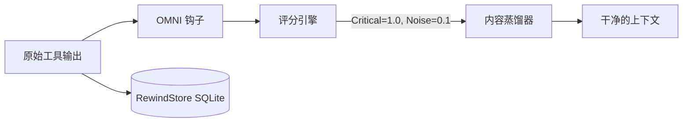

<div align="center">
  

<h1>OMNI</h1>
<p align="center">
    <em><b>别再为让 Claude 读一万行终端噪音而付费。</b>OMNI 在你的智能体看到之前，把 <code>git</code> 砍掉 89%、<code>cargo</code> 砍掉 91%、<code>kubectl</code> 砍掉 77%。其余一切原样通过。没有任何东西会丢失，它也绝不编造结果。</em>
</p>

[🇺🇸 English](../README.md) | [🇯🇵 日本語](README-ja.md) | [🇨🇳 简体中文](README-zh.md) | [🇸🇦 العربية](README-ar.md) | [🇮🇩 Bahasa Indonesia](README-id.md) | [🇻🇳 Tiếng Việt](README-vi.md) | [🇰🇷 한국어](README-ko.md)

[](https://github.com/fajarhide/omni/actions/workflows/ci.yml)
[](https://github.com/fajarhide/omni/releases)
  [](https://www.rust-lang.org/)
  [](https://modelcontextprotocol.io/)
  [](https://github.com/fajarhide/omni/blob/main/LICENSE)
  [](https://hits.sh/github.com/fajarhide/omni/)
</br></br>
<b>
<code>git</code> 89% &middot; <code>cargo</code> 91% &middot; <code>kubectl</code> 77% &middot; 每条命令 21 ms &middot; 9,965 次调用中 0 次让输出变大 &middot; 每一处裁剪都可按字节还原 &middot; 跨会话记忆 </b>

</br></br>

```bash
brew install fajarhide/tap/omni && omni init
```

开箱即用，支持 Claude Code、Cursor、Windsurf、Codex 和 Roo。

</br>

</div>

---

每一个 AI 编码助手都有两个巨大的问题。

**1. 它们什么都读。**  
构建日志。  
Docker 日志。  
CI 日志。  
进度条。  
ANSI 颜色。  
成千上万个 Token，只为找出一行。贵的不是 Claude，是你的终端。

**2. 它们什么都忘。**  
每次重启 Cursor，或者从 Claude Code 换到 Windsurf，你的智能体就失忆了。你得重新解释项目目标，得一遍又一遍提醒它同样的框架陷阱。

OMNI 把这两件事一起解决。

---

## 差别在哪

**问题 1：终端淹没了信号**

同一条 `git log` 并排对比。没有 OMNI，一条提交的 `Author` / `Date` / 正文就填满
了屏幕。有了 OMNI，**每一条提交都还在**，压成一行 `hash subject`，体积小 94%。
没有任何东西被摘要掉；页脚的数字是按真实字节数量出来的，不是承诺出来的。

<table>
<tr>
<td align="center"><b>没有 OMNI</b><br/><sub>原始 <code>git log -15</code></sub></td>
<td align="center"><b>有 OMNI</b><br/><sub>保留每条提交，体积小 94%</sub></td>
</tr>
<tr>
<td valign="top"></td>
<td valign="top"></td>
</tr>
</table>

真实数字，测自 `tests/fixtures/` 与回放的 trace，不是愿景：

| 命令 | 没有 OMNI | 有 OMNI | 节省 |
|---|---|---|---|
| `cargo test`（490 通过，10 失败） | 16.5 KB 逐条测试输出 | 运行器自己的通过/失败汇总 | **92.9%** |
| `git status`（有改动） | 496 B 的 porcelain 输出 | 分支与改动过的路径 | **61.7%** |
| `docker build`（缓存噪音很重） | 9.2 KB 的层哈希与进度条 | 构建结果，缓存命中折叠 | **35.9%** |
| `git diff`（多文件） | 锁文件、空白、生成物变动 | 真正改动的代码 | **25.2%** |
| `kubectl get pods`（35 个 pod，5 个崩溃） | 整张表 | 整张表 | **0%**，刻意如此 |

上面每个数字都是**真正交付**的载荷，含 OMNI 每次丢弃内容时附上的约 77 字节还原标记。
早先的版本引用的是加标记之前的蒸馏输出，那会让小载荷显得更好看：`git diff` 在这里读作
25.2%，不含标记则是 44.6%。正是这个标记让裁剪可以还原，所以它该算进数字里。

有意思的是 `kubectl get pods` 这一行。它以前报 9.3%，现在什么也不报，因为 pod 表是一种
每行都是数据的枚举，没有噪音可砍。丢掉那 9.3% 才是修复本身。

> **它刻意什么都不做的地方。** 失败的命令原样放行，因为被藏起来的错误比没压缩的错误代价更高。结构化输出（JSON、YAML、CSV）从不触碰，因为你流水线的下一步要去解析它。OMNI 在重复的工具絮语上赚回自己的位置，在别处让开，这正是它可以对你运行的每一条命令都保持开启的原因。

### 没有任何东西会丢失。它也绝不编造。

两个承诺，两个都在代码里，而不在这段话里。

**没有任何东西会丢失。** OMNI 砍掉的每一个字节都以 SHA-256 为键归档在本地 RewindStore 里。智能体拿到蒸馏输出的同时也拿到一个哈希，随时可以调用 `omni_retrieve`，在对话中途把原文按字节取回，无需重跑你的命令。

**它也绝不编造。** 在输入里什么都没认出来的蒸馏器，返回的是原始输入。这是类型，不是约定：`distill` 返回 `Option<String>`，路由层每次拿到 `None` 就回退到原文。不存在任何一条代码路径，能产出一句 OMNI 没读过的绿色 "no errors"。

别的压缩工具要你*相信*它砍掉的东西不重要。OMNI 把凭据交到你手里：

| 保证 | 怎么做到 | 依据 |
|---|---|---|
| **原文可按字节取回** | 砍掉的一切都归档在本地 SQLite **RewindStore**（SHA-256 到内容）；智能体拿到哈希并调用 `omni_retrieve` | [`工作原理`](#工作原理) |
| **绝不编造结果** | 没能解析出任何信号的蒸馏器返回原始输出，而不是一句绿色的 `no errors` 或 `passed` | [#143](https://github.com/fajarhide/omni/issues/143) |
| **失败绝不被掩盖** | 退出码非零的命令原样放行 | [#120](https://github.com/fajarhide/omni/issues/120) |
| **结构化数据绝不触碰** | JSON / YAML / NDJSON / CSV 按字节原样通过 | `pipeline::format` |
| **数字是测出来的，不是喊出来的** | 在发布版二进制上回放 9,965 条真实 trace，而且 90.0% 的调用一点没省，这个数字我们同样公开 | [`基准测试`](#基准测试) |

这正是更大的压缩率买不到的东西：**你永远能拿回原文，而它永远不会对你的智能体撒谎。**

**问题 2：你的智能体一夜之间忘光一切**

### 开始一个新会话
**没有 OMNI：**「麻烦再讲一遍项目结构，auth 模块是坏的，我们用的是 Postgres 不是 MySQL。」  
**有 OMNI：** 智能体已经知道了。它从你停下的地方接着做。

### 同一个 bug 修两遍
**没有 OMNI：** 智能体又撞上昨天已经解决过的框架陷阱，因为它没有记忆。  
**有 OMNI：** 修法早已存下。它会在重蹈覆辙之前，通过 MCP 工具 `omni_recall` 自己把答案捞出来。

### 跨 IDE 的工作流（Cursor 到 Claude Code）
**没有 OMNI：** 新 IDE，新智能体，零上下文。你从头开始。  
**有 OMNI：** 会话摘要自动注入，新智能体立刻进入状态。

---

## 为什么这很重要

你*不*发给 AI 的代码，和你发出去的一样重要。

当你把几兆字节的终端噪音喂给 AI，它会陷入上下文膨胀：为不相干的警告幻想出修复方案，把 API 预算烧在无关输出上。

当你重启智能体而它没有记忆，你会花上几个小时重建本该自动留存的上下文。

OMNI 把这两件事都解决了，而且不露痕迹：

* **噪音更少**，成本更低，模型能绊倒的无关输出也更少。
* **设计上就格式安全**：JSON、YAML、NDJSON 和 CSV 按字节原样通过；解析不了输入的蒸馏器会闭嘴，而不是编一份摘要。
* **持久记忆**：不用再解释你的项目，不用再重复同一处修复。
* **装一次**：与你已经在用的每个智能体静默协作。

---

## 基准测试

在发布版二进制上，回放某位开发者真实使用中的 **9,965 次真实命令执行**测得
（`cargo test --release --test bench_replay -- --ignored`）：

* **在真正产生噪音的命令上，76% 到 91%。** `cargo` 91.4%，`git` 89.2%，
  `kubectl` 76.5%。你的上下文预算就是花在那里的，OMNI 也就在那里干活。
* **OMNI 只对十条命令里的一条动手，对另外九条一个字节都不加。** 它是过滤器，不是
  摘要器。没有可砍的东西时它彻底让开，这就是它可以对所有命令都保持开启的原因。
* **9,965 次调用里，没有一次让输出变大。** 这才是任何同类工具值得核对的数字，而且
  由同一套测量程序印出来。
* 把嘈杂和安静的命令算在一起，整个组合上**字节减少 43.3%**（40.1 MB 到 22.7 MB）。
* **结构化输出从不触碰。** JSON、YAML、NDJSON 和 CSV 按字节原样通过，因为一份损坏
  的载荷比一次错过的压缩代价更高。

这份语料只统计结果真正到达模型的调用。终端输出被排除在外：在这台机器上它占原始字节
的 68%，算进去我们就能印 79.1% 而不是 43.3%。我们不这么做，因为那个数字量的是一个
从没有模型读过的样本。

同类工具大多只公布一个很大的百分比。我们公布的是我们什么都没做的调用占比，因为一个
宣称对每条命令都节省 90% 的工具，等于在告诉你：它把你需要的东西也摘要掉了。

<div align="center">

</div>

在同样这 9,965 次执行里，节省究竟从哪来：

| 命令 | 调用 | 输入 | 输出 | 节省 |
|---------|-------|-------|--------|-------|
| `cargo` | 124 | 1.5 MB | 127 KB | **91.4%** |
| `git` | 931 | 12.0 MB | 1.3 MB | **89.2%** |
| `kubectl` | 456 | 5.5 MB | 1.3 MB | **76.5%** |
| `az` | 62 | 264 KB | 176 KB | **33.6%** |
| `grep` | 938 | 2.4 MB | 2.0 MB | **18.1%** |
| `gh` | 232 | 534 KB | 509 KB | **4.6%** |
| `cd` | 2,963 | 5.6 MB | 5.5 MB | **2.2%** |
| `cat`、`ls`、`find`、`sed`、`python3` | 1,235 | 4.2 MB | 4.2 MB | **0%** |

扛住全部结果的是 `git`、`cargo` 和 `kubectl`。最后一行才是这张表的重点：五个最常运行
的命令如今是刻意的原样放行，因为它们的输出是每行都是数据的枚举。它们过去会报出节省，
而每一笔那样的节省，都是某人需要的一行。

想手动复现一条的话，`tests/fixtures/` 里的单个 fixture：

| 命令 / 场景 | 输入 | 输出 | 节省 |
|-------------------|-------|--------|-------|
| `cargo build`（大型，成功） | 3,220 B | 87 B | **97.3%** |
| `cargo test`（490 通过，10 失败） | 16,515 B | 1,178 B | **92.9%** |
| `git status`（有改动） | 496 B | 190 B | **61.7%** |
| `git diff`（多文件） | 397 B | 297 B | **25.2%** |
| `docker build`（噪音很重） | 9,207 B | 5,904 B | **35.9%** |
| `kubectl get pods`（混合） | 840 B | 840 B | **0%** |

"输出"是智能体收到的东西，含标记。减去约 77 字节的还原标记，这些数字就和早先版本
公布的一致；这里把标记算进来，是因为智能体要为它付费。

**每条命令 21 ms。** 这是经过 post-hook 的整条流水线端到端的耗时，它随你的历史增长，
而不是随载荷大小增长。发布版二进制，每格 12 次运行的中位数：

| | 全新数据库 | 205 MB 数据库 |
|---|---|---|
| `git status`（496 B） | **21.1 ms** | **60.7 ms** |
| `cargo test`（16.5 KB） | **24.5 ms** | **64.5 ms** |

载荷大小几乎无关紧要，数据库大小才有关。早先版本在全新数据库上测得 82 ms 和 276 ms，
差别来自三个修复而不是更快的机器：一个只为某个报表列而按命令加载的 GPT tokenizer、
249 条无论所属过滤器是否命中都要编译的行过滤正则，以及一个在处理完单个载荷就退出的
进程里开了四个 SQLite 句柄的连接池。

*想看自己真实的 Token 节省，用几天之后跑一下 `omni stats` 就好。*


---

## 快速上手与安装

OMNI 极易配置，原生集成进你的终端。

**macOS / Linux:**
```bash
# 1. 通过 Homebrew 安装
brew install fajarhide/tap/omni

# 2. 配置 OMNI（面向 Claude、VS Code、OpenCode、Codex、Antigravity 的交互菜单）
omni init

# 3. 确认已生效
omni doctor

# 4. 或自动修复问题
omni doctor --fix

# 5. 查看当前状态
omni init --status
```

**通用安装脚本（macOS / Linux / WSL）:**
```bash 
curl -fsSL omni.weekndlabs.com/install | bash
```

**Windows (PowerShell):**
```powershell
irm omni.weekndlabs.com/install.ps1 | iex
```

---

## 集成

OMNI 与你已经在用的智能体工具无缝配合，自动拦截它们的终端执行。

* Claude Code
* Cursor
* Windsurf
* Roo Code
* OpenAI Codex
* Antigravity CLI

---

## Adaptive Memory OS

OMNI 不只是一个终端过滤器，它是 AI 健忘症的解药。

只要你和 AI 智能体一起工作超过一小时，就知道上下文丢失有多难受。你重启智能体，它突然忘了你们在做什么，忘了项目目标，开始重犯昨天犯过的一模一样的错误，因为它忘了这个仓库那些没写进文档的怪癖。

OMNI 的 Memory OS 在后台静静运行来解决这件事：

* **不用再重复目标（`omni goal`）**：把你的北极星目标设定一次。OMNI 会在每一次提示里坚持提醒智能体这个优先级，不让它跑偏。
* **不丢失思路（会话连续性）**：Cursor 崩了，或者你换到 Claude Code，OMNI 会立刻注入上一次会话的压缩摘要。新智能体清楚知道哪些文件是热的、最后一个活跃错误是什么，从你停下的地方接着做。
* **只教一次（`omni remember`）**：别再修同一个幻觉。智能体可以把项目专属的规则、陷阱和架构决策直接存进 OMNI 本地的 SQLite 后端。之后卡住时，它会通过语义搜索自动把答案取回来。

你的智能体每天都更懂你的代码库，而你再也不用重复自己。

---

## 工作原理

OMNI 完全在本地运行，走一条确定性的 `Read → Guard → Score → Collapse → Distill → Persist` 流水线。



如果 AI *真的*需要被丢掉的噪音，OMNI 本地的 SQLite **RewindStore** 会把完整的未压缩日志安全地按哈希保存，智能体随时可以取回。

---

## 架构


<div align="center">
  
</div>

用 Rust 构建，不过端到端的开销并不是零。

* **蒸馏**：评分与折叠流水线本身在个位数毫秒内跑完。
* **端到端**：你真正等的是它加上 RewindStore 的写入，而这部分随历史增长，对着全新数据库约 21 ms，对着 205 MB 的数据库约 61 ms。在你假设它免费之前，先看 [基准测试](#基准测试)。
* **内存**：通过高效流处理运行，即使 2 万行日志，内存占用也保持平稳。
* **失败即放行**：如果 OMNI panic，它会静默失败并放行原始输出，绝不会拖垮你的宿主智能体。

```bash
# 开发
cargo build --release
cargo test --all
make fmt && make clippy
```

---

## 常见问题

**OMNI 会永久删除我的日志吗？**  
不会。原始日志被压缩后存在本地的 SQLite RewindStore 里。AI 拿到一个哈希，需要时可以取回完整日志。

**这会让我的终端变慢吗？**  
会，而且是可测量的，代价还随历史增长。蒸馏流水线本身是个位数毫秒，但每条被挂钩的命令还要写一次本地 RewindStore：496 字节的 `git status` 对着全新数据库约 21 ms，对着 205 MB 的数据库约 61 ms，16.5 KB 的 `cargo test` 约 25 ms。请算进预算。需要拿回原始输出时，`OMNI_PASSTHROUGH=1` 会完全跳过流水线。

**我能加自己的过滤器吗？**  
能。你可以用 TOML 教 OMNI 剥掉你们内部工具特有的噪音：
```toml
# ~/.omni/signals/custom.toml
[filters.my_tool]
match_command = "^internal-tool\\b"
strip_lines_matching = ["^DEBUG", "syncing..."]
```

## 贡献与许可

这是一个为智能体 AI 时代而生的兴趣项目。无论你是来省 Token 费用、试用免费模型，还是来一起打造终极的智能体工具带，我们都欢迎贡献！

- **开发**：想从源码构建？运行 `make ci` 和 `cargo build`。细节见 [CONTRIBUTING.md](../CONTRIBUTING.md)。
- **许可**：[MIT License](../LICENSE)

<!-- Star History -->
<p align="center">
  <a href="https://star-history.com/#fajarhide/omni&Date">
    <picture>
      <source media="(prefers-color-scheme: dark)" srcset="https://api.star-history.com/svg?repos=fajarhide/omni&type=Date&theme=dark" />
      <source media="(prefers-color-scheme: light)" srcset="https://api.star-history.com/svg?repos=fajarhide/omni&type=Date" />
      
    </picture>
  </a>
</p>
<center>
Build with ❤️ by <a href="https://github.com/fajarhide">Fajar Hidayat</a>
</center>
